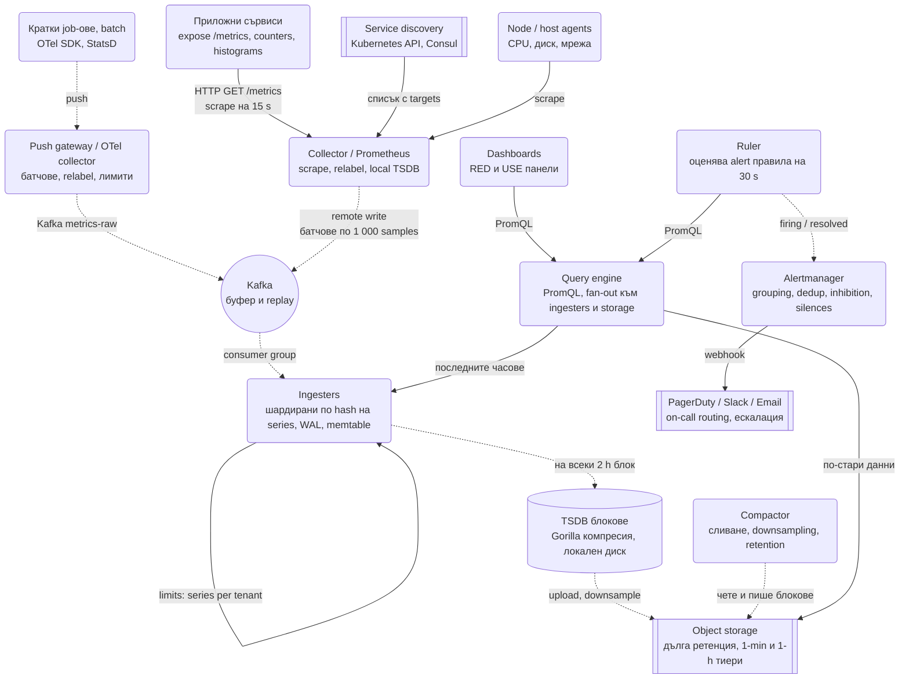
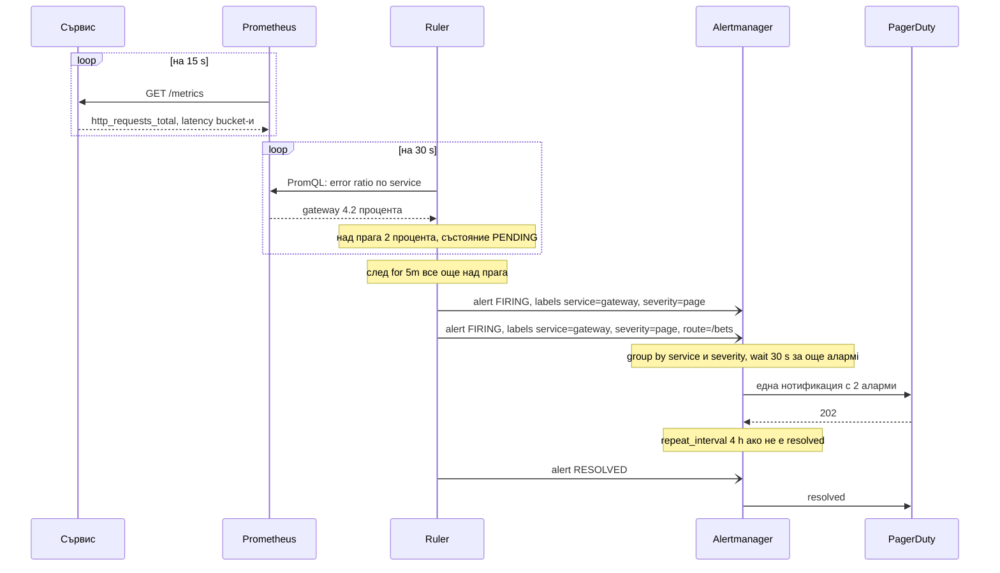
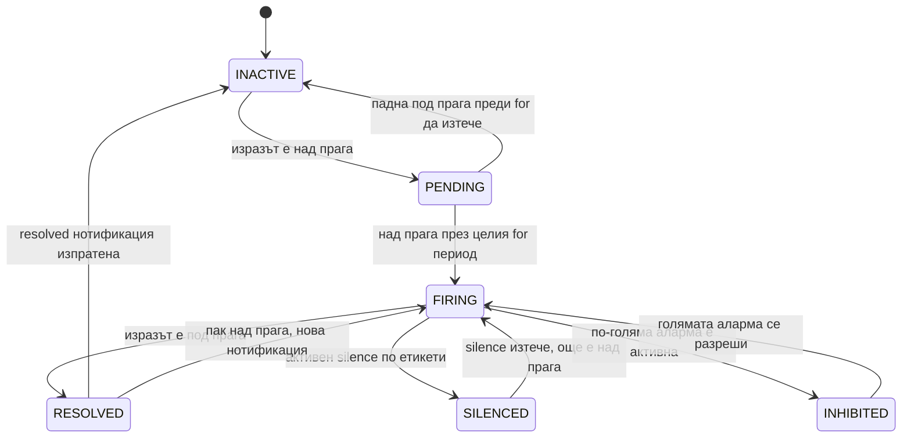

# Метрики, мониторинг и алармиране (Prometheus / Datadog тип) - System Design

Това е системата, която следи всички останали системи в тази папка, и затова интервюиращият я задава
на хора, които ще бъдат on-call. Тя има три части с различни изисквания: **събиране** на милиони
числа в секунда от хиляди машини, **съхранение** на тези числа така, че въпрос за последните 30
дни да се отговаря за секунди, и **алармиране**, което буди човек в 3 през нощта само когато трябва.

Централният компромис: метриката е евтина именно защото е **агрегируемо число с малко етикети**, а
не запис за всяко събитие. В момента, в който някой сложи `user_id` като етикет, системата спира да е
евтина и обикновено спира да работи изобщо. Всичко в дизайна пази тази граница.

## Архитектурна диаграма



**Как да четеш диаграмата:** отгоре са двата начина данните да влязат: pull (Prometheus сканира
`/metrics` на сървисите и агентите по списък от service discovery) и push (кратки job-ове и OTel
SDK-та пращат към gateway). Всичко се събира в Kafka като буфер, а ingester-ите го записват в
локални TSDB блокове, които после отиват в обектно хранилище за дълга ретенция. Отдясно е четенето:
един query engine обслужва и дашбордите, и ruler-а, който оценява alert правилата и праща
резултата на Alertmanager. Той решава кой, кога и с какво групиране да бъде събуден. Пунктираните
стрелки са асинхронни: нито един scrape, нито едно правило не чака запис на диск.

## Системен дизайн накратко

Три части с различни изисквания: събиране (pull и push, милион samples/сек), съхранение (TSDB с Gorilla компресия и tiered retention) и алармиране (ruler → Alertmanager → човек). 7 сървиса; границата, която всичко пази, е кардиналността на етикетите.

### Сървиси

| # | Сървис | Какво прави | Как комуникира |
| --- | --- | --- | --- |
| 1 | **Collector / Prometheus** (2 реплики) | Scrape на `/metrics` на 15 s по списък от service discovery, relabel, локална TSDB, `up == 0` безплатно | HTTP pull към сървисите и агентите; remote write на партиди |
| 2 | **Push gateway / OTel Collector** | Приема push от кратки job-ове и SDK-та, батчове, relabel, лимити | Push от приложенията; към Kafka `metrics-raw` |
| 3 | **Ingesters** (шардирани по hash на series) | WAL, последните 2 часа в паметта, флъш на immutable 2 h блокове; лимити на series на тенант (429) | Kafka consumer; репликация 3; блокове към object storage |
| 4 | **Compactor** | Слива блокове, downsampling до 1 min и 1 h тиери (5 агрегата), retention | Фонов над object storage |
| 5 | **Query engine** | PromQL: селекция по обърнат индекс → chunks → функция; fan-out към ingesters (скорошно) и store (старо); кеш на резултати | HTTP от дашбордите и Ruler-а |
| 6 | **Ruler** | Оценява alert правилата на 30 s, `for` продължителност, PENDING → FIRING | PromQL към Query engine; POST alerts към Alertmanager |
| 7 | **Alertmanager** (клъстер) | Grouping, dedup, inhibition, silences, routing по етикети, ескалация | Gossip между инстанциите; webhook към PagerDuty или Slack |

### Хранилища

| Компонент | Роля |
| --- | --- |
| Kafka | Буфер и replay между колектори и ingester-и |
| TSDB блокове (локален SSD) | Raw 15 s, 7-15 дни; Gorilla: около 1.4 B/sample вместо 16 |
| Object storage | 1 min тиер за 30-90 дни, 1 h за 1-2 години |
| Series index (в паметта) | Обърнат индекс етикет → posting list; размерът му е кардиналността |

### Комуникация, backpressure и патерни

- **Pull и push:** pull за дълготрайни сървиси (контрол на честотата, `up`), push през gateway за batch job-ове и затворени мрежи.
- **Асинхронно:** нито един scrape и нито едно правило не чака запис на диск; Kafka поглъща пикове и позволява replay.
- **Backpressure:** лимити на series и samples на тенант, пресечен лимит връща 429 към колектора; лимит на series в една заявка и timeout; alert правилата с приоритет пред ad-hoc дашбордите; Alertmanager групира и потиска, за да не залее хората.
- **Патерни:** time series модел с histogram вместо summary (адитивни bucket-и), LSM-подобни immutable блокове с retention като триене, delta-of-delta + XOR компресия, downsampling с min/max/avg/count/sum, SLO burn rate с два прозореца вместо прагове, dead man's switch, exemplars към traces, мониторингът в отделен клъстер от продукцията.

## Описание на архитектурата стъпка по стъпка

### 1. Моделът на данните: time series

Една **time series** е `име на метрика + набор от етикети`, а стойността ѝ е поредица от
`(timestamp, float64)`:

```text
http_requests_total{service="gateway", method="POST", route="/bets", status="200"}  → (t1, 10412), (t2, 10598), ...
```

Четири типа метрики и кой за какво служи:

| Тип | Какво е | Пример | Как се пита |
| --- | --- | --- | --- |
| **Counter** | Само расте (нулира се при рестарт) | Брой заявки, брой грешки | `rate(x[5m])`: заявки в секунда |
| **Gauge** | Може да пада и да расте | Памет, дълбочина на опашка, connections | Директно, `max`, `avg` |
| **Histogram** | Броячи по фиксирани bucket-и (`le="0.1"`, `le="0.5"`, ...) + сума + брой | Латентност на заявка | `histogram_quantile(0.99, sum(rate(bucket[5m])) by (le))` |
| **Summary** | Квантили, изчислени **в процеса** | Латентност | Директно, но не може да се агрегира |

**Защо histogram, а не summary.** p99 на инстанция А и p99 на инстанция Б не могат да се съберат в
p99 на сървиса: квантилите не са адитивни. Bucket броячите са адитивни: събираш `le="0.5"` от 40
инстанции и получаваш коректен bucket за целия сървис, от който квантилът се пресмята при
заявката. Цената е точност (интерполация вътре в bucket-а) и кардиналност (12 bucket-а = 12
series на всяка комбинация от етикети). За интервю: "латентността е histogram с bucket-и по SLO
праговете ми, така че `p99 < 300 ms` е една точна проверка".

### 2. Събиране: pull срещу push

| | Pull (Prometheus) | Push (StatsD, OTel, Datadog agent) |
| --- | --- | --- |
| Кой инициира | Колекторът вика `/metrics` на всеки target | Приложението праща |
| Откриване на цели | Service discovery (Kubernetes, Consul, DNS) | Не е нужно, целта знае адреса на колектора |
| "Целта е долу" | Безплатно: scrape fail = `up == 0` | Трудно: липсата на данни е единственият сигнал |
| Кратки job-ове | Не работи, процесът умира преди scrape | Естествено |
| Мрежа | Колекторът трябва да стига до всеки pod | Само изход от приложението, минава през firewall и NAT |
| Контрол на натоварването | Колекторът решава честотата | Приложение с бъг може да залее колектора |

Продукционният отговор е и двете: pull за дълготрайни сървиси (заради `up` и контрола), push през
gateway за batch job-ове и за среди, в които колекторът няма мрежов достъп. OpenTelemetry
Collector е компонентът, който приема push, прави relabel и лимити, и препраща.

### 3. Ingestion: буфер и шардиране

- Колекторите пишат в **Kafka** (или директно към ingester-ите с remote write). Kafka дава буфер при
  пик, replay при бъг в ingester-а и разкачване на скоростите на писане и четене.
- Ingester-ите са шардирани по `hash(series)` (consistent hashing, виж
  [KV Store](Distributed_Key_Value_Store.md)) с репликация 3: една series винаги отива на едни и същи
  3 възела, така че четене на една series не е scatter-gather.
- Всеки ingester пише WAL за durability и държи последните 2 часа в паметта; на всеки 2 часа
  флъшва неизменяем **блок** на диск. Това е LSM моделът, приложен към числа.
- **Лимити на тенант** живеят тук: максимум активни series, максимум samples/сек, максимум етикети
  на series. Пресечен лимит връща 429 към колектора, а не срива ingester-а.

### 4. Съхранение: защо TSDB, а не Postgres

Един sample е `(int64 timestamp, float64 value)` = 16 байта наивно. При 1 млн. samples/сек това са
16 MB/s или 1.4 TB/ден само сурови данни, без индекси. Специализираните хранилища смъкват това с
порядък:

- **Delta-of-delta за timestamps.** Scrape на 15 s дава timestamps 15 000 ms един от друг; разликата
  между две поредни разлики е почти винаги 0 и се кодира с 1 бит.
- **XOR за стойности** (Gorilla, Facebook 2015). Поредни стойности на gauge са близки, XOR-ът им
  има дълги поредици от нули, които се кодират с малко битове. Средно **1.37 байта на sample** вместо
  16.
- **Обърнат индекс по етикети:** `service="gateway"` → списък от series ID-та. Заявката пресича
  posting списъци (същата идея като в [търсачката](Search_Engine_Inverted_Index.md)) и чак после
  чете самите данни.
- **Блокове по време.** Всеки 2-часов блок е immutable директория с индекс и chunks. Ретенцията е
  `rm -rf` на стар блок, не `DELETE`. Заявка за последните 6 часа отваря 3 блока.

**Тиери на ретенция и downsampling:**

| Тиер | Резолюция | Ретенция | Къде |
| --- | --- | --- | --- |
| Raw | 15 s | 7-15 дни | Локален SSD на ingester-и / store |
| 1 минута | 1 min (min, max, avg, count, sum) | 30-90 дни | Object storage |
| 1 час | 1 h | 1-2 години | Object storage |

Downsampling-ът пази **пет агрегата**, не средното, защото `max` на 1-минутен прозорец е
единственият начин да видиш пик, който е траял 20 секунди преди месец. Compactor-ът (Thanos,
Cortex, Mimir) слива блокове, изчислява тиерите и трие изтеклите.

### 5. Кардиналност: проблемът номер едно

Брой активни series = произведението на стойностите на всички етикети. `http_requests_total` с
`method` (5) × `route` (50) × `status` (10) = 2 500 series на инстанция; при 200 инстанции са
500 000. Приемливо. Добави `user_id` с 10 млн. стойности и получаваш 10^13 потенциални series:
ingester-ите изчерпват паметта за индекса, заявките спират да се връщат, а сметката при доставчик
скача хилядократно.

Правилата за етикети:

- Етикетът е ок, ако стойностите му са **изброими и ограничени** (route template, не реалният URL с
  ID-та; status class, не всеки код, ако не трябва).
- Всичко с висока кардиналност (user, request id, IP, email) отива в **логове или traces**, не в
  метрики.
- Лимит на series на тенант и на метрика в ingester-а, с аларма при 80% от лимита.
- Инструмент за "топ 10 метрики по series" е първото, което on-call отваря при инцидент с паметта.

### 6. Query engine

Заявката (`PromQL`) се изпълнява на три стъпки: селекция на series по етикети през обърнатия
индекс, четене на chunks за времевия прозорец, и функция върху тях (`rate`, `sum by`,
`histogram_quantile`). Няколко неща, които интервюиращият очаква да знаеш:

- **`rate()` върху counter** трябва да преживее рестарт на процеса (counter-ът се нулира): engine-ът
  открива спад и го третира като нулиране, не като отрицателна скорост.
- **Fan-out:** заявка за последните 2 часа отива към ingester-ите, за миналата седмица към store
  gateway-а над object storage, резултатите се сливат. Кеш на резултати за дашборд заявки, които
  50 души гледат едновременно.
- **Защита:** лимит на series в една заявка (заявка без етикети върху 10 млн. series убива всичко),
  timeout, и приоритет на alert правилата пред ad-hoc дашбордите.

### 7. Алармиране: от правило до събуден човек



Стъпките:

1. **Правило** е PromQL израз + праг + `for` продължителност + етикети (`severity`, `team`). Ruler-ът
   го оценява на всеки 30 s.
2. **`for` пази от трептене (flapping).** Изразът трябва да е верен непрекъснато 5 минути, преди
   алармата да стане `FIRING`. Скок от 20 секунди никога не буди никого.
3. **Alertmanager** получава сурови аларми и прави четири неща: **grouping** (20 инстанции на един
   сървис = една нотификация), **dedup** (два Prometheus репликата пращат едно и също), **inhibition**
   ("ако datacenter-ът е долу, не ме уведомявай за всеки сървис в него"), **silences** (по време на
   планирана поддръжка).
4. **Routing** по етикети: `severity=page` към PagerDuty на екипа, `severity=ticket` към Slack. С
   ескалация, ако никой не потвърди за 15 минути.

### Състояния на една аларма



### 8. SLO алармиране с burn rate вместо прагове

"CPU > 80%" и "error rate > 2%" са симптомни прагове, които будят за неща, които не засягат
потребителите. По-зрелият подход (Google SRE Workbook):

- Дефинираш **SLO**: 99.9% успешни заявки за 30 дни. Error budget = 0.1% = 43 минути пълен отказ на
  месец.
- **Burn rate** = с каква скорост изгаряш бюджета. Burn rate 1 = точно изчерпваш го за 30 дни. Burn
  rate 14.4 = изчерпваш го за 2 дни.
- Алармата е **многопрозоречна**: page, ако burn rate > 14.4 за последния 1 час **и** за последните 5
  минути (бързо и все още продължава); ticket, ако burn rate > 1 за 3 дни. Двата прозореца заедно
  отрязват и шума, и пропуснатите бавни изтичания.

Едно изречение за интервю: "Алармирам по error budget burn rate, не по прагове, защото прагът
ме буди за пик, който не засяга SLO-то, и мълчи при бавно изтичане, което го изяжда."

### 9. Метрики, логове, traces

| | Метрики | Логове | Traces |
| --- | --- | --- | --- |
| Какво | Агрегирани числа с малко етикети | Текстови събития, произволна кардиналност | Дървото от span-ове на една заявка през сървисите |
| Цена | Много ниска на събитие | Висока (байтове на събитие) | Висока, затова sampling |
| Въпрос | "Колко и колко бързо" | "Какво точно стана с потребител X" | "Къде във веригата се губят 400 ms" |

Свързването: histogram bucket-ът може да носи **exemplar** (trace id на една конкретна заявка,
попаднала в него), така че от пика в дашборда се отива с един клик към конкретен trace, а от trace-а
към логовете по `trace_id`. Това е отговорът на "как дебъгвате p99".

### 10. Кой следи следящия

- Два Prometheus репликата сканират **едни и същи** цели независимо; Alertmanager дедупликира по
  етикети. Загубата на един не губи нито данни (другият ги има), нито аларми.
- Alertmanager е клъстер с gossip между инстанциите за състоянието на нотификациите.
- **Dead man's switch:** правило, което винаги е `FIRING` (`vector(1)`), пратено към външна услуга
  (PagerDuty Heartbeat). Ако спре да пристига, значи цялата верига е паднала. Това е единственият
  начин да разбереш, че мониторингът мълчи, защото е мъртъв, а не защото всичко е наред.
- Мониторингът живее в **отделен** клъстер и акаунт от продукцията, иначе инцидентът, който трябва
  да засече, го събаря заедно с нея.

## Оразмеряване (Back-of-the-envelope)

Допускане: **10 000 хоста**, средно 1 000 активни series на хост (сървиси + агент), scrape на 10 s,
ретенция 15 дни сурови данни.

| Метрика | Изчисление | Резултат |
| --- | --- | --- |
| Активни series | 10 000 × 1 000 | 10 млн. series |
| Samples в секунда | 10M / 10 s | 1 млн. samples/сек |
| Сурово (16 B/sample) | 1M × 16 B × 86 400 | ≈ 1.4 TB/ден |
| Компресирано (~1.5-2 B/sample) | 1M × 1.7 B × 86 400 | ≈ 150 GB/ден |
| Сурови данни за 15 дни | 150 GB × 15 | ≈ 2.2 TB SSD, шардирано по ingester-и |
| Индекс в паметта | 10M series × ~1 KB (етикети + postings) | ≈ 10 GB RAM общо, затова лимити на кардиналност |
| 1-min тиер за 90 дни | 10M series × 5 агрегата × 1 440 × 90 × ~2 B | ≈ 13 TB в object storage |
| Alert правила | 2 000 правила / 30 s | ≈ 70 заявки/сек към query engine, приоритетни |

Изводът: **компресията е разликата между 1.4 TB и 150 GB на ден**, а индексът, не данните, е
това, което изяжда паметта; затова кардиналността е лимитът, който се пази най-строго.

## Модел на данните и API

```text
GET  /metrics                                        → text exposition: name{labels} value
POST /api/v1/write                                   → remote write, protobuf + snappy, батчове
GET  /api/v1/query?query=<PromQL>&time=              → моментна стойност
GET  /api/v1/query_range?query=&start=&end=&step=    → серия за дашборд
GET  /api/v1/series?match[]=up{job="gateway"}        → кои series отговарят
POST /api/v2/alerts                                  → Ruler към Alertmanager
POST /api/v2/silences                                → { matchers, startsAt, endsAt, comment }
```

| Структура | Съдържание | Бележка |
| --- | --- | --- |
| Series index | `label → posting list от series ID` | Обърнат индекс, в паметта за активния блок |
| Chunk | 120 samples на една series, Gorilla компресирани | ~1.37 B/sample средно |
| Block | 2 h директория: `index`, `chunks/`, `meta.json`, tombstones | Immutable, ретенцията е триене на блок |
| Alert rule | `expr`, `for`, `labels`, `annotations` | В git, деплойва се като конфигурация |

## Ключови въпроси за интервюто

### Pull или push?

Pull за дълготрайни сървиси: `up == 0` е безплатна аларма "целта е долу", колекторът контролира
честотата, а service discovery казва кого да сканира. Push за batch job-ове (умират преди scrape) и
за среди без мрежов достъп от колектора към целите (мобилни клиенти, чужди облаци). Продукцията
ползва и двете през OTel Collector, който приема push и се scrape-ва от Prometheus.

### Как получавате p99 за целия сървис от 40 инстанции?

Не от 40 p99 стойности: квантилите не се агрегират. Всяка инстанция излага histogram с еднакви
bucket-и; при заявката bucket броячите се събират по `le`, а квантилът се изчислява от сумарния
histogram. Точността зависи от границите на bucket-ите, затова се слагат по SLO праговете (100 ms,
300 ms, 1 s), където точността трябва.

### Как избягвате alert fatigue?

Пет неща в този ред: `for` продължителност (никакви аларми за пикове от 30 секунди); симптомни
аларми за потребителя (SLO burn rate), а не причинни (CPU, диск); grouping в Alertmanager (един
инцидент = една нотификация); inhibition (паднал datacenter потиска всичко под себе си); и всяка
аларма има **runbook** и owner, а аларма без действие се трие. Метриката за самия екип: аларми на
седмица на on-call и процент от тях, които са изисквали действие.

### Какво става, ако Prometheus падне?

Две реплики сканират едни и същи цели, така че данните и алармите продължават от втората;
Alertmanager дедупликира. Загубеният е само прозорецът, в който падналият е бил единствен, ако е
бил. Дълготрайните данни са в object storage и не зависят от нито един Prometheus. А dead man's
switch алармата казва на външна услуга, ако цялата верига е замлъкнала.

### Какво е кардиналност и защо е проблем?

Броят уникални комбинации от етикети = броят series = размерът на индекса в паметта и цената при
доставчик. `user_id` като етикет умножава series по броя потребители и изчерпва паметта на
ingester-ите за минути. Защитата: етикетите са само с изброими стойности, лимити на series на тенант
в ingester-а с 429 при пресичане, аларма при 80% от лимита, и високата кардиналност отива в logs и
traces.

### Как алармирате за "няма данни"?

Липсата на данни е най-опасният отказ, защото прагът върху нищо е тих. Три инструмента: `up == 0`
при pull (scrape-ът се провали); `absent(metric{job="x"})` в PromQL за series, която трябва да
съществува; и dead man's switch за самия мониторинг. За push системи: аларма върху "възраст на
последния sample" за критичните job-ове.

### Защо не Postgres или Cassandra за метриките?

Може, и Timescale/Cassandra се използват. Но специализираната TSDB печели с порядък по три неща:
Gorilla компресия (1.4 TB → 150 GB на ден), обърнат индекс по етикети за селекция на series без
сканиране, и ретенция като триене на immutable блокове. Cassandra е добър отговор, ако вече я имаш
и обемът е умерен (виж [Ad Click Aggregation](Ad_Click_Aggregation.md), където агрегатите са
малко и рядко се променят); за 1 млн. samples/сек не е.

### Как решавате какво да мерите в нов сървис?

RED за всеки сървис (Rate, Errors, Duration като histogram) и USE за всеки ресурс (Utilization,
Saturation, Errors), виж [патерните](System_Design.md). Плюс метриките на бизнес механизма: consumer
lag за консуматор, дълбочина на опашка, hit ratio на кеш, брой компенсации на Saga. Правилото:
първо SLO, после метриките, които го доказват, накрая дашбордът. Дашборд без SLO е декорация.
