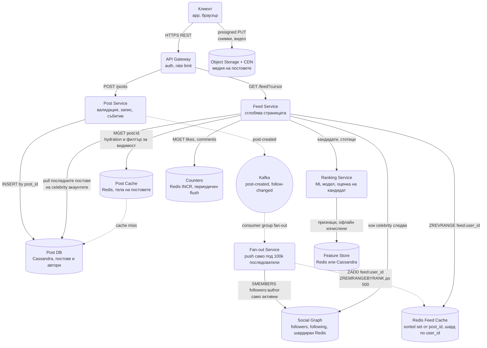
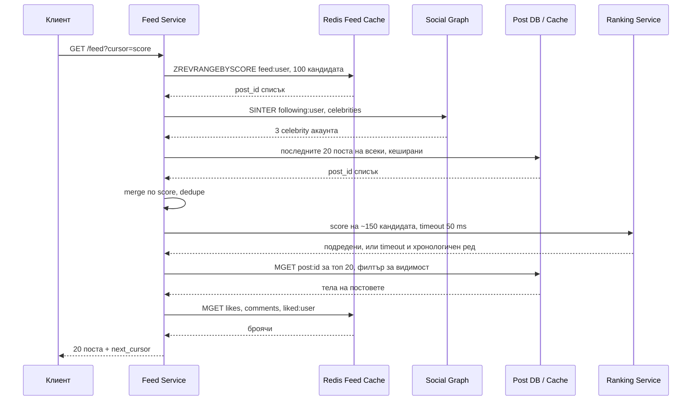

# News Feed / Timeline (Facebook, Twitter, Instagram) - System Design

Основното предизвикателство е асиметрията: един пост на човек с 50 милиона последователи трябва да
се появи в 50 милиона feed-а, а всеки от тези feed-и трябва да се сглоби за под 200 ms. Целият
дизайн се върти около един въпрос: **работата да се свърши при писането или при четенето.**

## Архитектурна диаграма



**Как да четеш диаграмата:** Има два пътя. **Публикуването** е кратко и синхронно до записа в Post DB
и събитието в Kafka; всичко след това, включително fan-out към inbox-ите на последователите, е
асинхронно и потребителят не го чака. **Четенето** тръгва от Feed Service, който взима готовия
sorted set от Redis, добавя постовете на малкото celebrity акаунти, които потребителят следва, слива
двата източника, подрежда ги през Ranking Service и накрая "хидратира" ID-тата в цели постове от
кеша и броячите.

## Системен дизайн накратко

Един въпрос решава всичко: работата при писане или при четене. Отговорът е хибрид: fan-out on write за нормални автори, pull за celebrity акаунти, сливане при четене. 5 сървиса и много Redis.

### Сървиси

| # | Сървис | Какво прави | Как комуникира |
| --- | --- | --- | --- |
| 1 | **API Gateway** | Auth, rate limit | HTTPS REST от клиента; gRPC към Post и Feed Service (синхронно) |
| 2 | **Post Service** | Валидира и записва поста, публикува събитие | gRPC от Gateway; CQL INSERT в Post DB; Kafka producer `post-created` (асинхронно); връща 201 веднага след записа |
| 3 | **Fan-out Service** | За автори под около 100k последователи записва `post_id` в inbox-а на всеки активен последовател; backfill при нов follow | Kafka consumer group (pull); Redis `SMEMBERS followers:<author>` (или заявка към graph DB); Redis pipeline `ZADD feed:<user>` + `ZREMRANGEBYRANK` |
| 4 | **Feed Service** | Взима inbox-а от Redis, добавя pull на celebrity постовете, слива, ранкира, хидратира, филтрира за видимост | gRPC от Gateway; Redis `ZREVRANGEBYSCORE`, `SINTER`, `MGET`; CQL `SELECT` от `posts_by_author` за celebrity pull; gRPC към Ranking с deadline 50 ms |
| 5 | **Ranking Service** | ML оценка на стотици кандидати с офлайн изчислени признаци | gRPC от Feed Service (синхронно, с timeout); чете Feature Store (Redis или Cassandra) |

### Хранилища

| Компонент | Роля |
| --- | --- |
| Post DB (Cassandra) | Постове по `post_id` и `posts_by_author` за pull |
| Redis Feed Cache | `feed:<user_id>` sorted set от 500 post_id, шард по `user_id`, TTL 30 дни |
| Post Cache (Redis) | Тела на постовете за hydration |
| Social Graph (Redis или graph DB) | followers, following, set `celebrities` |
| Counters (Redis) | Лайкове и коментари, write-behind към Post DB |
| Kafka | `post-created`, `follow-changed`, лайкове |
| Object Storage + CDN | Медия, качена директно |

### Комуникация, backpressure и патерни

- **Синхронно:** HTTPS REST за публикуване (до записа в Post DB) и за четене на feed-а; gRPC между сървисите. Ranking е sync, но с timeout budget и fallback към хронологичен ред.
- **Асинхронно:** fan-out през Kafka; потребителят не чака 200 записа в Redis. Броячите се флъшват write-behind.
- **Backpressure:** Kafka поглъща пиковете на fan-out-а и позволява worker-ите да наваксват; celebrity постовете изобщо не се fan-out-ват; неактивните потребители се пропускат; локална агрегация на лайкове (INCRBY на 100 ms) срещу hot key.
- **Патерни:** хибриден push/pull според power-law разпределението, ID-та в кеша + hydration (не копия), cursor пагинация по score, дедупликация чрез `ZADD` member, производен кеш с rebuild от Post DB при загуба, graceful degradation на ranking-а.

### Flow: сценариите стъпка по стъпка

**Публикуване на пост.** Мария с 300 последователи пише пост със снимка. Снимката отива директно в Object Storage с presigned URL, а текстът и `media_id` тръгват като `POST /posts` към API Gateway, който по gRPC вика Post Service. Post Service записва поста в Cassandra (ключ `post_id`, Snowflake ID, което носи и времето) и публикува събитие `post-created` в Kafka. Връща 201. Мария вижда поста си веднага, а всичко останало става без нея. Fan-out Service тегли събитието от Kafka, проверява броя последователи на Мария (300, под прага от 100 000, значи push модел), взима списъка им от Social Graph и за всеки, който е бил активен през последните 30 дни, прави `ZADD feed:<follower> <time> <post_id>` плюс `ZREMRANGEBYRANK`, който пази само последните 500 ID-та. Това са 300 малки записа в Redis, pipeline-нати. Inbox-ът пази само 8-байтови ID-та, не поста, защото иначе редакция или изтриване биха означавали 300 обновявания. Ако Redis клъстерът е временно недостъпен, събитията се трупат в Kafka и се обработват после.

**Отваряне на feed-а.** Иван отваря приложението; `GET /feed?cursor=` стига до Feed Service. Той прави `ZREVRANGEBYSCORE feed:Иван` и взима 100 кандидат ID-та от готовия inbox (повече от 20-те, които ще покаже, защото някои ще отпаднат при филтъра). После пита Social Graph кои от следваните от Иван са celebrity (`SINTER following:Иван celebrities`), получава например 3 акаунта и тегли последните им 20 поста от `posts_by_author` в Cassandra (тези заявки са кеширани, защото един и същ celebrity пост го питат милиони). Слива двата списъка по време, дедупликира и праща около 150 кандидата към Ranking Service по gRPC с deadline 50 ms; ако моделът не отговори навреме, feed-ът се връща хронологичен (feed без ranking е приемлив, feed без отговор не е). За топ 20 прави един `MGET post:<id>` от Post Cache за телата (при miss чете Cassandra и пълни кеша), минава филтър за видимост (изтрит пост, блокиран автор, вече не е следван) и един `MGET` за броячите на лайкове. Връща 20 поста и `next_cursor` (score на последния), така че следващата страница е "преди този", не `OFFSET 20`, който би показвал повторения при нови постове.

**Celebrity пост и неактивен потребител.** Футболист с 50 милиона последователи публикува. Post Service го записва и толкова: Fan-out Service вижда, че е над прага, и не прави нищо, защото 50 милиона записа за един клик биха задръстили Redis, а повечето от тези хора няма да отворят приложението днес. Постът се появява в чуждите feed-ове чак при четене, през pull стъпката по-горе, с 200 ms разлика, която никой не забелязва. Самият пост става hot key в Post Cache, затова Feed Service държи локален кеш в процеса с TTL от секунди. Обратният случай: Петър не е отварял приложението 3 месеца. Fan-out го пропуска всеки ден (не е в active set-а), inbox-ът му изтича по TTL. Когато се върне, Feed Service вижда празен inbox и го изгражда на място с pull от Post DB за всички, които Петър следва: скъпа заявка от секунди, но платена веднъж при завръщане, вместо всеки ден за нищо. Същото се случва, ако целият Redis feed кеш се загуби: той е производен, не източник на истина.

## Описание на архитектурата стъпка по стъпка

### 1. Fan-out on write (push модел)

При публикуване Fan-out Service чете списъка с последователи и **записва `post_id` в inbox-а на
всеки от тях** (Redis sorted set `feed:<user_id>`, ограничен до последните ~500 поста).

- **Плюс:** четенето е един `ZREVRANGE` от Redis. Feed-ът е готов преди потребителят да го поиска.
- **Минус:** един пост поражда N записа. При 50 млн. последователи това са 50 млн. записа за един
  клик, а повечето от тези хора няма да отворят приложението днес.

### 2. Fan-out on read (pull модел)

Feed-ът се сглобява в момента на четене: взимат се последните постове на всеки, когото следваш, и се
сливат.

- **Плюс:** нула работа при писане.
- **Минус:** ако следваш 2 000 души, всяко зареждане на feed-а е 2 000 заявки и сливане в реално
  време. Неприемливо за P99 латентност.

### 3. Хибридът (реалният отговор)

Нито един от двата чисти модела не работи в мащаб. Продукционните системи правят следното:

| Тип автор | Стратегия | Защо |
| --- | --- | --- |
| Нормален потребител (< ~100k последователи) | **Push** в inbox-ите | Записите са малко, четенето е моментално |
| Celebrity (≥ ~100k последователи) | **Без fan-out**, само в Post DB | 50 млн. записа за един туит биха задръстили клъстера |

При четене Feed Service взима готовия push-нат списък от Redis, **добавя** постовете на малкото
celebrity акаунти, които потребителят следва (обикновено под 50 заявки, кеширани, защото един и същи
celebrity пост се пита от милиони), слива двата източника и ги подрежда. Така 99% от съдържанието
идва наготово, а скъпият случай се плаща само от малцината, които следват знаменитости.

### 4. Защо sorted set, а не list

Inbox-ът е `ZADD feed:<user_id> <score> <post_id>`, където score е времето на публикуване (или
самото `post_id`, ако е Snowflake и носи времето). Причини:

- **Дедупликация по member:** повторна доставка от Kafka (at-least-once) прави `ZADD` на същия
  `post_id` и нищо не се дублира. При list трябва да се проверява ръчно.
- **Подреждане по score:** сливането с pull-натите celebrity постове е сливане на два сортирани
  източника по едно и също време, без допълнително сортиране.
- **Отрязване по ранг:** `ZREMRANGEBYRANK feed:<user_id> 0 -501` пази последните 500 с една команда,
  изпълнена в същия pipeline като `ZADD`.
- **Cursor пагинация:** `ZREVRANGEBYSCORE feed:<user_id> (<last_score> -inf LIMIT 0 20` е точно
  "следващите 20 преди този, който видях", без `OFFSET`.

### 5. Hydration (защо в кеша стоят само ID-та)

В `feed:<user_id>` се пазят **само `post_id`-та**, не самите постове. Причини:

- Постът се променя (редакция, брой лайкове, изтриване). Ако е копиран в 50 млн. inbox-а, всяка
  промяна изисква 50 млн. обновявания.
- Изтрит или блокиран пост трябва да изчезне навсякъде моментално.
- Паметта: 500 ID-та × 8 B = 4 KB на потребител, срещу мегабайти при пълни копия.

Самите постове се дърпат с един `MGET` от Post Cache при сглобяването на отговора. При miss се чете
от Post DB и се пълни кешът. Целият hydration е **един MGET за телата плюс един MGET за броячите**,
не N заявки.

### 6. Подреждане (ranking)

Хронологичният ред е най-простият вариант и все още се използва (Twitter "Latest"). Алгоритмичният
feed минава през ML модел, който оценява всеки кандидат по вероятност за взаимодействие. За интервю
е достатъчно да кажеш:

- Кандидатите се **набират** от inbox-а и pull-а (стотици), не от цялата база.
- Оценяването е на **малък набор**, затова може да е скъпо на кандидат.
- Признаците (features) се пресмятат офлайн и се четат от feature store, не се изчисляват в
  критичния път.
- Ranking Service е с **timeout budget** (напр. 50 ms) и при изчерпване Feed Service връща
  хронологичния ред. Feed без ranking е приемлив; feed без отговор не е.

### 7. Follow и unfollow

Социалният граф се променя непрекъснато и inbox-ите трябва да отразяват това:

- **Нов follow:** събитие `follow-changed` в Kafka. Fan-out Service прави **backfill**: взима
  последните ~20 поста на новия followee от Post DB и ги `ZADD`-ва в inbox-а на последователя.
  Иначе потребителят следва някого и не вижда нищо от него до следващия му пост.
- **Unfollow:** два варианта. **Lazy:** нищо не се трие; при hydration филтърът за видимост
  проверява дали авторът още е следван и просто пропуска поста. **Async:** worker-ът чете последните
  постове на бившия followee и ги `ZREM`-ва. Lazy е по-евтино и се предпочита; async се пуска при
  **block**, където потребителят очаква авторът да изчезне веднага.
- **Celebrity, който пада под прага:** нищо особено, следващият му пост просто се fan-out-ва.
  Обратното (нормален потребител става celebrity) също е автоматично, защото прагът се проверява
  при всеки пост.

### 8. Неактивни потребители

Половината от 300 млн. потребители не са отваряли приложението този месец, а fan-out-ът записва в
inbox-ите им всеки ден. Това е най-голямата загуба в системата:

- Пази се **active user set**: `last_active_at` в профила, кеширано, или Redis set с TTL 30 дни.
- Fan-out Service пропуска получателите, които не са били активни от 30 дни. Техният inbox просто
  спира да се обновява и изтича по TTL.
- При завръщане Feed Service вижда празен или изтекъл inbox и го **изгражда на място** с pull:
  последните постове на всеки следван, слети и отрязани до 500. Това е скъпа заявка (секунди), но се
  плаща веднъж на завръщане, вместо всеки ден за нищо.
- Това намалява fan-out записите с около половина без видима промяна за никого.

### 9. Броячи: лайкове и коментари

Лайкът е най-честият запис в системата (десетки пъти повече от постовете) и никога не минава през
Post DB синхронно:

- `INCR post:<id>:likes` в Redis при всеки лайк плюс запис на самия лайк `(user_id, post_id)` в Kafka.
- Worker флъшва броячите към Post DB на партиди (write-behind) на всеки няколко секунди.
- Броячът в отговора е **приблизителен и eventual**: 1 000 004 срещу 1 000 007 не интересува никого.
  Изключение е "лайкнах ли го аз", което се чете точно от отделен set `liked:<user_id>` за
  постовете на текущата страница.
- Броячите се шардират по `post_id`, така че вирусен пост е един hot key. Решение: **локална
  агрегация** в Feed Service на 100 ms и един `INCRBY`, вместо 10 000 `INCR`.

## Оразмеряване (Back-of-the-envelope)

Допускане: **300 млн. дневно активни потребители**, средно 2 поста на човек на ден, средно 200
последователи, всеки отваря feed-а 10 пъти дневно.

| Метрика | Изчисление | Резултат |
| --- | --- | --- |
| Постове на ден | 300M × 2 | 600 млн. |
| Записи (постове) | 600M / 86 400 | ≈ 7 000/сек |
| Fan-out записи | 7 000 × 200 последователи | ≈ 1.4 млн. записа/сек в Redis |
| Fan-out само към активни (~50%) | 1.4M × 0.5 | ≈ 700 000 записа/сек |
| Четения на feed | 300M × 10 / 86 400 | ≈ 35 000/сек |
| Redis операции при четене | 35k × (ZREVRANGE + 2 MGET + graph) | ≈ 150 000 ops/сек |
| Памет за inbox-ите | 300M × 500 ID × 8 B | ≈ 1.2 TB RAM (шардиран Redis) |
| Съхранение на постове | 600M × ~1 KB | ≈ 600 GB/ден |
| Лайкове (10 на пост) | 6G / 86 400 | ≈ 70 000 INCR/сек |

Числото, което носи точки: **1.4 милиона записа в секунда само от fan-out**, при едва 7 000
същински поста. Точно това число обосновава защо celebrity акаунтите се изключват от push модела и
защо неактивните потребители се пропускат. Второто число: **1.2 TB RAM** за inbox-ите обяснява
защо в тях стоят 8-байтови ID-та, а не постове.

## Модел на данните

```text
POST /api/v1/posts          { body, media_ids }        → 201 { post_id }
GET  /api/v1/feed?cursor=   → { posts[20], next_cursor }
POST /api/v1/follow         { target_user_id }         → 204
POST /api/v1/posts/:id/like                            → 204
```

| Хранилище | Ключ | Съдържание |
| --- | --- | --- |
| Post DB (Cassandra) | `post_id` (partition), плюс таблица `posts_by_author (author_id, bucket) / post_id DESC` | Тяло, автор, време, медия. Втората таблица обслужва pull-а на celebrity постовете. |
| Feed cache (Redis) | `feed:<user_id>` | Sorted set от `post_id`, score = време, отрязан на 500, TTL 30 дни |
| Post cache (Redis) | `post:<post_id>` | Сериализиран пост, TTL часове, LRU |
| Social Graph | `followers:<user_id>` / `following:<user_id>` | Графова база или шардиран Redis set; списъкът на celebrity се пази и като отделен `celebrities` set |
| Counters | `post:<id>:likes`, `post:<id>:comments` | Отделно от поста, защото се променят непрекъснато |
| Active users | `active:<user_id>` с TTL 30 дни | Fan-out филтър |

**Пагинация:** винаги cursor-based (score на последния видян пост), никога `OFFSET`. При feed, в
който непрекъснато влизат нови постове, `OFFSET 20` показва повторения и пропуска съдържание.

### Пътят на четене стъпка по стъпка



## Ключови въпроси за интервюто

### Fan-out on write или on read?

Отговорът "зависи" е грешен, ако не кажеш **от какво**. Зависи от разпределението на броя
последователи, което е power law: 99% от акаунтите са малки и им приляга push, а дългата опашка от
знаменитости чупи модела и минава на pull. Хибридът не е компромис, а следствие от разпределението.

### Какво става, когато някой с 50 млн. последователи публикува?

Нищо синхронно. Постът се записва в Post DB и толкова. Появява се в чуждите feed-и чак при четене,
което е напълно приемливо, защото никой не забелязва 200 ms разлика. Ако все пак се прави fan-out,
той е асинхронен, приоритизиран (първо активните последователи) и разстлан във времето. Самият пост
става **hot key** в Post Cache, защото милиони го хидратират едновременно; решение е локален кеш в
Feed Service с TTL от секунди.

### Как се държи новорегистриран потребител (cold start)?

Празният inbox не бива да води до празен екран. Fallback: популярно съдържание по регион и
интереси, генерирано офлайн, докато потребителят започне да следва хора. Всеки нов follow прави
backfill, така че feed-ът се пълни веднага.

### Как изчезва изтрит или блокиран пост от 50 млн. feed-а?

Не се трие от inbox-ите. При hydration постовете минават през филтър за видимост (изтрит, блокиран
автор, гео-ограничение, вече не е следван) и просто не влизат в отговора. Точно затова в кеша стоят
ID-та, а не копия. Feed Service взима **повече кандидати**, отколкото връща (100 за страница от 20),
за да компенсира отпадналите.

### Как се шардира Redis feed кешът?

По `user_id`, за да е inbox-ът на един потребител на един възел и четенето да е една команда. Fan-out
записът тогава е разпръснат по целия клъстер, което е приемливо, защото е асинхронен. При няколко
региона всеки регион държи inbox-ите на **своите** потребители (данните са локални за четене), а
Kafka репликира `post-created` събитията между регионите, за да може fan-out-ът да стигне до
последовател на друг континент. Постовете са глобални, inbox-ите са регионални.

### Kafka за какво служи тук?

За да не чака потребителят fan-out-а. `POST /posts` връща 201 веднага след записа в Post DB;
разпращането към 200 inbox-а се случва след това. Освен това позволява fan-out worker-ите да се
скалират независимо и да наваксват при пик, вместо да отказват заявки. Ако Redis клъстерът е
недостъпен, събитията се натрупват в Kafka и се обработват после, без загуба.

### Какво става, ако Redis feed кешът се загуби напълно?

Feed-ът е **производна структура**, не източник на истина. Feed Service вижда празен inbox и го
изгражда с pull от Post DB, точно както за завърнал се неактивен потребител. Първите минути след
загубата са бавни и Post DB е под натиск, затова се прави постепенно (rate limit на rebuild-овете и
fallback към популярно съдържание), но нищо не е загубено.

### Как се вкарват реклами и препоръчани постове?

Като допълнителен източник на кандидати в стъпката на сливане: Ads Service и Recommendation Service
връщат по няколко ID-та, които влизат в ranking-а с отделни правила (максимум 1 на 5 поста, никога
две последователни). Архитектурата не се променя, само източниците на кандидати стават три вместо два.

### Как се гарантира, че потребителят не вижда един и същи пост два пъти?

Дедупликация на две нива: `ZADD` по member в inbox-а и `seen` set на клиента за текущата сесия. При
pagination с cursor по score постовете с еднакъв score (публикувани в една и съща милисекунда) са
рядкост, но за пълна коректност cursor-ът носи и последния `post_id` като tie-breaker.
