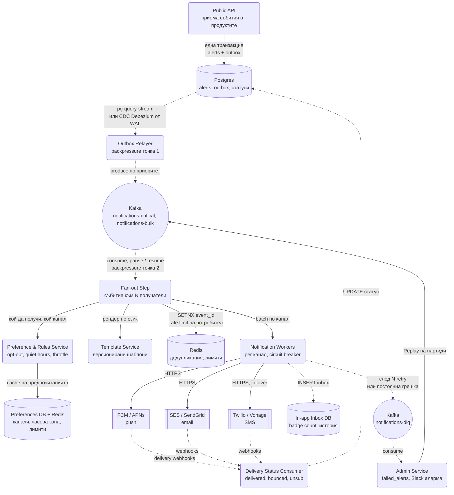
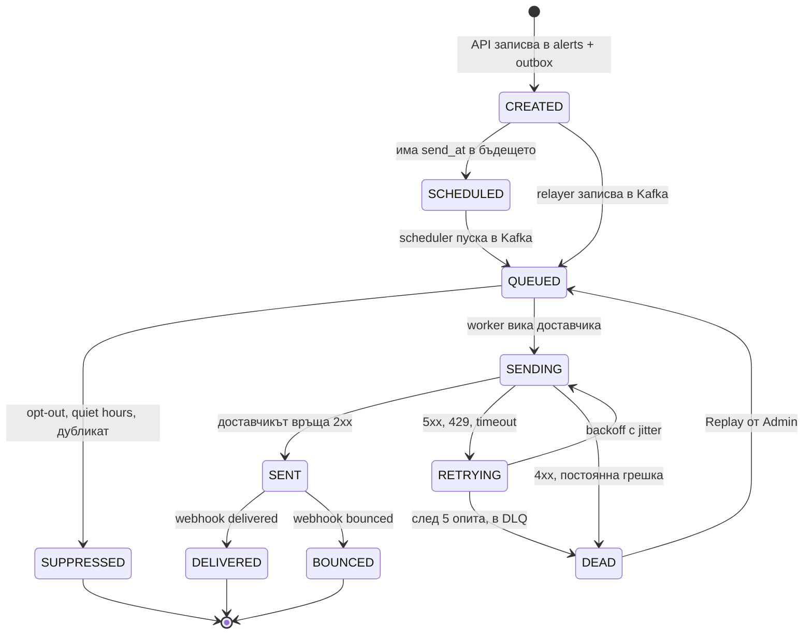

# Notification System - System Design

Поток на известие от Public API до доставка при доставчика и обратно, с Outbox за атомарност, две
приоритетни опашки, проверка на предпочитания и правила, два Backpressure контрола, retry с
Exponential Backoff, DLQ и Replay през Admin Dashboard.

## Архитектурна диаграма

**Как да четеш диаграмата:** Има три пътя. **Записът** е синхронен: Public API записва алерта и
outbox реда в една транзакция и връща 202. **Транспортът** е асинхронен: Outbox Relayer прехвърля в
Kafka по приоритетен топик, Fan-out Step разширява едно събитие до списък получатели, минава през
правила, шаблони и дедупликация, и чак тогава Worker-ите говорят с доставчиците. **Обратният път**
са webhook-ите от доставчиците, които обновяват реалния статус, и DLQ веригата, през която
провалилите се съобщения се преглеждат и се пускат наново.

## Системен дизайн накратко

Записът е синхронен и минимален (API + outbox в една транзакция, 202 веднага), всичко друго е асинхронен конвейер през Kafka: relay → fan-out → правила и шаблони → worker по канал → доставчик → webhook обратно. 8 сървиса, два приоритетни топика, DLQ с Replay.

### Сървиси

| # | Сървис | Какво прави | Как комуникира |
| --- | --- | --- | --- |
| 1 | **Public API** | Валидира събитието, записва `alerts` + `outbox` в една транзакция, връща 202 | REST от продуктите; SQL към Postgres |
| 2 | **Outbox Relayer** | Прехвърля outbox редовете в Kafka по приоритет и ги маркира обработени | pg-query-stream или CDC (Debezium) → Kafka `notifications-critical` / `notifications-bulk` |
| 3 | **Fan-out Step** | Разширява едно събитие до списък получатели на партиди по 1000, дедупликира (SETNX), rate limit на потребител | Kafka consumer; sync към Rules и Template; Redis |
| 4 | **Preference & Rules Service** | Канал, opt-out, тихи часове, throttling по потребител | Викан от Fan-out; Preferences DB с Redis кеш |
| 5 | **Template Service** | Версионирани шаблони по канал и език | Викан от Fan-out |
| 6 | **Notification Workers** (по канал) | HTTP към доставчика с rate limit, circuit breaker, retry с backoff; записва в in-app inbox | Kafka consumer; HTTPS към FCM/APNs, SES/SendGrid, Twilio/Vonage; DLQ при провал |
| 7 | **Delivery Status Consumer** | Приема webhook-и `delivered`, `bounced`, `unsubscribed`, проверява подпис, идемпотентен по `provider_message_id` | HTTPS webhook endpoint; UPDATE в Postgres |
| 8 | **Admin Service** | Чете DLQ, записва `failed_alerts`, аларма в Slack, Replay на партиди | Kafka consumer на `notifications-dlq`; publish обратно в основния топик |

### Хранилища

| Компонент | Роля |
| --- | --- |
| Postgres | `alerts`, `outbox` (партиция по дата), статуси |
| Kafka | `notifications-critical`, `notifications-bulk`, `notifications-retry`, `notifications-dlq` |
| Redis | Дедупликация, throttling counters, кеш на предпочитания, scheduler (ZSET за отложени) |
| Preferences DB | Матрица `(user_id, event_type) → channels` |
| In-app Inbox DB | Персистиран канал с badge брояч |

### Комуникация, backpressure и патерни

- **Синхронно:** само API → Postgres и webhook endpoint-ът (бърз 200, обработка после).
- **Асинхронно:** цялата доставка през Kafka; webhook-ите от доставчиците са обратният асинхронен канал.
- **Backpressure:** две точки. Relayer-ът чете със streams, за да не препълни RAM. Fan-out консуматорът регулира с batch size и `pause()/resume()`. Отделно: отделни топици и worker pool-ове по приоритет, за да не бави кампания OTP кода; retry топик вместо блокиране на партицията; circuit breaker към доставчика.
- **Патерни:** Transactional Outbox / CDC, priority queues, идемпотентен консуматор (exactly-once не съществува), retry с exponential backoff и jitter, DLQ + Replay, failover между доставчици, dry-run и kill switch.

## Стъпки в потока

1. Public API валидира събитието (`event_type`, `entity_id`, получатели или правило за получатели)
   и записва алерта и събитието в `outbox` таблицата в **една и съща БД транзакция**. Връща 202
   Accepted веднага. Нищо не е изпратено още, но нищо не може да се загуби.
2. Outbox Relayer чете редовете чрез Node.js Streams (`pg-query-stream`), без да препълва RAM
   паметта (**Backpressure точка 1**). Алтернатива без собствен код: **CDC** с Debezium, който чете
   WAL-а на Postgres и пише направо в Kafka.
3. При ACK от Kafka редът се маркира като обработен. Relayer-ът избира топика по приоритет на
   събитието: `notifications-critical` или `notifications-bulk`.
4. Fan-out Step чете от Kafka; самата Kafka служи като регулаторен буфер чрез batch size и
   `pause()` / `resume()` (**Backpressure точка 2**). Едно събитие "нов коментар в тема X" се
   разширява до списъка абонати на темата, на партиди по 1000, всяка партида е отделно съобщение
   надолу по веригата.
5. За всеки получател се проверяват предпочитания и правила (канал, opt-out, тихи часове,
   throttling), прави се дедупликация по `(user_id, event_type, entity_id)` и се рендерира шаблон на
   езика на потребителя.
6. Notification Worker за съответния канал прави HTTP заявка към доставчика с rate limit и Circuit
   Breaker. Резултат:
   - **6a. Успех (2xx):** записва `SENT`, commit offset.
   - **6b. Преходна грешка (5xx, 429, timeout):** retry 5 пъти с Exponential Backoff и jitter, а
     при пълен провал съобщението отива в `notifications-dlq`.
   - **6c. Постоянна грешка (4xx, невалиден адрес):** директно в DLQ, без retry.
   - **6d.** Offset-ът в основния топик се commit-ва във всички случаи, за да не блокира потока.
7. Доставчикът праща webhook (`delivered`, `bounced`, `unsubscribed`). Delivery Status Consumer
   обновява статуса в базата. HTTP 200 от доставчика означава "приех заявката", не "потребителят го
   получи".
8. Admin Service чете DLQ, записва в `failed_alerts` и уведомява през Slack/Email. Девелопърите ги
   преглеждат в Admin Dashboard и с бутона "Replay" ги връщат обратно в основния топик на партиди.

### Жизнен цикъл на едно известие

`SUPPRESSED` е важно състояние: известие, което правилно **не** е изпратено, не е грешка и не бива
да отива в DLQ. Ако се брои като провал, DLQ-то се пълни с шум и реалните инциденти се губят в него.

## Слоевете около транспорта

Транспортът е лесната част. Реалната система има още пет слоя около него, и повечето интервюта
задълбават именно тук.

### 1. Предпочитания на потребителя и правила за изпращане

Преди каквото и да е изпращане се проверява:

- **Канал:** иска ли този потребител push, email, SMS или нищо, за този тип известие. Матрица
  `(user_id, event_type) -> [channels]`, кеширана в Redis, защото се чете при всяко известие.
- **Opt-out и законови изисквания:** маркетинговите известия изискват съгласие (GDPR), транзакционните
  не. Смесването на двете в една опашка е класическа грешка с правни последици. Отписването трябва
  да влезе в сила **веднага**, включително за съобщения, които вече чакат в Kafka. Затова проверката
  е в момента на изпращане, не в момента на публикуване.
- **Тихи часове (quiet hours)** по локалната часова зона на потребителя. SMS в 3 през нощта е
  по-скъп от пропуснатото известие. Съобщението не се изхвърля, а се **отлага** до края на тихите
  часове (виж планиране).
- **Ограничаване на честотата (throttling):** максимум N известия на час на потребител, за да не се
  превърне активен чат в 200 push-а. Реализира се като sliding window counter в Redis на
  `(user_id, channel)`. Излишните се агрегират в дайджест ("още 37 съобщения").
- **Дедупликация:** едно и също събитие, породено два пъти, не бива да стигне до телефона два пъти.
  Ключ е `(user_id, event_type, entity_id)` с прозорец от няколко минути, `SETNX` в Redis.

### 2. Fan-out: от едно събитие към много получатели

Продуктите публикуват **събития**, не известия. "Нов пост в група с 200 000 члена" е едно събитие и
200 000 потенциални известия.

- Fan-out Step разширява събитието по правило (членове на групата, абонати на темата, последователи)
  и пише партиди по ~1000 получателя като отделни съобщения в Kafka, за да може работата да се
  разпредели между много worker-и.
- Списъкът получатели се чете от **snapshot** в момента на fan-out. Ако някой напусне групата секунда
  по-късно, проверката на правилата в стъпка 5 го хваща (той вече не е абониран).
- Големите fan-out-и минават през `notifications-bulk`, дори събитието да е "важно": 200 000
  съобщения по дефиниция не са спешни за всеки от тях поотделно.

### 3. Шаблони и локализация

Текстът не се сглобява в кода на worker-а. Отделен **Template Service** пази версионирани шаблони с
плейсхолдъри и превод по език на потребителя. Worker-ът рендерира шаблон + данни, което позволява на
маркетинга да сменя текст без деплой. Шаблонът е **по канал**: push има 100 символа, email има HTML
и plain text вариант, SMS има лимит от 160 символа и цена на сегмент.

### 4. Приоритетни опашки

OTP код за вход и седмичен бюлетин нямат нищо общо помежду си. Затова има два топика с отделни
consumer group-и, отделни worker pool-ове и отделна квота при доставчика:

| Приоритет | Топик | Пример | Изисквания |
| --- | --- | --- | --- |
| **Critical / transactional** | `notifications-critical` | OTP, потвърждение на плащане, security alert | Секунди, малки партиди, никога throttling, отделна квота при доставчика |
| **Bulk / marketing** | `notifications-bulk` | Кампании, дайджести, "може да познаваш" | Минути до часове, throttling, спира се първо при инцидент |

Ако споделят опашка, кампания до 2 милиона души забива OTP кода на 40 минути назад в опашката.
При инцидент при доставчика първото действие е **пауза на bulk consumer group-а**, което освобождава
цялата квота за critical.

### 5. Планиране във времето (scheduling)

"Изпрати в 9:00 местно време" и "отложи до края на тихите часове" изискват отложена доставка, а
**Kafka няма native delay**. Съобщението, което влезе в топика, е видимо веднага. Варианти:

- **Redis Sorted Set като scheduler:** `ZADD scheduled <send_at_unix> <notification_id>`. Scheduler
  процес на всяка секунда прави `ZRANGEBYSCORE scheduled 0 <now>` и публикува готовите в Kafka.
  Просто и точно до секунда. Redis трябва да е persistent (AOF), иначе рестарт губи графика.
- **Postgres таблица `scheduled_notifications` с индекс по `send_at`:** същият scheduler чете
  `WHERE send_at <= NOW() FOR UPDATE SKIP LOCKED LIMIT 1000`. По-бавно, но durable и с нула нови
  компоненти. Достатъчно за десетки хиляди на минута.
- **Time-bucketed топици:** `delay-1m`, `delay-10m`, `delay-1h`. Consumer-ът чете първото съобщение,
  вижда `send_at`, и ако не е дошло, прави `pause()` до тогава. Груба точност, но чиста Kafka.

Локалното време е капан: "9:00 местно" за 10 млн. потребители в 40 часови зони е 40 различни момента,
а потребителят може да е сменил зоната от последното известие. Затова `send_at` се смята в UTC в
момента на планиране, по актуалната зона от профила.

### 6. In-app inbox като канал

Известието в приложението (камбанката с брояч) е **канал като другите**, но с една разлика: то се
**персистира и се чете**, вместо да се изпраща и забравя.

- Worker-ът записва ред в `inbox` таблица (`user_id`, `created_at DESC`, `read_at`, payload).
- `GET /inbox?cursor=` с keyset пагинация. Броячът на непрочетени е отделен `INCR inbox_unread:<user_id>`
  в Redis, нулиран при "маркирай всички".
- Ако потребителят е онлайн с WebSocket, известието се избутва и в реално време, но записът в
  inbox-а е този, който гарантира, че няма да се загуби.
- Това е и естественият fallback: потребител без push token и без имейл все пак вижда известието при
  следващо отваряне.

### 7. Доставчици: failover и идемпотентност

- **Няколко доставчика на канал** (напр. Twilio + Vonage за SMS) с автоматично превключване при
  трайни грешки, и Circuit Breaker около всеки, за да не се задръстват worker-ите с таймаути.
  Превключването е по държава: доставчик, който е отличен в САЩ, може да е неизползваем в Индия.
- **Идемпотентност към доставчика:** повечето приемат client reference / dedup ключ. Изпраща се
  същият ключ при retry, за да не тръгнат два SMS-а (които се и плащат по отделно).
- **Обратни callback-ове** за реален статус на доставката (`delivered`, `bounced`, `unsubscribed`).
  Webhook endpoint-ът проверява подписа на доставчика и е идемпотентен по `provider_message_id`,
  защото и доставчиците преизпращат webhook-и.
- **Bounce и unsubscribe обработка**: твърдите bounce-ове изключват адреса, иначе репутацията на
  изпращащия домейн пада и всичко започва да отива в спам.
- **Push token-ите умират:** FCM/APNs връщат "unregistered" за изтрито приложение. Token-ът се маха
  веднага, иначе всяко следващо известие изгаря заявка към доставчика.

## Оразмеряване (Back-of-the-envelope)

Допускане: **10 млн. потребители**, средно 5 известия на ден.

| Метрика | Изчисление | Резултат |
| --- | --- | --- |
| Известия на ден | 10M × 5 | 50 млн. |
| Средно | 50M / 86 400 | ≈ 580/сек |
| Пик при кампания | 2M за 10 минути | ≈ 3 300/сек |
| Outbox редове на ден | 50M | Задължителна партиция по дата + чистене |
| Redis операции | 580/сек × (prefs + dedup + throttle) | ≈ 2-3k ops/сек, тривиално |
| Webhook-и обратно | ~1 на изпратено, някои канали 2-3 | ≈ 600-1 500/сек входящи |
| Провалили се (~1%) | 500 000/ден | DLQ-то не е рядък случай, а ежедневен обем |
| In-app inbox редове | 50M/ден × ~500 B | ≈ 25 GB/ден, retention 90 дни ≈ 2.3 TB |

Изводите: **DLQ-то и Replay UI-ът не са екстра, а оперативна необходимост** при половин милион
провалили се съобщения дневно. И **входящият трафик от webhook-и е сравним с изходящия**, което
изненадва почти всеки, който не е поддържал такава система.

## Ключови въпроси за интервюто

### Защо Outbox, а не директно писане в Kafka?

Защото "запиши в базата и прати в Kafka" не са една транзакция. Ако падне между двете, или имаш
алерт, който никой няма да изпрати, или изпратен алерт, който не съществува в базата. Outbox прави
двата записа един атомарен акт, а отделен relayer поема доставката. Алтернатива без код: **CDC**
(Debezium) чете направо WAL-а на базата и е и по-бърз, защото не polling-ва таблицата.

### At-least-once доставка означава дубликати. Как да не звъннем на потребителя два пъти?

Exactly-once не съществува end-to-end. Постига се чрез **идемпотентен консуматор**: преди изпращане
worker-ът прави `SETNX notification:<event_id>:<user_id>:<channel>` в Redis с TTL. Дубликатът вижда
ключа и приключва без изпращане. Втора линия на защита е dedup ключът към самия доставчик.

### Кога съобщението отива в DLQ и кога просто се retry-ва?

Разделя се по тип грешка:

- **Преходни** (таймаут, 5xx, 429): retry с exponential backoff **и jitter**, до N опита.
- **Постоянни** (невалиден номер, 4xx, отписан потребител): директно в DLQ или изхвърляне. Retry на
  невалиден номер само изгаря квота.

Retry-ите **не блокират партицията**: worker-ът пуска съобщението в `notifications-retry` топик с
`next_attempt_at`, commit-ва offset-а и продължава. Иначе един бавен доставчик спира всички получатели
в същата партиция.

### Как Replay-ът не създава нова лавина?

Пускането наново минава през същите проверки за идемпотентност и през rate limit, а UI-ът пуска на
партиди с настройваема скорост. Иначе "Replay all" върху 500 000 съобщения е самопричинен DDoS върху
доставчика. Освен това Replay проверява **дали известието още е релевантно**: OTP код от вчера не
бива да се изпраща днес, затова критичните известия носят `expires_at`.

### Какво става, ако Redis с предпочитанията падне?

Fail closed за bulk (спираме маркетинг, никой не страда), fail open с fallback към Preferences DB за
critical (OTP трябва да излезе). Дедупликацията при паднал Redis се губи, затова dedup ключът към
доставчика е втората линия.

### Как се тества, че кампания до 2 млн. души няма да отиде на грешните хора?

Dry-run режим: fan-out и правила се изпълняват докрай, но worker-ът записва в таблица `would_send`
вместо да вика доставчика. Продуктът вижда точния списък и брой преди реалното пускане. Плюс
задължителен **kill switch** на кампания, който маркира събитието като отменено и всеки worker
проверява флага преди изпращане.

### Как се измерва, че системата работи?

Не по "брой изпратени", а по **латентност от събитие до `DELIVERED` по приоритет** (P99 за critical
под 10 секунди), consumer lag на всеки топик, delivery rate на доставчик и държава, и bounce rate.
Аларма при лаг на `notifications-critical` над 30 секунди е най-важната в цялата система.
