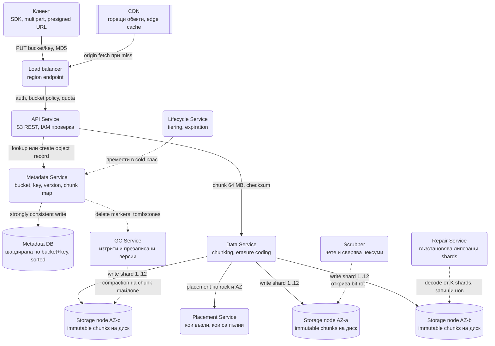
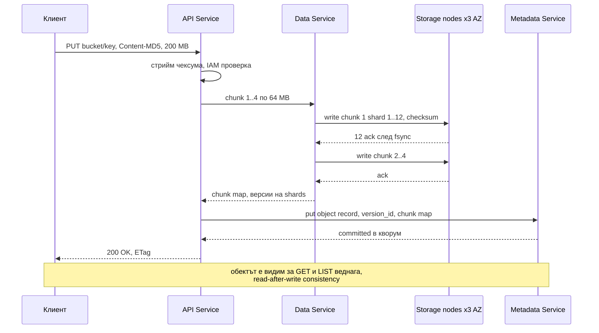
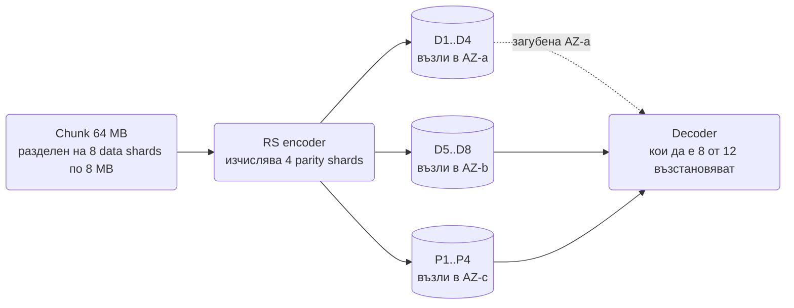

# Обектно хранилище (S3 тип) - System Design

Видео платформата качва в него сурови файлове, Dropbox пази в него блокове, Kafka му дава старите си
сегменти, а всяка друга система го ползва за архив. Обектното хранилище е най-долният слой на почти
всичко и затова изискванията му са екстремни по различен начин от останалите системи: **не
латентност, а трайност.** Обещанието на S3 е 99.999999999% (11 деветки) годишна трайност, тоест
при 10 милиона обекта се очаква да загубиш един на 10 000 години. Целият дизайн е подчинен на това
число.

Второто, което определя формата: обектите са **неизменяеми**. Няма частичен запис, няма append.
Качваш цял обект, четеш цял обект или диапазон, изтриваш. Тази липса на функционалност е причината
хранилището да може да е плоско, репликирано и евтино.

## Архитектурна диаграма



**Как да четеш диаграмата:** заявката минава през API слоя и се разделя на два свята. Metadata
Service пази **какво** съществува (bucket, ключ, версия, къде са парчетата) в силно консистентна
шардирана база. Data Service пази **байтовете**: реже обекта на парчета, кодира ги и ги разпръсква
по storage възли в различни зони по указание на Placement Service. Пунктираните процеси долу са
фоновият живот на хранилището, без който трайността е само число на слайд: scrubbing срещу тихи
грешки на диска, repair на загубени парчета, GC на изтритото и lifecycle между класове на съхранение.

## Системен дизайн накратко

Два свята: Metadata Service (какво съществува, силно консистентно, малки заявки, истинското гърло) и Data Service (байтовете, immutable парчета, erasure coded по зони). 8 сървиса плюс стотици storage възли; четири от сървисите са фонови и без тях 11-те деветки трайност са само число.

### Сървиси

| # | Сървис | Какво прави | Как комуникира |
| --- | --- | --- | --- |
| 1 | **API Service** | S3 REST, IAM и bucket policy, quota, чексума в движение | HTTPS от SDK или presigned URL; вика Metadata и Data |
| 2 | **Metadata Service** | bucket, key, version, chunk map; LIST като range scan по сортиран ключ; read-after-write | Силно консистентен запис в шардирана Metadata DB (кворум) |
| 3 | **Data Service** | Реже на 64 MB парчета, чексума на парче, erasure coding 8+4, пише shards по възли | Пита Placement; паралелни записи към storage възли, чака всички ack |
| 4 | **Placement Service** | Кои възли, в кои rack-ове и зони; обратна карта shard → chunk; кой е пълен | Викан от Data; health от възлите |
| 5 | **Storage nodes** (около 400) | Immutable chunks на локален диск с `fsync`; малки обекти пакетирани в extents (Haystack) | RPC от Data Service; фонови четения от Scrubber и Repair |
| 6 | **Scrubber** | Чете всички парчета на цикли от седмици и сверява чексуми (bit rot) | Фонов, с лимит на пропускливостта |
| 7 | **Repair Service** | Възстановява загубени shards от K останали, паралелно по стотици възли за часове | Фонов; чете Placement за какво е било на падналия диск |
| 8 | **GC Service** | Трие парчета без референции (изтрити и презаписани версии), компактира extents | Фонов, отложен с дни; чете tombstones от Metadata |
| 9 | **Lifecycle Service** | Tiering между класове, expiration, чистене на изоставени multipart uploads | Фонов; обновява `storage_class` и chunk map транзакционно |

### Хранилища

| Компонент | Роля |
| --- | --- |
| Metadata DB (шардирана по bucket+key, сортирана) | `objects`, `chunks`, `uploads`, `nodes`; най-строгите SLO в системата |
| Локални дискове на storage възлите | Immutable chunks и extents, без база |
| CDN | Горещи обекти, origin fetch при miss |

### Комуникация, backpressure и патерни

- **Синхронно:** PUT = байтове първо (всички shards ack-нати), после метаданни; 200 чак след commit в кворум. GET = метаданни → 8 от 12 shards.
- **Асинхронно:** scrubbing, repair, GC, lifecycle, прекодиране от репликация към erasure coding.
- **Backpressure:** фоновите процеси работят с лимит на пропускливостта, за да не изядат I/O на горещите заявки; hot префикс се решава с ентропия в ключа или разделяне на шарда; горещ обект се обслужва от CDN и динамични реплики, не от 12-те възела.
- **Патерни:** metadata/data разделение, immutable content-addressed chunks, erasure coding (Reed-Solomon) срещу репликация, landing зона с репликация + фонов преход към EC, чексуми на всяко ниво, versioning с delete markers, reference counting + отложен GC, multipart upload, плоско пространство с префикс listing, storage classes.

## Описание на архитектурата стъпка по стъпка

### 1. Плоско пространство от имена

- Има bucket и ключ. **Няма директории.** `photos/2024/img.jpg` е един низ, а `/` е символ като всеки
  друг. "Папката" `photos/2024/` е илюзия на UI-а, получена от `LIST prefix=photos/2024/ delimiter=/`.
- Затова listing изисква **подредена** метаданна структура: ключовете в един bucket са сортирани и
  listing по префикс е range scan. Именно това правеше старият S3 eventually consistent за LIST:
  индексът се обновяваше асинхронно.
- Ключовете с общ префикс попадат в един шард на метаданните. Милион качвания в `logs/2024-09-30/`
  правят hot partition. Отговорът е префикс с ентропия отпред (hash или обърнат timestamp) или
  разчитане на автоматично разделяне на шарда по натоварване.

### 2. Разделянето, което носи точки: метаданни срещу данни

Същото разделяне, което носи точки при [File Sync](File_Sync_Dropbox_Google_Drive.md), тук е ядрото:

| | Metadata Service | Data Service |
| --- | --- | --- |
| Пази | bucket, key, version_id, size, ETag, потребителски метаданни, списък chunk локации | Неизменяеми парчета байтове |
| Обем | 1 млрд. обекта × ~200 B = 200 GB, стотици GB до TB | Петабайти до екзабайти |
| Консистентност | **Силна**: put-ът е видим веднага след отговора | Няма нужда: парчето е immutable и адресирано по съдържание |
| Заявки | Много, малки, латентно-чувствителни | Малко, големи, throughput |
| База | Шардиран KV/SQL с консенсус или синхронна репликация | Локални дискове на storage възли, без база |

Силната консистентност на четенето (read-after-write) идва оттук: обектът "съществува" в момента, в
който метаданният запис е commit-нат в кворум, и той сочи парчета, които вече са потвърдени от
storage възлите. Редът е строг: **първо байтовете, после метаданните**. Обратният ред би направил
видим обект без данни.

### 3. Пътят на запис

1. API валидира правата и приема потока; изчислява чексума в движение и я сравнява с подадената
   от клиента (`Content-MD5` или `x-amz-checksum-sha256`). Несъвпадение отхвърля целия PUT.
2. Data Service реже обекта на парчета (chunk) с фиксиран размер, например 64 MB, и за всяко
   изчислява собствена чексума, която се пази до парчето.
3. За всяко парче Placement Service връща набор storage възли в **различни стойки и зони**, така че
   загуба на един rack, един switch или една зона не отнема повече от един shard.
4. Възлите записват парчето на диска с `fsync` и отговарят. Data Service чака потвърждение от всички
   (при репликация) или от всички K+M shards (при erasure coding).
5. Metadata Service записва обекта с картата на парчетата в една транзакция. Отговорът `200` с ETag
   се връща **след** този commit. При срив преди стъпка 5 парчетата са безобидни сираци за GC.



### 4. Репликация срещу erasure coding

| | Репликация 3x | Erasure coding 8+4 (Reed-Solomon) |
| --- | --- | --- |
| Overhead на съхранение | 3.0x | 1.5x |
| Издържа загуба на | 2 копия | 4 от 12 shards, тоест цяла зона плюс един възел |
| Четене | От едно копие, най-близкото | Събиране на 8 shards от 8 възела, повече мрежови обиколки |
| Repair на загубен shard | Копиране на 64 MB | Четене на 8 × 64 MB и декодиране: 8x повече трафик и CPU |
| Малки обекти | Естествено | Неефективно: 1 KB обект в 12 shards е абсурд, затова малките се пакетират първо |
| Кога | Горещи и малки обекти, метаданни | Всичко голямо и топло/студено, тоест по-голямата част от петабайтите |

Практиката: обектите влизат с репликация в "landing" слой за бърз ack и ниска латентност, а фонов
процес ги пакетира и прекодира в erasure coded stripes. Така потребителят вижда бърз PUT, а
хранилището плаща 1.5x вместо 3x.



### 5. Трайност: чексуми, scrubbing, repair

Единадесет деветки не идват от репликацията сама. Дисковете лъжат тихо (bit rot, сгрешени сектори,
firmware бъгове), а мрежата обръща битове. Затова:

- **Чексума на всяко ниво:** клиент → API (MD5/SHA-256 на целия обект), API → storage (CRC на всяко
  парче), парчето на диска носи чексумата си. Всяко четене сверява; несъвпадение означава четене от
  друг shard и заявка за repair, никога връщане на съмнителни байтове.
- **Scrubbing:** фонов процес чете **всички** парчета на цикли от седмици и сверява чексумите, за да
  открие грешки в данни, които никой не чете. Без него студените данни изгниват незабелязано, докато
  не стане късно за repair.
- **Repair:** при паднал диск или възел системата знае кои shards са били там (Placement държи
  обратната карта) и ги възстановява на нови възли от останалите. Ключовото число е **времето за
  repair**: трайността зависи от вероятността да загубиш M+1 shards **преди** първият да е
  възстановен. Repair на паднал 20 TB диск трябва да е часове, не дни, и се разпределя по стотици
  възли паралелно, не от една реплика.
- **Разпръскване:** shards на един обект никога в един rack, никога зад един switch, при
  възможност в три зони. Корелираните откази (спиране на ток в зала) са това, което убива трайността,
  не независимите откази на дискове.

### 6. Малки обекти: проблемът Haystack

Обектното хранилище е проектирано за мегабайти, а реалният трафик са милиарди thumbnail-и от 20 KB.
Всеки такъв обект като отделен файл на диска е inode, метаданни във файловата система и случайно
четене. Решението (Facebook Haystack, същото прави S3 вътрешно):

- Много малки обекти се **пакетират в един голям файл** (extent, обикновено 1-4 GB), append-only.
- Индекс в паметта (или в метаданните) пази `(object_id) → (extent, offset, size)`.
- Четенето е едно позиционирано четене от диска без обхождане на файлова система.
- Изтриване е маркер в индекса; extent-ът се компактира, когато мъртвите байтове надхвърлят праг.

Това е същият append-only + compaction модел като LSM дървото в [KV Store](Distributed_Key_Value_Store.md).

### 7. Големи обекти: multipart upload

Обект от 50 GB не се качва в една HTTP заявка. Multipart:

1. `CreateMultipartUpload` връща `upload_id`.
2. Клиентът качва части (5 MB до 5 GB) **паралелно и в произволен ред**, всяка с ETag.
3. `CompleteMultipartUpload` с списъка ETag-ове сглобява обекта чрез запис в метаданните, без да
   копира байтове.
4. Прекъснат upload се продължава от липсващите части; изоставен upload се чисти от lifecycle правило
   след N дни, иначе е тих разход.

Клиентите на [Video Platform](Video_platform_like_Udemy.md) и [File Sync](File_Sync_Dropbox_Google_Drive.md)
качват точно така, с presigned URL за всяка част, без байтовете да минават през приложните сървъри.

### 8. Версии, изтриване, GC

- **Versioning:** PUT върху съществуващ ключ не презаписва, а създава нова версия; старата остава
  адресируема по `version_id`. Метаданните са списък версии на ключ, парчетата на старите версии не
  се пипат.
- **DELETE** при включен versioning е **delete marker**: нова "версия", която казва "няма обект".
  GET без версия връща 404, GET с версия работи. Това е защитата от случайно изтриване и основата
  на "restore".
- **GC:** парче се трие чак когато никоя версия на никой обект не го сочи (reference count или
  периодично mark-and-sweep върху метаданните). Триенето е отложено с дни: първо tombstone, после
  реално освобождаване, за да могат забавени операции и репликация да се уталожат. Точно като
  `gc_grace_period` при [KV Store](Distributed_Key_Value_Store.md).

### 9. Класове на съхранение и lifecycle

| Клас | Достъп | Цена на съхранение | Как е реализиран |
| --- | --- | --- | --- |
| Hot (Standard) | Милисекунди, често | Най-висока | SSD/HDD, репликация или EC с бърз достъп |
| Warm (Infrequent Access) | Милисекунди, рядко | По-ниска, такса за четене | Същите възли, по-агресивен EC, по-малко кеш |
| Cold (Glacier Instant) | Милисекунди, много рядко | Ниска | Плътни HDD, висок EC overhead ratio |
| Archive (Deep Archive) | Часове за restore | Най-ниска | Лента или спрени дискове; данните се "размразяват" в hot слой при заявка |

Lifecycle правилата ("след 30 дни премести в IA, след 365 в Glacier, след 7 години изтрий") се
изпълняват от фонов процес, който обхожда метаданните и мести парчетата между слоеве, като обновява
chunk map-а. Обектът не сменя ключ и URL, само `storage_class` в метаданните.

### 10. Горещи обекти и CDN

Хранилището скалира по обем, не по QPS за един ключ. Обект, четен 100 000 пъти в секунда (популярен
видео сегмент), удря едни и същи 12 възела. Решението е отпред: CDN с origin в хранилището, а вътре
- допълнителни реплики на горещите парчета, създадени динамично по статистика за достъп. Затова
[Video Platform](Video_platform_like_Udemy.md) никога не сервира сегменти директно от bucket-а.

## Оразмеряване (Back-of-the-envelope)

Допускане: **100 PB** полезни данни, **1 млрд. обекта**, среден размер 100 KB (силно изкривено: 90%
от обектите под 1 MB, 90% от байтовете в обекти над 100 MB), входящ трафик 10 GB/s.

| Метрика | Изчисление | Резултат |
| --- | --- | --- |
| Сурово съхранение с EC 8+4 | 100 PB × 1.5 | 150 PB |
| Storage възли | 150 PB / (24 диска × 20 TB = 480 TB на възел) | ≈ 315 възли, с резерв за repair ≈ 400 |
| Метаданни | 1G × ~200 B | ≈ 200 GB, шардирани на ~20 възела с кворумна репликация |
| Метаданни QPS | 10 GB/s / 100 KB ≈ 100k PUT/s + четения ×10 | ≈ 1M ops/s върху метаданните, това е истинското гърло |
| Входящ трафик по мрежата | 10 GB/s × 1.5 EC | 15 GB/s към storage възли, ≈ 40 MB/s на възел, тривиално |
| Scrubbing цикъл | 150 PB / (400 възли × 100 MB/s фонов лимит) | ≈ 43 дни за пълен цикъл |
| Repair на паднал възел | 480 TB / (300 възли × 50 MB/s паралелно) | ≈ 9 часа, приемливо; от една реплика би било 55 дни |

Двата извода: **метаданните, не байтовете, са трудната част при милиарди обекти**, и **времето за
repair е параметърът, който определя трайността**, а не броят копия сам по себе си.

## API

```text
PUT    /{bucket}/{key}                     body, Content-MD5, x-amz-meta-*    → 200, ETag, version_id
GET    /{bucket}/{key}?versionId=          Range: bytes=0-1048575              → 200 | 206 | 404
DELETE /{bucket}/{key}                                                         → 204, delete marker при versioning
GET    /{bucket}?prefix=photos/2024/&delimiter=/&continuation-token=           → keys[], common_prefixes[]
POST   /{bucket}/{key}?uploads                                                 → upload_id
PUT    /{bucket}/{key}?partNumber=3&uploadId=                                  → ETag на частта
POST   /{bucket}/{key}?uploadId=          { parts: [ETag...] }                 → 200, ETag на обекта
GET    presigned URL: /{bucket}/{key}?X-Amz-Signature=...&X-Amz-Expires=900   → директен достъп без credentials
```

| Таблица (метаданни) | Ключ | Съдържание |
| --- | --- | --- |
| `buckets` | `bucket_name` | owner, region, versioning, policy, lifecycle rules |
| `objects` | `(bucket, key, version_id DESC)` | size, etag, content_type, storage_class, user metadata, `is_delete_marker`, `chunk_ids[]` |
| `chunks` | `chunk_id` | checksum, size, EC schema, `shard_locations[]` (node, disk, extent, offset) |
| `uploads` | `upload_id` | bucket, key, parts[] с ETag и chunk_id, created_at |
| `nodes` (Placement) | `node_id` | rack, AZ, capacity, free, health, обратна карта shard → chunk |

Сортирането по `(bucket, key)` е това, което прави `LIST prefix=` range scan, а `version_id DESC`
поставя текущата версия първа.

## Ключови въпроси за интервюто

### Как се емулират директории?

Не се емулират в хранилището, а в клиента: listing с `prefix` и `delimiter` връща ключовете под
префикса и "общите префикси" (следващото ниво). Метаданните са сортиран индекс, така че това е range
scan. "Преименуване на папка" е копиране и изтриване на всеки ключ, защото няма папка за преименуване;
затова се избягва в дизайна на приложенията.

### Как работи versioning и защо е евтин?

Всеки PUT създава нов метаданен запис с нов `version_id`; парчетата на старата версия не се пипат.
Изтриване е delete marker. Цената е само метаданни плюс парчетата, които реално се различават. GC
трие парче чак когато никоя версия не го сочи.

### Защо парчетата са неизменяеми?

Защото неизменяемото може да се репликира, кешира, кодира и сверява без координация: няма "коя е
последната версия на този байт", няма локове, чексумата е валидна завинаги. Промяна на обект е нов
обект. Всичко трудно се премества в метаданните, които са малки.

### Как гарантирате 11 деветки трайност?

Разпръскване на shards по зони и стойки, за да няма корелирани откази; erasure coding, който издържа
загуба на M shards; чексуми на всяко четене и scrubbing на всичко периодично; бърз паралелен repair,
защото трайността е функция на времето между загубата на първия и последния shard. Числото се смята
от MTBF на дисковете, времето за repair и броя толерирани откази, и се проверява с реални данни за
отказите.

### Репликация или erasure coding?

Репликация за малки, горещи и латентно-чувствителни обекти и за метаданните: просто четене от едно
копие, евтин repair. Erasure coding за големите и топлите/студените: половината съхранение при
по-висока издръжливост, с цена в CPU, мрежови обиколки при четене и 8x по-скъп repair. Реалните
системи правят и двете: landing зона с репликация и фонов преход към EC.

### Как скалира LIST по префикс?

Метаданните са сортирани по ключ и шардирани по диапазони; listing е range scan в един или няколко
съседни шарда с continuation token. Проблемът е hot префикс при запис (всички ключове на деня в един
диапазон), решаван с ентропия в началото на ключа или с автоматично разделяне на шарда. LIST е
най-скъпата операция и приложението не бива да го ползва за "има ли обект" - за това е HEAD.

### Как се мести обект между класове на съхранение?

Lifecycle процесът чете правилата на bucket-а, намира обектите по възраст, прекодира или премества
парчетата към възлите на новия клас и обновява `storage_class` и `chunk_ids` в метаданните
транзакционно. Ключът, URL-ът и ETag-ът не се променят. За archive класа четенето става "заявка за
restore", която копира парчетата обратно в hot слой за ограничено време.

### Какво става, ако Metadata Service падне?

Всичко спира: без метаданни няма PUT, GET и LIST, независимо че байтовете са на място. Затова
метаданните са с кворумна репликация в няколко зони, шардирани, с най-строгите SLO-та в системата, а
данните се оразмеряват за throughput. Това е и отговорът на "кое е тясното място": не дисковете, а
1 млн. метаданни операции в секунда.
