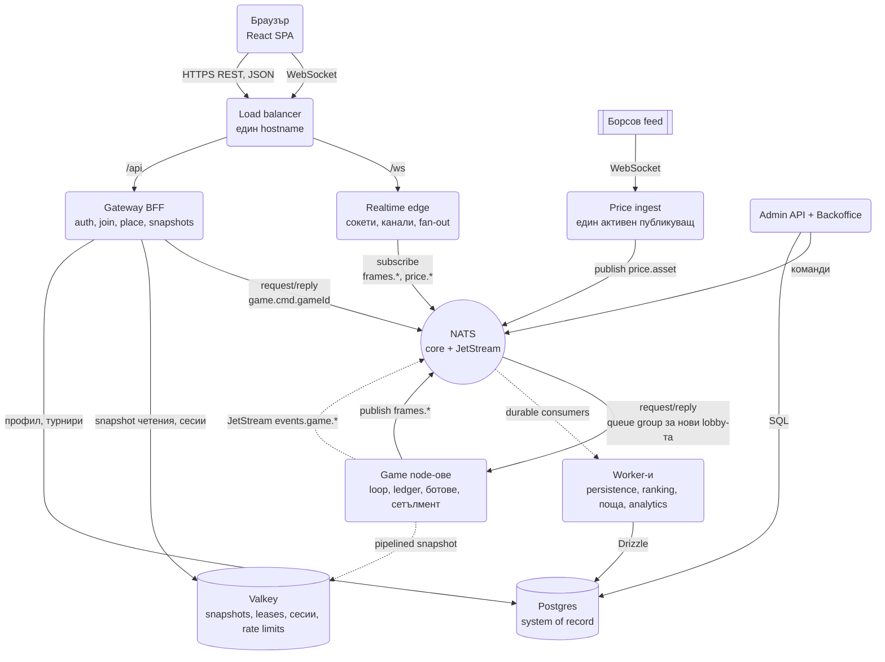
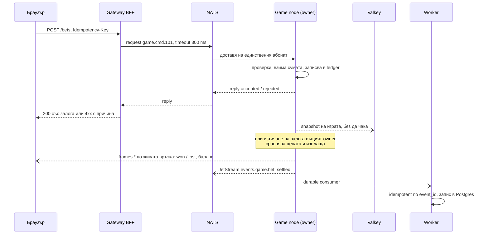
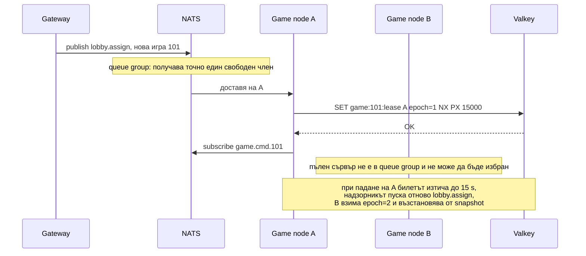

# Online Trading Game: HIGH/LOW игра с цени в реално време - System Design

Играта е проста за играча: залагаш дали цената на актив ще се вдигне или ще падне (HIGH/LOW), в
реално време и с истински борсови цени. Има малки cash игри с пет места и турнирни рундове до 10 000
играчи. Дизайнът е прост по форма: входни сървъри, които не пазят нищо, сървъри, които въртят игрите,
една вътрешна "телефонна централа", през която всички си говорят, и фонови работници, които записват
резултатите. Това е единствената система в папката, която е проектирана отначало като реален продукт,
а не като интервю упражнение, затова решенията ѝ са конкретни: Node/TypeScript, NATS, Valkey, Postgres.

Трите правила, от които произтича всичко останало:

1. **Всяка игра има един стопанин.** Един сървър върти играта и държи парите в нея. Никой друг не
   пипа жива игра.
2. **Към играча: бързо "да" или бързо "не".** Залог не се слага на опашка. Опашки има само за
   работа след факта: запис, класиране, поща.
3. **Всяко число се смята веднъж.** Баланс, класация, серии се изчисляват на едно място и всички
   останали четат готовия резултат.

## Архитектурна диаграма

**Как да четеш диаграмата:** отляво е пътят на играча: една жива WebSocket връзка към Realtime edge
за новините и REST заявки към Gateway за действията. В средата е NATS, единствената "телефонна
централа", през която всички сървиси си говорят. Отдясно влизат цените от борсата и админ командите.
Долу са двете хранилища: Valkey за бързи снимки и билети за собственост, Postgres за всичко, което
трябва да се пази завинаги. Плътните линии са заявки и разпращане на живо, пунктираните са фонова
работа, която играта не чака.

| Кутия | Какво прави |
| --- | --- |
| Браузър | Приложението, в което играе играчът. |
| Load balancer | Единствената входна врата. Праща заявките към Gateway, а живите връзки към Realtime edge. |
| Gateway BFF | Приема действията на играча: вход, влизане в игра, залог. Сам не решава нищо, а ги препраща. |
| Realtime edge | Държи отворените връзки с браузърите и им праща новини на живо: цени, резултати, класация. |
| NATS | Вътрешната "телефонна централа". Всички сървиси си говорят само през нея. |
| Game node | Сървърът, който върти играта и държи парите в нея. Много такива, всеки със свои игри. |
| Price ingest | Чете цените от борсата и ги разпраща на всички, които ги следят. |
| Worker-и | Фонова работа след факта: запис в базата, класиране, имейли, анализи. |
| Valkey | Бърза споделена памет: снимки на игрите, билети за собственост, сесии, броячи за rate limit. |
| Postgres | Основната база. Тук остава всичко, което трябва да се пази завинаги. |

## Системен дизайн накратко

6 сървиса, един bus и две хранилища. Stateless отпред (Gateway BFF и Realtime edge), stateful в средата (Game node-ове, всяка игра с точно един owner), фонови worker-и отзад. NATS е единственият начин сървисите да си говорят: request/reply вместо gRPC, publish за живите фреймове, JetStream вместо отделна job библиотека.

### Сървиси

| # | Сървис | Какво прави | Как комуникира |
| --- | --- | --- | --- |
| 1 | **Gateway BFF** | Auth, join, залог с `Idempotency-Key`, snapshot четения, rate limits; сам не решава нищо | HTTPS REST (JSON, валидиран с Zod) от браузъра; NATS request по subject `game.cmd.<gameId>` с timeout 300 ms (синхронно, чака reply); Valkey RESP за сесии, snapshots и rate limit броячи; SQL (Drizzle) към Postgres за профил и турнири |
| 2 | **Realtime edge** (2-4 процеса) | Държи WebSocket връзките, канали, fan-out на цени, резултати и класация; coalescing за бавни клиенти | WebSocket от браузъра през load balancer; NATS core subscribe на `frames.<gameId>` и `price.<asset>` (push от NATS, at-most-once); не пише никъде |
| 3 | **Game node-ове** | Owner на игри: loop, ledger в паметта, залози, сетълмент, ботове в процеса, дялове и координатор на турнир | NATS subscribe на `game.cmd.<gameId>` (единствен абонат) и reply на всяка команда; NATS queue group `lobby.assign` за нови игри; NATS publish `frames.<gameId>` (fire-and-forget); JetStream publish `events.game.*` с ack (durable); Valkey `SET NX PX` lease с epoch и pipelined `SET` на snapshot (асинхронно спрямо отговора) |
| 4 | **Price ingest** (active-passive) | Чете борсовия feed и го публикува веднъж | WebSocket клиент към борсовия feed; NATS publish `price.<asset>` на 250 ms (fire-and-forget); Valkey lease, за да публикува само едно копие |
| 5 | **Worker-и** | Persistence, ranking, поща, analytics; надзорник за изтекли lease-ове | JetStream durable consumers (pull, ack след обработка, retry и DLQ от JetStream); идемпотентни по `event_id`; SQL (Drizzle) към Postgres; надзорникът чете lease ключовете във Valkey и публикува `lobby.assign` за поемане |
| 6 | **Admin API + Backoffice** | Команди към игрите, справки | HTTPS от backoffice UI; NATS request към `game.cmd.<gameId>` за команди; SQL към Postgres за справки |

### Хранилища

| Компонент | Роля |
| --- | --- |
| NATS (core + JetStream) | Request/reply, pub/sub на живо, durable събития с ack, retry и DLQ |
| Valkey | Snapshots за takeover и презареждане, leases с epoch, сесии, rate limits |
| Postgres | System of record: профили, турнири, резултати, история на ledger-а |

### Комуникация, backpressure и патерни

- **Синхронно:** HTTPS REST клиент → Gateway; NATS request/reply Gateway → owner (300 ms, рутиране по subject, no responders при липса на owner). По пътя на играча нарочно няма опашка.
- **Асинхронно:** `frames.*` и `price.*` при at-most-once (resync при reconnect, не replay); JetStream `events.game.*` при at-least-once към worker-ите; snapshot, без да чака.
- **Backpressure:** бърз отказ към играча (503 след 1 s); пълен node сваля ръка от queue group-а; coalescible срещу mandatory фреймове и затваряне с "resync" при лимит; JetStream consumer lag като сигнал за autoscale; измерван crash window на snapshot-а.
- **Патерни:** single owner per game с ledger в паметта (без distributed locks по парите), lease + fencing epoch срещу split brain, subject-based routing вместо service registry, queue group за placement без диспечер, resync вместо replay, compute once at the owner, sharded round (coordinator + N shards, merge на подредени списъци), идемпотентност по клиентски ключ и `event_id`.

### Flow: сценариите стъпка по стъпка

Пътят на един залог е описан стъпка по стъпка в следващата секция, затова тук са трите други сценария, които интервюиращият пита.

**Нова игра и нейният стопанин.** Пет играчи чакат в lobby-то и Gateway-ът решава, че трябва нова cash игра 101. Не пита регистър "кой сървър има място"; публикува съобщение "нова игра 101" на NATS subject `lobby.assign`. На този subject слушат като queue group всички game node-ове, които в момента имат свободни места и не са бавни: NATS дава съобщението на точно един от тях, на случаен принцип, да кажем A (пълният node B не е член на групата в момента и не може да бъде избран, така че разпределението отчита натоварването без диспечер). A опитва `SET game:101:lease A epoch=1 NX PX 15000` във Valkey: "запиши, само ако ключът не съществува". Успява. Ако по някаква причина (повторна доставка, мрежов проблем) и B беше решил, че играта е негова, `SET NX` е последният съдия и вторият се отказва, без да пипне нищо. A се абонира за `game.cmd.101` и пуска играта в паметта си: местата, балансите, ботовете за празните места (обикновени обекти в процеса, не отделна услуга). Оттук нататък Gateway-ът "звъни" на номера `game.cmd.101` и NATS доставя на единствения абонат. A подновява lease-а на всеки 5 секунди. Всяка промяна в играта се записва като snapshot във Valkey с pipeline, без отговорът към играча да я чака.

**Game node пада по средата на игра.** A спира да отговаря (срив, или мрежов проблем, или GC пауза от 20 секунди). След 15 секунди lease-ът `game:101:lease` изтича сам. Надзорникът (един процес в worker-ите, също с lease, за да е един) забелязва изтеклия ключ и публикува "игра 101, поемане" на `lobby.assign`. Този път я получава B. B взима lease с epoch=2, прочита последния snapshot от Valkey (включително отворените залози), възстановява играта в паметта си и се абонира за `game.cmd.101`. Залозите, чието време е изтекло през тези 15 секунди, приключва по историята на цените; ако не може, ги анулира и връща парите. Gateway-ът не е забелязал нищо: звъни на същия номер и сега вдига B. Играчите за кратко са получили "опитай отново" (503 след 1 секунда без отговор, защото залог на цена отпреди 5 секунди е различен залог), но нищо не е загубено отвъд милисекундите между последната промяна и последния snapshot (crash window, който се мери). Ако A се "събуди" и опита да запише snapshot или да публикува резултат, всяко негово съобщение носи epoch=1, а текущият е 2: отхвърля се (fencing). Освен това A, щом види, че не е успял да поднови lease-а си, сам спира играта, без да чака да го спрат. Това е защитата срещу split brain, при който два стопанина изплащат едни и същи пари два пъти.

**Играчът презарежда страницата.** Интернетът на играча прекъсва за 10 секунди и браузърът презарежда. Няма sticky session: той се свързва по WebSocket към който и да е Realtime edge, защото edge-овете не пазят нищо за играча. Браузърът пита `GET /api/games/101/state`; Gateway-ът чете snapshot-а на игра 101 директно от Valkey и го връща, без да безпокои game node-а (той е най-натовареното място: ако след кратък срив 10 000 души презаредят едновременно и всички питат него, това ще забави самата игра; Valkey понася такива четения лесно). Клиентът заменя старата си картина с новата и продължава да слуша `frames.101` по живата връзка. Пропуснатите междинни цени и позиции в класацията нямат значение, защото картината е текуща; важните неща (баланс, спечелен или загубен залог) са вътре в нея. Това е resync, не replay: не пазим опашка от пропуснати съобщения за всеки играч, фреймовете са at-most-once и клиентът разпознава и пропуска вече видените по ID на залога и статуса. Снимката може да изостава с милисекунди, но веднага след нея по живата връзка идват най-новите фреймове. Ако същият играч е с много бавна връзка, edge-ът сгъва coalescible фреймовете (цена, класация: важи само най-новото), но mandatory фреймовете ("залогът е приет", "спечели") задължително стигат; ако и те се натрупат над лимит, edge-ът затваря връзката с код "синхронизирай се" и клиентът минава през същия resync.

## Пример от край до край: какво става, когато играч натисне HIGH

1. Браузърът праща заявката с уникален номер на действието (idempotency key). Ако заявката се
   повтори, защото интернетът е прекъснал, сървърът разпознава номера и не слага залога втори път.
2. Gateway-ът я препраща през NATS директно към сървъра, който държи тази игра, и чака отговор до
   300 милисекунди.
3. Сървърът на играта проверява всичко (има ли баланс, върви ли играта, минало ли е времето между
   два залога), взима сумата и записва залога в паметта си. Отговаря "прието" или "отказано,
   защото...".
4. Играчът вижда залога веднага, от самия отговор. Във фонов режим сървърът записва снимка на
   играта във Valkey.
5. Когато времето на залога изтече, **същият** сървър сравнява цената, изплаща печалбата и праща
   "спечели" или "загуби" по живата връзка.
6. Накрая пуска съобщение "залогът е приключен" към фоновите работници, които го записват в
   Postgres. Играта не ги чака.

## Как са подредени игрите по сървърите

Сървърите за игри не държат играчи, а **игри**. Играчът е част от играта, в която седи в момента.

| Game node | Какво държи |
| --- | --- |
| A | Игра 101 (cash, 4 играчи + 1 бот, `game.cmd.101`), игра 102 (cash, 5 играчи, `game.cmd.102`), рунд R7 дял 1 (1 800 играчи, `game.cmd.R7.1`) |
| B | Игра 103 (cash, 2 играчи + 3 бота, `game.cmd.103`), рунд R7 дял 2 (1 800 играчи, `game.cmd.R7.2`) |
| C | Рунд R7 координатор (етапи на рунда, обща класация, `game.cmd.R7`), игра 104 (cash, 5 играчи, `game.cmd.104`) |

Всяка игра има свой "телефонен номер" в NATS. Сървърът държи в паметта всичко за нея: местата,
играчите и ботовете в тях, балансите, отворените залози, класацията. Когато играта свърши,
резултатите отиват в Postgres и играта изчезва от паметта. Турнирният рунд R7 с 3 600 играчи е
разделен на два дяла (на A и B) и координатор (на C). Трите са обикновени игри за сървърите, които
ги държат.

### Как работи номерът на играта

1. Когато сървър A поеме игра 101, той казва на NATS: "искам да получавам всичко, което идва на
   `game.cmd.101`". Това е абонамент (subscribe). NATS пази таблица кой номер към коя връзка води.
2. Gateway-ът знае номера от самата заявка, защото браузърът праща "залог в игра 101". Gateway-ът
   проверява сесията и дали играчът е в тази игра, след което праща командата на `game.cmd.101`.
   NATS я доставя на единствения абонат, сървър A.
3. Ако играта се премести на друг сървър, старият се отписва, а новият се абонира. Gateway-ът
   продължава да звъни на същия номер и не разбира, че нещо се е сменило. Не е и нужно да разбира.
4. При голям турнир номерът съдържа и дяла, например `game.cmd.R7.2`. Gateway-ът изчислява дяла от
   ID-то на играча по формула (hash), така че знае на кой номер да звъни, без да пита никого.

Без този механизъм Gateway-ът трябва да пази или да пита регистър от вида "игра 101 е на сървър
10.0.3.17". Такъв регистър трябва да се обновява при всяко преместване, а остарелите записи в него
водят до залози, пратени към грешния сървър.

### Как една игра попада на точно един сървър

Пример: има два сървъра, A и B, и двата със свободни места.

1. Трябва нова игра. Gateway-ът пуска съобщение "нова игра 101" на общ адрес, `lobby.assign`.
2. На този адрес слушат като група всички сървъри, които имат свободни места (queue group). NATS
   дава всяко съобщение на точно един член на групата, избран на случаен принцип. Да кажем, че е A.
3. A опитва да вземе билета във Valkey с команда "запиши `game:101:lease = A, №1`, само ако ключът
   не съществува" (`SET NX`). Успява.
4. A се абонира за `game.cmd.101` и пуска играта.

**Защо и двете стъпки.** NATS избира сървъра, а Valkey потвърждава избора. Обикновено NATS дава
съобщението само на един, но в редки случаи (повторна доставка, поемане, мрежов проблем) двама
може да решат, че играта е тяхна. `SET NX` е последният съдия: печели този, който запише пръв.
Вторият вижда, че ключът вече съществува, и се отказва, без да пипне нищо.

**Пълният сървър не участва.** Ако B е пълен, той в момента не е член на групата и NATS изобщо не
може да го избере. Така разпределението отчита натоварването без отделен диспечер.

**Поемането минава по същия път.** Ако A падне, билетът му изтича до 15 секунди. Надзорникът
забелязва това и пуска отново "игра 101, поемане" на `lobby.assign`. Този път я получава B. Той
взима билет №2, възстановява играта от снимката и се абонира за `game.cmd.101`. Gateway-ът продължава
да звъни на същия номер.

## Ключови решения

Всяко решение е обяснено с прости думи, с пример и с фразата, която можеш да кажеш на интервюто.

### 1. Всяка игра има точно един стопанин (single owner per game)

**Какво значи.** Един сървър отговаря изцяло за една игра. Той приема залозите, пази баланса на
всеки играч в нея, решава кой печели, изплаща, управлява ботовете и праща новините на играчите.
Всички тези неща стават в паметта на един процес, едно след друго.

**Пример.** Маса за карти с един крупие, който държи всички чипове. Ако двама крупиета можеха да
вземат чипове от една и съща купчина, щяха постоянно да си звънят: "Взимам 100, не пипай". Стига
едно обаждане да закъснее и едни и същи пари се броят два пъти.

**Защо така.** Когато парите се пипат само от един процес, не може две операции да променят един
баланс едновременно (race condition). Затова не ни трябват "ключалки", които сървърите да си
подават по мрежата (distributed locks), а те са бавни и чупливи. Изчисляването на резултата и
изплащането (settlement) стават в същия процес, който е приел залога. По пътя няма мрежа, в която
нещо да се изгуби или удвои. Сравни с [Ticketmaster](Ticketmaster.md), където инвентарът е споделен
между много процеси и конкуренцията се решава с условен `UPDATE` в базата.

> "Всяка игра има един owner, който държи и ledger-а. Така сетълментът е локален и нямам distributed
> locks по парите."

### 2. Една вътрешна "телефонна централа" вместо HTTP и отделни опашки (NATS core + JetStream)

**Какво значи.** Сървисите не се викат директно един друг по HTTP. Всички говорят през NATS, който
има два режима. Първият е като телефонен разговор: питаш и чакаш отговор, или съобщаваш нещо на
всички, които слушат. Вторият (JetStream) е като препоръчано писмо: съобщението се пази, докато
получателят не потвърди, че го е обработил.

**Пример.** Вътрешните номера в голяма фирма. Не ти трябва списък кой служител в коя стая седи.
Набираш номера "Игра 123" и вдига само този, който отговаря за нея. Ако никой не вдигне, веднага
знаеш, че в момента никой не отговаря за тази игра, без да чакаш.

**Защо така.**

- **Няма нужда от указател.** Всяка игра има свой номер (subject, например `game.cmd.123`).
  Gateway-ът звъни на номера и не пита никого къде е играта (спестява service discovery или
  регистър на собствениците).
- **Бърз сигнал при проблем.** Ако никой не слуша на номера, NATS отговаря веднага "няма кой да
  вдигне" (no responders). Разбираме за проблема за миг, вместо да чакаме таймаут.
- **Един инструмент вместо два.** Режимът "препоръчано писмо" дава това, заради което иначе се слага
  отделна библиотека за опашки като BullMQ: потвърждение за обработка (ack), автоматичен повторен
  опит (retry) и отделяне настрана на съобщение, което се проваля многократно (dead letter queue).
- **Никой не проверява ръчно.** Сървисите не питат базата на всяка секунда "свърши ли вече
  играта?" (polling). Получават съобщение в момента, в който нещо се случи.

**Защо не gRPC за синхронните извиквания.** gRPC е обичайният избор, когато един сървис трябва бързо
да попита друг и да чака отговор. Тук използваме въпрос-отговор през NATS (request/reply). Първо,
една технология по-малко: NATS вече го имаме за разпращане и за опашки. Второ, gRPC вика адрес, NATS
вика номер: с gRPC трябва първо да знаеш, че игра 101 е на сървър A, тоест ти трябва регистър, който
да се обновява при всяко преместване. Цената: няма автоматично генерирани договори между сървисите,
каквито дава gRPC. Компенсираме с общи типове и Zod схеми в общия пакет. Освен това всяко извикване
минава през NATS клъстера, което е една стъпка повече по пътя, обикновено под милисекунда.

**Защо не Kafka.** Kafka е отличен durable лог, но не дава request/reply и е тежка за ниска
латентност по пътя на играча. По пътя на играча нарочно няма опашка. Сравнението е в документа за
[Message Queue](Distributed_Message_Queue_Kafka.md).

> "Един bus за всичко. Синхронните извиквания са NATS request/reply вместо gRPC: не въвеждам нова
> технология и рутирам по subject, така че не ми трябва регистър къде е всяка игра. JetStream ми дава
> durable събития с ack и retry без отделна job библиотека."

### 3. Парите са в паметта на сървъра, Valkey пази само снимка

**Какво значи.** Ledger е главната книга на парите: кой колко има, кои залози са отворени. Тя живее
в паметта (RAM) на сървъра на играта, защото това е най-бързото място. Valkey е бърза споделена
памет, която всички сървъри виждат. След всяка промяна сървърът прави копие на цялата игра и го
записва там. Това копие наричаме снимка (snapshot).

**Пример.** Касиерът води касовата книга на бюрото си, а след всяка операция снима страницата и я
качва в общата папка. Колегите гледат снимката, когато искат да видят състоянието, но не пишат по
нея. Ако касиерът се разболее, заместникът продължава от последната снимка.

**За какво служи снимката.**

- **Първо, за поемане.** Ако сървърът падне, друг сървър продължава играта от снимката (takeover).
- **Второ, за презареждане.** Играчът презарежда страницата или връзката му е прекъснала. Браузърът
  пита `GET /api/games/101/state`. Gateway-ът чете снимката на игра 101 директно от Valkey и я връща.
  Сървърът на играта изобщо не участва. Той е най-натовареното място в системата: ако след кратък
  срив 10 000 играчи презаредят едновременно и всички питат него, това ще забави самата игра. Valkey
  понася такива четения лесно. Снимката може да изостава с милисекунди, но това не пречи: веднага
  след нея по живата връзка идват най-новите съобщения, а клиентът разпознава и пропуска вече
  видените (по ID на залога, рунда и статуса).

**Защо парите не са направо във Valkey.** Тогава правилата за парите трябва да са написани като
малки скриптове, които се изпълняват вътре в базата (Lua скриптове). Такъв код трудно се тества и се
дебъгва. Тук правилата за парите са обикновен TypeScript код, покрит с обикновени тестове. Цената:
снимката може да изостава с няколко милисекунди от истината. Колко точно, мерим (виж точка 5 при
претоварването).

> "Истината е в паметта на owner-а. Valkey държи snapshot за takeover и за четения, не е ledger.
> Money логиката е TypeScript, тестван като чисти функции."

### 4. Никога два сървъра за една игра: билет с пореден номер (lease + epoch, fencing)

**Какво значи.** За да върти игра, сървърът трябва да държи билет за нея във Valkey (lease). Билетът
се взима с команда "запиши, само ако никой друг не го е взел" (`SET NX`), затова може да го има само
един. Той е временен: сървърът трябва да го подновява на всеки 5 секунди, а ако не го поднови,
билетът изтича сам след 15 секунди (TTL). Всеки билет има пореден номер, който расте при всяка смяна
на собственика: 1, 2, 3 (epoch).

**Проблемът, който решава.** Сървър А "замръзва" за 20 секунди, например заради мрежов проблем, но
не знае, че е замръзнал. Билетът му изтича, сървър Б поема играта с билет №2 и продължава. После А
се "събужда" и опитва да запише старото си състояние и да прати стари резултати на играчите. Така
изведнъж има два стопанина на една игра (split brain). При пари това значи двойни изплащания или
изгубен баланс.

**Как го предотвратява.** Всеки запис и всяко съобщение носи номера на билета. Всичко с остарял
номер (№1, когато текущият е №2) се отхвърля. Техниката се казва fencing: старият стопанин буквално
е "отграден". Освен това сървър, който не успее да поднови билета си, сам спира играта веднага, без
да чака да го спрат. Това е практическото приложение на Fencing Token от
[списъка с патерни](System_Design.md) и отговорът на критиката към Redlock.

> "Ownership-ът е lease във Valkey с TTL 15 s. Всеки запис е fenced с epoch, така че zombie owner не
> може да презапише новия. Това ме пази от split brain."

### 5. При прекъсване клиентът взима текущото състояние, а не пропуснатите съобщения (resync, not replay)

**Какво значи.** Интернетът на играча прекъсва за 10 секунди. Има два начина да го върнем в играта.
**Повторение (replay):** сървърът пази всяко пропуснато съобщение и ги праща едно по едно. Така
трябва да пазим опашка за всеки играч, а играчът задължително трябва да се върне на същия сървър,
който я държи (sticky sessions). **Синхронизиране (resync):** играчът пита "какво е състоянието
сега?", получава една свежа картина, заменя старата с нея и продължава да слуша новините. Ние правим
това.

**Пример.** Влизаш на мач в 60-ата минута. Не ти трябва запис на всяко подаване досега. Поглеждаш
таблото с резултата и гледаш нататък.

**Защо така.** Пропуснатите междинни цени и позиции в класацията вече нямат значение, защото
картината е текуща. Важните неща (баланс, спечелен или загубен залог) са вътре в нея. Затова
съобщенията по живата връзка не трябва да се пазят с гаранция (durability). Сървърите за живи връзки
(Realtime edge, не сървърите за игри) не пазят нищо важно за играча (stateless) и той може да се
свърже към който и да е от тях. Това е обратното на решението в
[Chat системата](Chat_system_WhatsApp_Slack%20_Messenger.md), където всяко съобщение има стойност и
клиентът дърпа пропуснатото по `seq_id`.

| | Realtime edge: без състояние | Game node: със състояние |
| --- | --- | --- |
| Какво държи | Само отворените връзки и кой за какво е абониран | Живите игри и парите в тях |
| Копията | Еднакви, взаимозаменяеми | Всяка игра е на точно един сървър |
| При падане | Играчите се свързват към друг edge и взимат снимката | Билетът изтича, друг node поема от снимката |
| Скалиране | Просто с добавяне на още | Точно тук има билет, снимка и поемане |

> "Reconnect е resync от REST snapshot, не replay. Така фреймовете са at-most-once, edge-ът е
> stateless и нямам sticky sessions."

### 6. Ботовете са просто играчи в същия сървър (in-process bots)

**Какво значи.** Бот е играч, чиито решения идват от алгоритъм вместо от кликове. Алгоритъмът е с
предвидима случайност (seeded), така че можем да повторим игра точно както е минала и да намерим
грешка.

**Всеки сървър има свои ботове.** Ботът не е отделна, постоянно съществуваща единица, която се мести
между сървърите. Когато на игра 101 трябва бот за празно място, сървърът, който държи игра 101,
създава бота в паметта си като част от играта. Когато играта свърши, ботът изчезва с нея. Общи за
всички сървъри са само две неща: как играе ботът (алгоритъмът е част от кода) и списъкът с профили
(име, аватар), от който се избира. Сървърите не споделят памет, но и не им трябва: всеки бот
принадлежи на точно една игра, а играта на точно един сървър.

**Защо така.** Да сложиш бота на масата, да залага и да го махнеш е обикновена операция в паметта.
Ако ботовете бяха отделна услуга, щеше да трябва опашка за тях и "ключалки" от типа "този бот зает
ли е", които сървърите да си подават по мрежата.

**Отворен въпрос.** Ако продуктът изисква един и същи бот профил да не седи в две игри едновременно,
за да изглежда като истински играч, това е единственото място, където трябва координация. Решение
без ключалки при всеки залог: всеки сървър при старт взима с билет свой пакет от профили и избира
само от него. Така два сървъра никога не избират един и същ профил.

### 7. Турнир с 10 000 играчи се дели на няколко сървъра (sharded round: coordinator + N shards)

**Какво значи.** Игра с 5 играчи се върти лесно от един сървър. Рунд с 10 000 е твърде много за един
Node процес: на всеки половин секунда трябва да подреди 10 000 резултата и да прати новини на 10 000
души. Node изпълнява кода на една нишка (event loop), така че просто не смогва. Затова рундът се
разделя между 5 и 10 сървъра (shards), всеки отговорен за 1 000 до 2 000 играчи. Кой играч в кой дял
отива, се решава с формула от ID-то му (hash). Всеки дял е пълен стопанин за своите играчи. Един
сървър координатор управлява рунда: старт, край и общата класация.

**Какво е координаторът.** Обикновен game node, със същия код и в същия вид процес. Разликата е
само в ролята, която има за този рунд. Той получава рунда по същия начин като всяка друга игра
(`lobby.assign`, билет, снимка), а ако падне, някой го поема по същия начин. Главен е само за своя
рунд, не за другите сървъри; същият сървър може да държи и обикновени игри или дял от друг рунд.
Координаторът не държи пари: залозите и балансите на играчите са в дяловете. Той държи етапите на
рунда (отброяване, игра, затваряне, край), графика на нивата и общата класация. При малък рунд,
например с 300 играчи, координаторът и единственият дял са един и същ процес. Ако координаторът
падне, дяловете продължават да приемат и приключват залози. До поемането (най-много около 15
секунди) изчакват само общата класация и преминаването към следващ етап.

**Пример.** Изпит с 10 000 кандидати. Всяка зала проверява своите работи и подава на комисията вече
подреден списък. Да слееш 10 подредени списъка е много по-лесно, отколкото да подреждаш 10 000
работи от нулата (виж merge K sorted lists в [алгоритмите](Algorithms_Core_Patterns.md)).

**Защо така.** Всеки сървър прави толкова работа, колкото и при обикновените малки игри, а мащабът
идва от броя сървъри. Координаторът праща само частите от класацията, които наистина са се
променили. Това е най-скъпата част за изграждане, но алтернатива няма: един процес за 10 000 души е
точно мястото, където една монолитна система спира.

### 8. Всяко число се смята на едно място (compute once, at the owner)

**Какво значи.** Баланс, класация, серии от печалби, резултати се изчисляват там, където се
променят данните им, и се записват. Всички останали четат готовото число. Всяка производна таблица
в базата се пише от точно един работник, от точно едно събитие.

**Защо така.** Ако три услуги смятат класацията, всяка по свой начин, рано или късно ще покажат три
различни числа. Освен това всяко събитие има уникален номер. Ако стигне два пъти, вторият път се
пропуска (idempotency), така че повторно пускане на събития е безопасно.

## Какво прави системата, когато работата идва по-бързо, отколкото смогва

Backpressure е начинът, по който системата реагира, когато получава повече работа, отколкото може да
свърши. Възможностите са две: да сложи работата на опашка (тя чака) или да я откаже (изпращачът
разбира веднага). Правилото тук: **към играча отказваме бързо, фоновата работа чака на опашка.** Като
ресторант, в който кухнята е пълна: по-добре е сервитьорът веднага да каже "не можем", отколкото да
вземе поръчката и клиентът да чака час.

| # | Къде | Какво става | Защо така |
| --- | --- | --- | --- |
| 1 | Залог | Gateway-ът чака сървъра на играта до 300 ms. Опитва втори път само ако никой не е отговорил. Най-много след секунда връща "опитай отново" (503) и бутонът пак става активен. | Цената се променя на всеки 250 ms. Залог, изпълнен 5 s по-късно, е на друга цена, тоест е различен залог. По-честно е да кажем "не" веднага. |
| 2 | Нови игри | Сървърите "вдигат ръка" за нови игри (queue group) само докато имат свободни места и не са бавни. Претоварен сървър сваля ръката си и спира да получава нови игри. Игрите, които вече има, продължават. | Не ни трябва централен диспечер (orchestrator), който да следи натоварването на всеки сървър. Всеки решава сам за себе си. |
| 3 | Бавен клиент | Съобщенията са два вида. При първия важи само най-новото: цена, класация, прогрес (coalescible); ако играчът изостава, по-старите се заменят с най-новото. Вторият вид задължително стига: "залогът е приет", "спечели", "загуби", баланс (mandatory). Ако дори те се натрупат над лимит, сървърът затваря връзката с код "синхронизирай се" и клиентът взима текущото състояние. | Един играч с бавна връзка не може да изяде паметта на сървъра и да забави хилядите други, свързани към него. |
| 4 | Фонова работа | Записът в базата, класирането, имейлите и анализите чакат в JetStream, докато работник не ги обработи и потвърди. Ако работниците изостават, опашката расте (consumer lag) и това е сигналът автоматично да пуснем още. | Тази работа може да закъснее с няколко секунди, без никой да забележи. Играта не чака нищо от нея. |
| 5 | Снимката | Записва се във фонов режим, без да задържа отговора към играча. Времето между промяната и снимката е точно това, което бихме изгубили при срив в този момент (crash window). Обикновено е милисекунди и го мерим постоянно. | При турнирите можем да изберем да изчакаме снимката, преди да потвърдим залога: с една малка стъпка по-бавно, но загубата при срив е нула. Това е продуктово решение, не техническо. |

Още една защита: Gateway-ът ограничава колко заявки може да прави един играч (rate limits).
Броячите са общи за всички копия на Gateway, защото стоят във Valkey.

## Всяка връзка с гаранцията, която ѝ трябва

Не даваме повече гаранции, отколкото трябват, защото всяка гаранция струва скорост. Нарочно липсват
две неща: опашка пред сървъра на играта и HTTP между вътрешните сървиси.

| Кой към кого | Как | Какво гарантира | Защо така |
| --- | --- | --- | --- |
| Браузър към Gateway | Обикновени HTTP заявки (REST, проверка с Zod) | Питаш и получаваш отговор | Просто и лесно за дебъгване. Залогът идва потвърден в самия отговор |
| Сървър към браузър | Една постоянна жива връзка (WebSocket) | Може да се изгуби (at-most-once) | При прекъсване клиентът взима текущото състояние |
| Gateway към сървър на игра | Позвъняване на номера на играта (NATS request, `game.cmd.<id>`) | Отговор до 300 ms | Не търсим къде е играта, номерът води право до нея |
| Нова игра към сървър | "Който е свободен, вдига ръка" (queue group `lobby.assign`) | Получава я точно един | Няма нужда от диспечер |
| Игра и цени към сървъри за връзки | Разпращане до всички, които слушат (NATS publish, `frames.*`, `price.*`) | Може да се изгуби | Всеки сървър получава само това, което следят неговите играчи |
| Игра към работници | "Препоръчано писмо" (JetStream `events.game.*`) | Стига поне веднъж, понякога два пъти (at-least-once) | Затова работниците разпознават и пропускат повторенията |
| Работници към Postgres | Транзакции в базата (Drizzle) | Пази се завинаги | Повторен запис на същото ID не променя нищо |

## Оразмеряване (Back-of-the-envelope)

Допускане: **20 000 едновременни играчи** в пик, цени на 250 ms за 20 актива, турнир с 10 000
души, cash игри по 5.

| Метрика | Изчисление | Резултат |
| --- | --- | --- |
| Ценови ъпдейти | 20 актива / 0.25 s | 80 съобщения/сек в NATS, тривиално |
| Fan-out на цени към клиенти | 20 000 × 4/сек за следения актив | ≈ 80 000 фрейма/сек през edge слоя |
| Edge инстанции | 80k фрейма/сек, ~20k връзки, 10k връзки на процес | 2-4 процеса, плюс резерв |
| Залози | 20 000 играчи × 1 залог / 10 s | ≈ 2 000 залога/сек, всеки под 300 ms |
| Турнирен рунд | 10 000 играчи / 1 500 на дял | 7 дяла + 1 координатор |
| Класация на дял | 1 500 записа сортиране на 500 ms | Милисекунди на дял, координаторът слива 7 подредени списъка |
| Snapshot трафик | 2 000 промени/сек × ~20 KB | ≈ 40 MB/s към Valkey, затова pipelined и само при промяна |
| Събития към worker-и | 2 000 залога/сек × 2 събития | ≈ 4 000 събития/сек в JetStream |

Числото за интервюто: **80 000 фрейма в секунда към клиентите срещу 80 ценови съобщения в секунда
на входа.** Скалирането е във fan-out слоя, който е stateless, а не в game node-овете.

## Какво плащаме за тези решения

Добре е сам да ги кажеш, преди да те питат. Показва, че знаеш къде са слабите места.

- **Една игра не може да е по-голяма от това, което един сървър смогва.** Това важи за всяка система
  на Node. Тук го плащаме с деленето на големите рундове, което е най-скъпата част за изграждане.
- **Valkey е най-чувствителната зависимост.** Ако падне, сървърите не могат да подновят билетите си
  и спират игрите. Когато се върне, игрите продължават от снимките. Затова Valkey е в клъстер с
  автоматично превключване (failover).
- **Добавянето на сървъри е лесно, махането не е.** Сървър с живи игри не може просто да се изключи.
  Първо спира да взима нови игри, довършва малките (минути), а турнирния рунд предава на друг сървър
  нарочно (drain). Автоматичното скалиране трябва да изчаква това.
- **Малък риск от загуба при срив.** Снимката изостава с милисекунди. За малките игри това е
  приемливо. За турнирите решава продуктът дали да чакаме снимката.
- **Цените от борсата ги чете само едно копие.** Цената трябва да се публикува веднъж, а не от
  няколко места едновременно. Второто копие стои готово и поема, ако първото падне (active-passive).

## Ключови въпроси за интервюто

### Какво става, ако сървър на игра падне по средата?

До 15 секунди билетът му изтича. Надзорник (работи в един от работниците и е само един, защото държи
ключ във Valkey) забелязва това и дава играта на друг сървър. Новият сървър продължава от последната
снимка, включително отворените залози. Залозите, чието време е изтекло междувременно, приключва по
историята на цените. Ако не може, ги анулира и връща парите.

### Как гарантираш, че залог не се изплаща два пъти?

С три неща. Браузърът дава уникален номер на всеки залог, така че повторена заявка не създава втори.
Само стопанинът на играта изплаща, а при равна цена решава формула от ID-то на залога, така че
повторение дава същия резултат. Фоновите работници пропускат вече видени събития по техния номер.

### Как Gateway-ът намира сървъра на играта?

Не го търси. Сървърът на играта е единственият, който слуша на нейния номер в NATS. Ако никой не
вдигне, значи в момента няма стопанин.

### Защо NATS request/reply, а не gRPC?

NATS вече е в системата за разпращане и опашки, така че не въвеждаме нова технология. Освен това
NATS вика номера на играта, а не адреса на сървър, и затова не ни трябва регистър къде е всяка игра.
Цената е, че няма генерирани договори. Покриваме ги с общи Zod схеми.

### При два свободни сървъра кой поема новата игра?

NATS дава съобщението "нова игра" на един от свободните сървъри, на случаен принцип. Той взима билета
във Valkey със "запиши, само ако няма". Ако по някаква причина и двата опитат, печели първият
записал, а вторият се отказва.

### Защо не Kafka, SQS или BullMQ?

Защото NATS ни покрива и трите нужди с един инструмент: въпрос и отговор, разпращане на живо и опашки
с гаранция. По-малко системи значи по-малко неща за поддръжка и наблюдение. А по пътя на играча
нарочно няма опашка.

### Как скалира частта с живите връзки?

Тези сървъри не пазят нищо за играча, така че просто добавяме още. Всеки получава от NATS само
новините, които следят неговите играчи. Всяко съобщение се подготвя веднъж, в сървъра на играта, и
после само се препраща.

### Идват ли съобщенията в правилния ред?

Да, в рамките на една игра и на един играч. Това е единственият ред, който има значение за клиента.

### Защо сървърите за игри са на обикновени виртуални машини (EC2), а не на Fargate или Lambda?

Защото изключването на сървър с живи игри може да трае дълго, понякога часове за турнирен рунд, а на
EC2 можем да го забавим и да защитим сървъра от изключване, докато има игри. CPU-то е и по-предвидимо.
Lambda отпада, защото стартира бавно при първа заявка, а ние имаме бюджет от 300 ms.

### Къде би се счупила системата първо?

В координатора на голям рунд: сливането на класациите и разпращането на промените всяка половин
секунда е най-тежкият единичен процес. Мерките: пращат се само разликите, класацията се обновява
по-рядко от цените, а при още по-голям рунд координаторът се дели на две нива.

## Речник

| Термин | Едно изречение |
| --- | --- |
| owner | Сървърът, който в момента отговаря изцяло за една игра. |
| ledger | Касовата книга на играта: баланси и отворени залози. |
| settlement | Приключване на залог: сравняване на цената и изплащане. |
| snapshot | Копие на цялата игра във Valkey след всяка промяна. |
| takeover | Друг сървър поема играта от снимката, когато стопанинът падне. |
| lease | Временен билет за собственост върху игра. Трябва да се подновява. |
| epoch / fencing | Поредният номер на билета. Записи със стар номер се отхвърлят. |
| split brain | Два сървъра мислят, че са стопани на една и съща игра. |
| race condition | Две операции променят едно и също нещо едновременно и резултатът зависи от късмета. |
| backpressure | Как системата се пази, когато работата идва по-бързо, отколкото смогва. |
| subject | Телефонният номер на канал в NATS, например на една игра. |
| subscribe | Сървърът казва на NATS "искам съобщенията за този номер". |
| request/reply | Питаш през NATS и чакаш отговор, като при gRPC, но по номер вместо по адрес. |
| placement | Решението на кой сървър да тръгне нова игра. |
| coordinator | Обикновен game node, който за даден рунд държи етапите и общата класация. |
| queue group | Група слушатели, от които само един получава всяко съобщение. |
| JetStream | Режимът "препоръчано писмо" на NATS: съобщенията се пазят до потвърждение. |
| ack / retry / DLQ | Потвърждение за обработка, повторен опит, отделяне на проблемните съобщения. |
| at-most-once | Съобщението стига един път или изобщо не стига. |
| at-least-once | Съобщението стига поне веднъж, понякога повече пъти. |
| idempotency | Повторението на една операция не променя резултата. |
| stateless | Сървърът не пази нищо важно в себе си. Всяко копие е равностойно. |
| sticky sessions | Играчът е задължен да се връща на същия сървър. |
| shard | Дял от голям рунд с част от играчите, на отделен сървър. |
| coalescible / mandatory | Фрейм, при който важи само най-новият, срещу фрейм, който задължително трябва да стигне. |
| event loop | Единствената нишка, на която Node изпълнява кода. Ако е заета, всичко чака. |
| drain | Спокойно изпразване на сървър преди изключване. |
| consumer lag | Колко съобщения чакат необработени в опашката; сигнал за autoscale. |

Ако имаш 20 секунди накрая: всичко идва от едно правило. Всяка жива игра има един стопанин, който
държи и парите ѝ. Така изплащането става на едно място, отказът към играча е бърз, всичко бавно е на
опашка зад играта, а големите турнири се делят на няколко сървъра.
