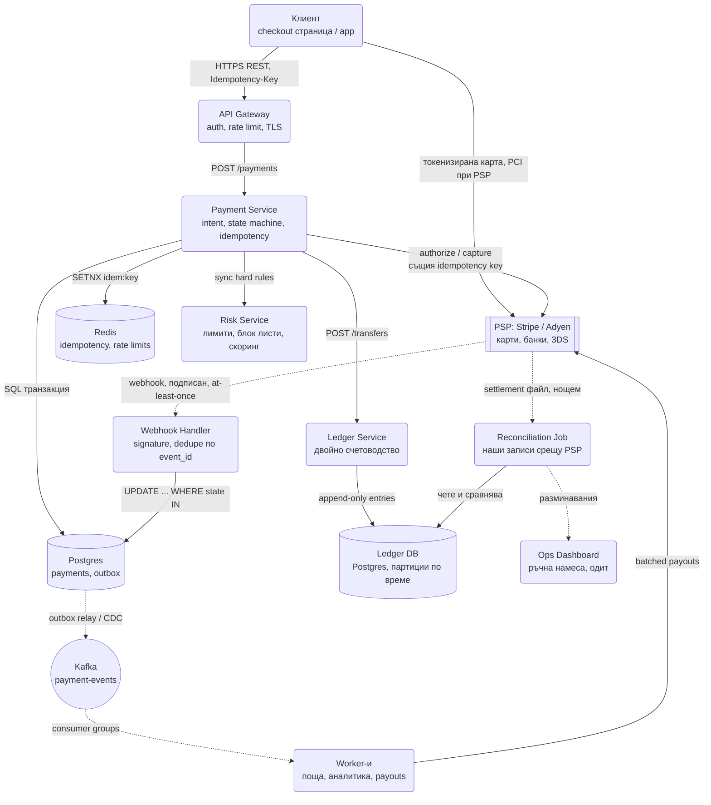
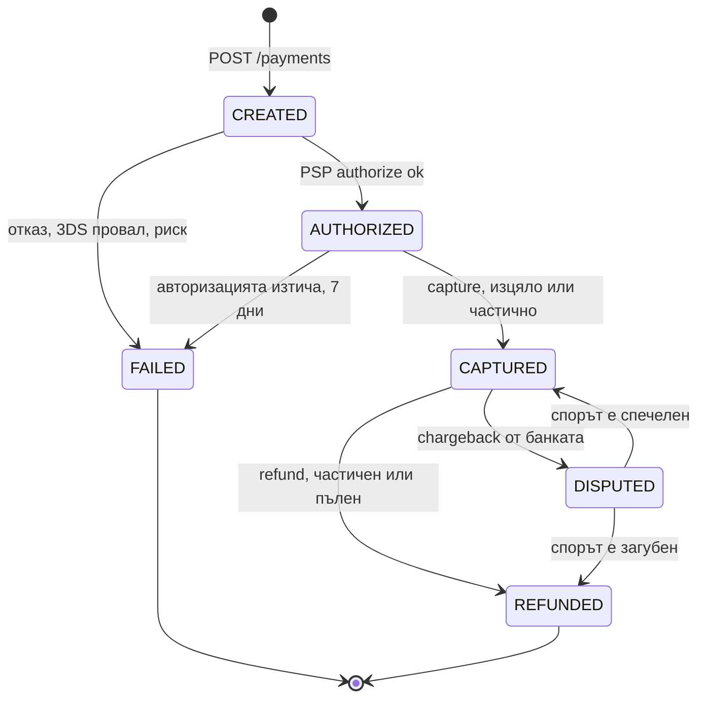
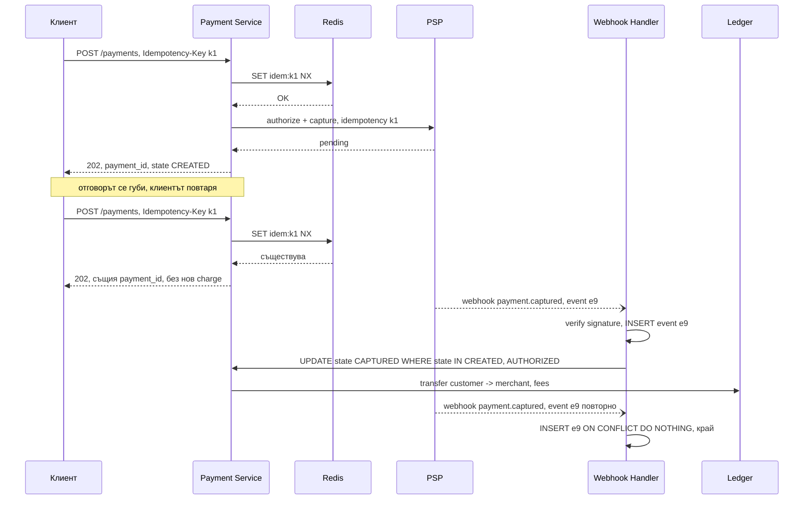

# Платежна система и дигитален портфейл (Stripe / PayPal тип) - System Design

Това е системата, при която интервюиращият не пита "как ще скалира", а "как ще е вярно". Обемът е
смешен в сравнение с чат или feed: милион плащания на ден са 12 транзакции в секунда. Трудното е, че
всяка от тях трябва да се случи **точно веднъж**, да остави следа, която одитор може да провери след
три години, и да остане вярна, докато мрежата губи отговори, доставчикът препраща едно и също
събитие три пъти, а клиентът натиска "Плати" два пъти.

Централните идеи: **идемпотентност от край до край**, **двойно счетоводство вместо "баланс минус
сума"**, и **признание, че exactly-once не съществува**, затова всеки консуматор трябва сам да се
пази от повторения. Картовите данни никога не влизат в нашата система: това не е дизайн решение, а
условието, при което PCI DSS обхватът остава при доставчика.

## Архитектурна диаграма



**Как да четеш диаграмата:** отляво е синхронният път на плащането: клиентът вика нашия API с
idempotency key, Payment Service минава през твърдите правила на риска и праща заявката към PSP със
същия ключ. Картата отива директно от браузъра към PSP и никога не минава през нас. Отдясно е
асинхронният път: подписани webhook-и от PSP променят състоянието на плащането, събитията излизат
през outbox към Kafka, а нощем reconciliation job сравнява нашия ledger със сетълмент файла на
доставчика. Ledger Service е отделен, защото парите се записват като двустранни счетоводни записи, а
не като поле "баланс".

## Системен дизайн накратко

Обемът е малък (12 TPS, 120 в пик), трудното е коректност и одит. 7 сървиса около един принцип: идемпотентност на всеки хоп, двойно счетоводство вместо поле "баланс", и признание, че exactly-once не съществува. Картовите данни никога не влизат при нас.

### Сървиси

| # | Сървис | Какво прави | Как комуникира |
| --- | --- | --- | --- |
| 1 | **API Gateway** | Auth, rate limit, TLS | REST с `Idempotency-Key` |
| 2 | **Payment Service** | Payment intent, state machine с условни UPDATE, идемпотентност (SETNX + UNIQUE), authorize/capture към PSP със същия ключ | Sync към Redis, Risk, PSP; SQL транзакция с outbox |
| 3 | **Risk Service** | Твърди синхронни правила под 50 ms (блок листи, velocity, гео); асинхронен ML скоринг след това | Викан sync от Payment; async консуматор за скоринга |
| 4 | **Ledger Service** | Двойно счетоводство: append-only записи, сумата на трансфера е нула, баланс = отчет | REST `POST /transfers` от Payment; Postgres с CHECK или тригер |
| 5 | **Webhook Handler** | Проверява подписа на PSP, дедупликира по `event_id` (`ON CONFLICT DO NOTHING`), бърз 200, условен UPDATE по състояние | HTTPS от PSP (at-least-once, без ред) |
| 6 | **Worker-и** | Поща, аналитика, payouts на партиди към търговци | Kafka consumer groups; payouts към PSP с ключ `merchant_id + period` |
| 7 | **Reconciliation Job** | Нощно сравнение на ledger-а със сетълмент файла на PSP; разминаванията отиват към Ops | Batch; чете Ledger DB; пише в Ops Dashboard |

### Хранилища

| Компонент | Роля |
| --- | --- |
| Postgres | `payments`, `payment_events`, `outbox`, `payouts`; UNIQUE на idempotency ключа |
| Ledger DB (Postgres, партиции по месец) | `ledger_entries` append-only без UPDATE/DELETE права; `account_balances` материализиран |
| Redis | Idempotency ключове (24 h), rate limits |
| Kafka | `payment-events` през outbox |
| PSP (Stripe / Adyen) | Карти, 3DS, PCI обхват; външна система |

### Комуникация, backpressure и патерни

- **Синхронно:** клиент → Payment → Risk → PSP. Крайният статус обаче не идва от sync отговора, а от webhook.
- **Асинхронно:** webhook-и от PSP, outbox → Kafka → worker-и, нощен reconciliation, ML скоринг.
- **Backpressure:** circuit breaker около PSP клиента; retry с backoff само за преходни грешки; webhook endpoint-ът записва и връща 200 веднага, обработва после; payouts на партиди.
- **Патерни:** идемпотентност на три хопа (клиент → нас → PSP → webhook), двойно счетоводство (append-only ledger), state machine с условни UPDATE, Transactional Outbox, reconciliation, optimistic locking или single writer per account за портфейли, bulkhead за риск, цели числа в минимални единици.

## Описание на архитектурата стъпка по стъпка

### 1. Pay-in: от checkout до потвърдено плащане

- Клиентът създава **payment intent** (`POST /payments`) с сума, валута и `Idempotency-Key`. Ние
  записваме реда в състояние `CREATED` и връщаме `client_secret`.
- Браузърът предава картата **директно на PSP** (hosted fields, iframe или SDK) и получава токен.
  Нашите сървъри виждат само токена. Това е единствената практична причина PCI обхватът ни да е
  SAQ-A, а не пълен одит на всяка машина, която пипа картови данни.
- Payment Service вика PSP за **authorize** (блокира сумата) и по-късно **capture** (взима я), или
  двете наведнъж. Разделянето е нужно при доставки: авторизираш при поръчка, capture-ваш при
  изпращане, иначе държиш чужди пари за стока, която може да няма.
- Крайният статус не идва от синхронния отговор, а от **webhook**. Синхронният отговор може да се
  изгуби в мрежата; webhook-ът ще дойде и ще се повтори, докато не го потвърдим.

### 2. Идемпотентност от край до край

Три места, три ключа, една идея: повторената заявка връща същия резултат, без нов ефект.

| Хоп | Ключ | Механизъм |
| --- | --- | --- |
| Клиент към нашия API | `Idempotency-Key` (UUID от клиента) | `SET idem:<key> NX EX 86400` в Redis; при съществуващ ключ връщаме **същия** предишен отговор, включително същия `payment_id` |
| Нашият API към PSP | Същият ключ, предаден на PSP | Stripe пази отговора 24 часа и при повторение връща него, без нов charge |
| PSP webhook към нас | `event_id` на доставчика | `INSERT ... ON CONFLICT DO NOTHING` в таблица `webhook_events`; дубликатът не се обработва втори път |

Ключът се генерира от **клиента**, защото само той знае, че двете заявки са едно намерение. Ако
сървърът го генерираше, retry след загубен отговор би бил нова заявка с нов ключ и второ плащане.

Съхраняваме не само ключа, а и **отпечатък на заявката** (hash на тялото). Същият ключ с различна сума
е грешка на клиента (`422`), не второ плащане и не тихо връщане на стария отговор.

### 3. Машина на състоянията на плащането



Всеки преход е **условен `UPDATE`**: `UPDATE payments SET state = 'CAPTURED' WHERE id = $1 AND
state = 'AUTHORIZED'`. Нула засегнати реда означава, че някой друг вече е направил прехода или че
събитието идва в грешен ред; и двете се обработват, без да се пипа нищо. Това е същият механизъм като
условното вземане на мястото в [Ticketmaster](Ticketmaster.md): базата е арбитърът, не кодът.

### 4. Ledger с двойно счетоводство

Наивният модел е `accounts(balance)` и `UPDATE accounts SET balance = balance - 100`. Проблемите:

- Няма история. Не можеш да отговориш "защо балансът е 4 217", само да го прочетеш.
- Един бъг или един повторен запис променя баланса необратимо и незабележимо.
- Трансфер между две сметки са два `UPDATE`-а; ако вторият падне, парите са изчезнали или удвоени.

Двойното счетоводство решава трите наведнъж. Всяко движение на пари е **транзакция от поне два
записа**, дебит и кредит, чиято сума е нула:

```text
transfer_id  account              direction  amount_minor  currency
T-1          customer:u42         DEBIT      -10000        EUR
T-1          merchant:m7          CREDIT      +9710        EUR
T-1          revenue:fees         CREDIT       +290        EUR
```

- Записите са **immutable и append-only**. Грешка се поправя с нов обратен запис, никога с `UPDATE`.
- Балансът е **производна стойност**: `SUM(amount_minor) WHERE account = X`. За скорост се пази
  materialized баланс на сметка плюс checkpoint (сума до дата), а фонов процес проверява, че
  сумата на записите и материализираният баланс съвпадат.
- Инвариантът "сумата на всички записи в една транзакция е нула" се пази с `CHECK` при commit или с
  тригер. Ако не е нула, транзакцията не влиза.
- Парите са **цели числа в минимални единици** (`amount_minor`, стотинки) плюс код на валутата.
  `0.1 + 0.2 !== 0.3` в JavaScript, а разлика от една стотинка на милион транзакции е одиторски
  проблем, не закръгляне.

Изречението за интервю: **балансът не е поле, а отчет.**

### 5. Портфейл: конкуренция върху една сметка

Ако ledger-ът е append-only, откъде идват race condition-ите? От проверката "има ли достатъчно":
двама теглят по 80 от сметка със 100 едновременно, всеки вижда 100, и двата записа минават.

- **Оптимистично заключване:** `UPDATE balances SET balance = balance - 80, version = version + 1
  WHERE account = X AND version = $seen AND balance >= 80`. Нула редове означава retry с прочитане
  наново. Работи, когато конфликтите са редки (лични портфейли).
- **Single writer per account:** всички операции по една сметка минават през един процес или една
  Kafka партиция по `account_id`, който ги изпълнява последователно. Няма локове, няма retry, но
  този процес е таван за една сметка. Точно това прави game node-ът в
  [Online Trading Game](Online_Trading_Game.md) с ledger-а на играта.
- **Горещи сметки** (сметката на платформата за такси, голям търговец) не се теглят и не се
  проверяват; те само получават кредити, така че за тях няма проверка "има ли достатъчно" и записът
  е чист append. Ако все пак трябва проверка, сметката се дели на sub-accounts и се сумира.

### 6. Webhook-и: at-least-once и без ред

PSP гарантира, че ще ни достави събитието **поне веднъж**, и не гарантира реда. Практическите
следствия:

- **Проверка на подписа** (`Stripe-Signature`, HMAC с таен ключ, толеранс на времето 5 минути).
  Без нея всеки може да ни прати `payment.captured` за чуждо плащане.
- **Дедупликация по `event_id`** преди каквато и да е логика.
- **Толерантност към реда:** `captured` може да пристигне преди `authorized`. Условните `UPDATE`-и
  по състояние го решават: `captured` върху `CREATED` се приема (PSP знае повече от нас), а по-късно
  `authorized` върху `CAPTURED` не променя нищо.
- **Бърз `200`:** записваме събитието и отговаряме веднага, обработваме асинхронно. Ако обработката
  ни отнема 10 секунди, PSP ще смята, че сме паднали, и ще препрати.
- **Не вярвай на съдържанието, вярвай на източника:** при съмнително събитие се прави `GET
  /payments/:id` към PSP и се взима истината от там.



### 7. Reconciliation: последната защита

Saga-та и webhook-ите могат да се разминат с истината при PSP: capture, за който webhook-ът никога не
е пристигнал; refund, направен ръчно от дашборда на доставчика; такса, различна от очакваната. Затова
нощен **Reconciliation Job** тегли сетълмент файла на PSP (CSV с всяко движение и такса) и го сравнява
с ledger-а ред по ред:

- **При PSP, не при нас:** плащане, за което нямаме запис. Обикновено загубен webhook. Създава се
  записът и се алармира.
- **При нас, не при PSP:** маркирано като платено без пари. Инцидент, не грешка.
- **Разлика в сумата или таксата:** записва се корекция с обратен запис.

Резултатът е отчет с нулево разминаване или списък за ръчна намеса. Финансовите системи се
проектират с допускането, че **ще има разминавания**, и въпросът е колко бързо се хващат.

### 8. Pay-out към търговци

Търговците не получават пари при всяко плащане. Натрупаният баланс се изплаща на партиди (дневно или
седмично) чрез payouts API на PSP или директен банков файл (SEPA, ACH):

- Изчислява се сума за изплащане = баланс минус резерв за chargeback-ове (rolling reserve, напр. 10%
  за 30 дни).
- Създава се `payout` с идемпотентен ключ `merchant_id + period`, за да не се изплати два пъти при
  рестарт на job-а.
- Ledger запис: дебит на сметката на търговеца, кредит на "pending payouts", а при потвърждение от
  банката (дни по-късно) прехвърляне към "settled".

### 9. Риск и измами

- **Синхронни твърди правила** в критичния път (под 50 ms): блок листи, лимит на сума, скорост
  (velocity: 5 карти от един акаунт за минута), гео несъответствие. Отказ или искане за 3DS.
- **Асинхронен скоринг** (ML модел, graph features) след авторизацията, който може да задържи
  capture-а или да маркира за ръчен преглед. Не бива да е в синхронния път, защото добавя латентност
  и защото моделът се сменя по-често от API-то.
- 3D Secure измества отговорността за измамата към банката (liability shift), затова се иска при
  висок риск, но не винаги, защото губи 10-20% от конверсията.

### 10. Валути и FX

Всяка сума носи валута. Записи в различни валути не се събират. Конверсията е отделна двустранна
транзакция със записан курс и timestamp: дебит в EUR, кредит в USD, разликата към сметка за FX
приход или загуба. Курсът се фиксира при създаването на intent-а за кратък прозорец (15 минути), за
да не се променя цената, докато клиентът въвежда картата.

## Оразмеряване (Back-of-the-envelope)

Допускане: **1 млн. плащания на ден**, средно 3 webhook събития на плащане, 5 ledger записа на
плащане (клиент, търговец, такса, FX, резерв).

| Метрика | Изчисление | Резултат |
| --- | --- | --- |
| Плащания средно | 1M / 86 400 | ≈ 12 TPS |
| Плащания в пик (Black Friday, x10) | 12 × 10 | ≈ 120 TPS |
| Webhook-и | 1M × 3 | 3M/ден ≈ 35/сек |
| Ledger записи | 1M × 5 | 5M реда/ден ≈ 60 записа/сек |
| Ledger за 7 години (законов срок) | 5M × 365 × 7 × ~200 B | ≈ 2.5 TB, партициониран по месец |
| Idempotency ключове в Redis | 1M × 24 h × ~100 B | ≈ 100 MB, тривиално |
| Сетълмент файл нощем | 1M реда | Минути обработка, batch |

Числото, което носи точки: **120 транзакции в секунда в пик.** Това го обслужва един Postgres. Ако
кандидатът започне с шардиране и Cassandra, е пропуснал същността: проблемът е коректност и
одитируемост, не мащаб. Мащабът идва чак при нива на Stripe (хиляди TPS), и тогава се шардира по
`merchant_id`, като ledger-ът на един търговец остава на един шард.

## Модел на данните

```text
POST   /api/v1/payments              { amount_minor, currency, customer_id, capture: auto|manual }
                                     Idempotency-Key: <uuid>      → 202 { payment_id, client_secret, state }
POST   /api/v1/payments/:id/capture  { amount_minor? }            → 200 { state }
POST   /api/v1/payments/:id/refunds  { amount_minor, reason }     Idempotency-Key → 202 { refund_id }
GET    /api/v1/payments/:id                                       → { state, amount, timeline[] }
POST   /webhooks/psp                 подписано тяло от PSP         → 200 винаги бързо
GET    /api/v1/accounts/:id/balance                               → { available, pending, currency }
```

| Таблица | Ключови колони | Бележка |
| --- | --- | --- |
| `payments` | `payment_id` (PK), `merchant_id`, `amount_minor`, `currency`, `state`, `psp_ref`, `idempotency_key` (UNIQUE) | Партиция по `merchant_id`; `UNIQUE` на ключа е втора защита след Redis |
| `payment_events` | `event_id` (PK, от PSP), `payment_id`, `type`, `payload`, `received_at` | Дедупликация на webhook-и; пълна времева линия за поддръжка |
| `ledger_entries` | `entry_id`, `transfer_id`, `account_id`, `amount_minor`, `currency`, `created_at` | Append-only, партиция по месец, без `UPDATE`/`DELETE` права за приложението |
| `account_balances` | `account_id` (PK), `balance_minor`, `version`, `as_of_entry_id` | Материализиран баланс; проверява се срещу сумата на записите |
| `outbox` | `id`, `aggregate_id`, `event_type`, `payload`, `published_at` | Същата транзакция като промяната на `payments` |
| `payouts` | `payout_id`, `merchant_id`, `period` (UNIQUE заедно), `amount_minor`, `state` | Идемпотентност на изплащанията |

**Защо Postgres, а не Cassandra/DynamoDB за ledger-а:** трансферът е няколко реда, които трябва да
влязат атомарно, с `CHECK`, че сумата е нула, и с външни ключове към сметки. Това е точно
релационна транзакция. Eventual consistency върху баланс означава, че две страни на разделена мрежа
приемат тегления и балансът става отрицателен. Ledger-ът е системата, в която CP се избира без
колебание.

## Ключови въпроси за интервюто

### Как гарантираш, че клиентът не е таксуван два пъти?

Три слоя: idempotency key от клиента, който връща същия отговор; същият ключ към PSP, който не прави
втори charge; и `UNIQUE` constraint върху ключа в базата за случая, когато Redis е загубил данни.
Плюс условният `UPDATE` по състояние, така че два webhook-а `captured` не правят два ledger записа.
Реалният отговор е "не мога да предотвратя повторната заявка, но правя повторението безвредно".

### Какво става, ако webhook-ът никога не дойде?

Три мрежи за безопасност. Първо, PSP препраща с backoff до 3 дни. Второ, за плащане в `CREATED`
повече от N минути имаме poller, който пита `GET /payments/:id` при PSP. Трето, нощният
reconciliation хваща всичко, което е минало през първите две. Загубен webhook е нормално събитие, не
инцидент.

### Какво става, ако PSP е недостъпен?

Плащането остава в `CREATED`, клиентът получава "опитай пак" за секунди, а не таймаут. Circuit
breaker около PSP клиента спира да праща заявки след N грешки, за да не се задръстят worker-ите.
Retry с exponential backoff **само за преходни грешки** (таймаут, 5xx, 429), никога за отказана карта
или невалидни данни, защото повторението там изгаря и опити, и репутация. Ако бизнесът го оправдава,
втори PSP с маршрутизиране по BIN на картата или по здраве на доставчика.

### Как работи частичен refund?

Refund е ново плащане с обратен знак и собствен idempotency key, свързано с оригинала. Ledger
записът е обратен: дебит на търговеца, кредит на клиента; таксата на PSP често не се връща и остава
като разход. `payments.refunded_minor` се увеличава с условен `UPDATE ... WHERE refunded_minor +
$x <= amount_minor`, така че сумата на частичните refund-и не може да надхвърли плащането дори при
конкурентни заявки.

### Може ли балансът да стане отрицателен?

В портфейл не бива, и това се налага в базата, не в кода: `CHECK (balance_minor >= 0)` върху
материализирания баланс плюс условният `UPDATE ... WHERE balance >= $x`. За търговски сметки може, и
се прави нарочно: chargeback след изплащане прави баланса отрицателен и следващото изплащане го
покрива; затова има rolling reserve.

### Как се прави одит на плащане отпреди две години?

Всичко е там по конструкция: `payment_events` пази всяко webhook събитие с оригиналния payload,
`ledger_entries` е append-only и никога не е променян, а `outbox`/Kafka дава последователността на
събитията. Одитът е заявка, не разследване. Ако ledger-ът позволяваше `UPDATE`, отговорът щеше да е
"не знаем".

### Защо парите не са `DECIMAL` в базата, а цяло число?

`DECIMAL(19,4)` в базата е коректен, но стойността минава през JSON и JavaScript, където става
`number` с плаваща запетая. Цяло число в минимални единици плюс код на валутата е представяне, което
не може да се обърка по пътя. Валути с различен брой знаци (JPY с 0, BHD с 3) се обработват по
таблица, не с константа 100.

### Къде би се счупила системата първо?

В reconciliation-а и в операциите, не в кода: разминаванията се натрупват, ако някой не ги гледа.
Затова метриките, по които се алармира, са бизнес метрики: процент плащания в `CREATED` над 15
минути, процент разминавания в нощния отчет, chargeback rate над 0.5% (прагът, при който картовите
схеми започват да глобяват). p99 латентността е на второ място.
