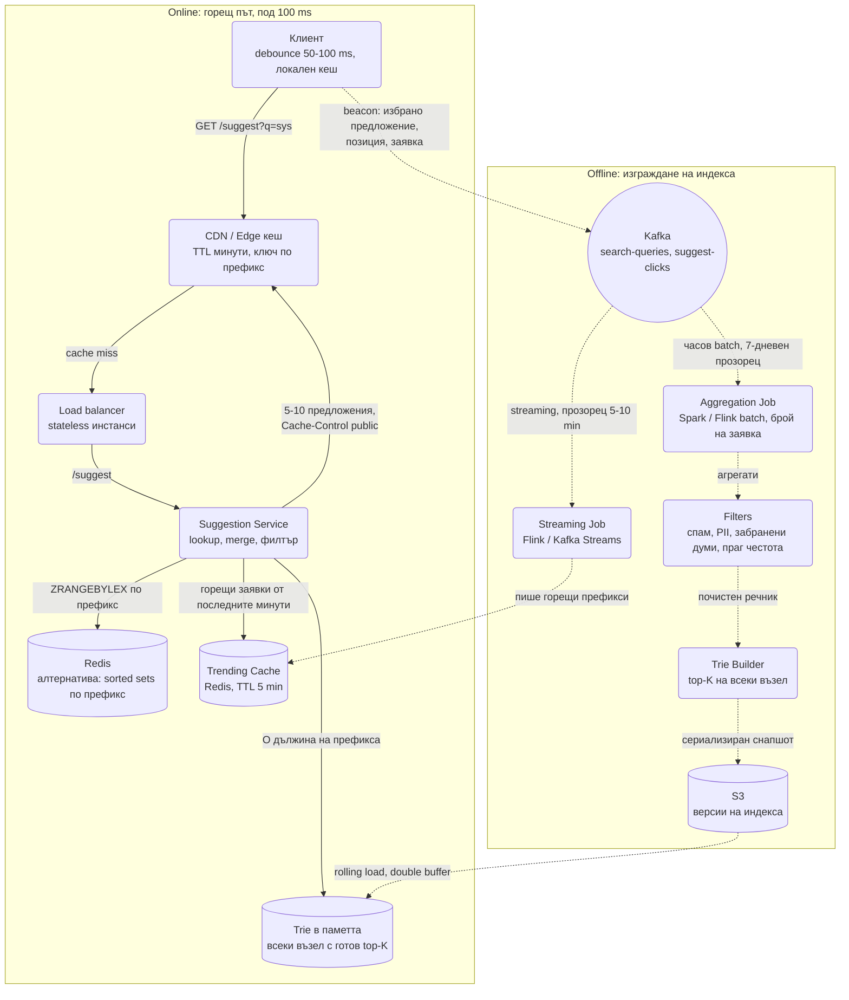
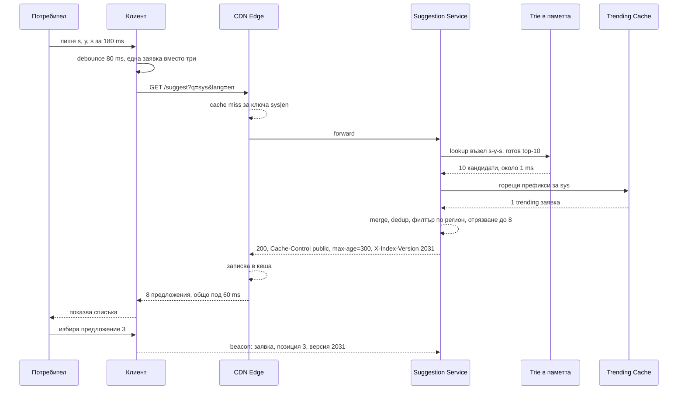

# Автодовършване при търсене (Search Autocomplete / Typeahead) - System Design

Изглежда като най-простата система в списъка и точно затова се задава: проверява дали разбираш
**латентност**. Всяко натискане на клавиш е заявка, а отговорът трябва да дойде за под 100 ms, иначе
предложенията се появяват след като човекът вече е дописал думата.

## Архитектурна диаграма



**Как да четеш диаграмата:** Горният блок е това, което потребителят чака. Заявката минава през
клиентски debounce, edge кеш и чак при miss стига до Suggestion Service, който чете готов top-K от
структура в паметта и слива няколко горещи предложения от trending кеша. Долният блок никога не се
вижда от потребителя: всички заявки и кликове отиват в Kafka, часов job ги агрегира и филтрира,
Trie Builder строи нов индекс, който се качва в S3 и се зарежда от инстансите без прекъсване. Малък
streaming job върви паралелно и пълни trending кеша, за да не чакаме един час за нов тренд.

## Двете системи, които трябва да разделиш

| | Обслужване (online) | Изграждане (offline) |
| --- | --- | --- |
| Честота | При всяко натискане на клавиш | Веднъж на час или на ден |
| Латентност | Под 100 ms, твърдо изискване | Минути, няма значение |
| Операция | Само четене от готова структура | Тежка агрегация върху милиарди редове |
| Мащаб | Стотици хиляди заявки/сек | Един batch job |

Ако тези две неща се смесят, тоест ако търсенето изчислява top-K в реално време, системата не може
да работи. **Всичко се предварително изчислява.**

## Системен дизайн накратко

Две системи, които не бива да се смесват: online обслужване (един stateless сървис с trie в паметта, под 100 ms) и offline изграждане (batch pipeline, веднъж на час). 5 компонента, от които само един е в горещия път.

### Сървиси

| # | Сървис | Какво прави | Как комуникира |
| --- | --- | --- | --- |
| 1 | **Suggestion Service** (online) | Lookup O(дължина на префикса) в trie с готов top-K на всеки възел, слива trending, филтрира по регион и блок-лист | HTTPS `GET /suggest?q=` през CDN и LB; чете trie-то в собствената си памет (нула мрежа); Redis `ZREVRANGE trending:<prefix>` и `SMEMBERS blocklist` (синхронно, под 1 ms); HTTPS GET от S3 за нов снапшот на индекса |
| 2 | **Aggregation Job** (offline) | Часов batch над 7-дневен прозорец: брой на заявка с тежест на скорошните | Spark/Flink batch, чете Kafka `search-queries` и `suggest-clicks` по offset за последния час (или Parquet от lake-а) |
| 3 | **Filters** (offline) | Спам, PII, забранени думи, праг на честота и уникални потребители | Етап в същия Spark job |
| 4 | **Trie Builder** (offline) | Строи нова структура с top-K на всеки възел, сериализира, версионира | Чете агрегатите; HTTPS PUT на снапшота в S3 с номер на версия |
| 5 | **Streaming Job** | Горещи префикси за последните 5-10 минути | Flink или Kafka Streams consumer (pull, прозорец 5-10 min); Redis `ZINCRBY` в Trending Cache с TTL |

### Хранилища

| Компонент | Роля |
| --- | --- |
| Trie в паметта (5-10 GB) | Репликиран на всеки инстанс, immutable между версиите |
| Redis | Алтернатива със sorted sets по префикс; Trending Cache (TTL 5 min); runtime блок-лист |
| Kafka | Всички заявки и кликове (сигналът за качество) |
| S3 | Версии на индекса, за rollback |
| CDN / Edge | Кешира отговора по префикс + език с TTL минути; 90%+ hit |

### Комуникация, backpressure и патерни

- **Синхронно:** само `GET /suggest`, с три слоя кеш пред него: клиентски debounce и локален кеш, CDN, самото trie в паметта.
- **Асинхронно:** всичко offline минава през Kafka; клиентът праща beacon за избраното предложение.
- **Backpressure:** debounce 50-100 ms на клиента маха голяма част от трафика; CDN поема 90%; индексът се репликира, не се шардира, така че четенето скалира с добавяне на инстанси.
- **Патерни:** предварително изчислен top-K, immutable snapshot + atomic pointer swap (double buffer), хибрид batch индекс + streaming trending, отделен индекс по език, runtime блок-лист за спешно махане, персонализация на клиента, за да остане CDN кешът споделен.

### Flow: сценариите стъпка по стъпка

**Потребителят пише "sys".** Клавишите s, y, s идват за 180 ms. Клиентът не праща три заявки: изчаква 80 ms тишина (debounce) и праща една, `GET /suggest?q=sys&lang=en`. Преди това проверява локалния си кеш: ако вече има отговор за "sy", може сам да стесни списъка до тези, които започват със "sys", докато чака. Заявката стига до CDN edge-а. Ключът на кеша е префикс + език; ако някой друг в същия регион е питал "sys" през последните 5 минути, edge-ът връща готовия отговор и до нашите сървъри не стига нищо (това е 90% от трафика). При miss заявката отива до Suggestion Service. Той слиза по trie-то в паметта си три стъпки по указатели, s → y → s, и в този възел вече стои готов списък с топ 10 довършвания, изчислен при последното изграждане (ако трябваше да обходи поддървото под "sys", това щяха да са милиони възли на всяко натискане на клавиш). Пита Redis за trending префикси "sys" от последните минути и получава една гореща заявка. Слива, маха дубликатите, филтрира по runtime блок-листа и по регион, отрязва до 8 и връща с `Cache-Control: public, max-age=300` и заглавие с версията на индекса, за да може проблем да се проследи до конкретен build. Edge-ът записва отговора. Общо под 60 ms. Когато потребителят избере третото предложение, клиентът праща beacon (заявка, позиция, версия) в Kafka: това е сигналът за качество, по който се мери дали ранкингът е верен.

**Часовото преизграждане.** На всеки час Aggregation Job чете от Kafka всички търсени заявки и кликове за последния час и ги добавя към плъзгащ прозорец от 7 дни, като скорошните тежат повече. Филтрите махат спам и ботове, лични данни, обидни думи, заявки под праг на честота и такива, направени от твърде малко уникални потребители (една заявка от един човек не бива да стане предложение за всички). Trie Builder строи напълно нова структура с top-K във всеки възел, сериализира я (5-10 GB) и я качва в S3 като версия 2032. Всеки Suggestion инстанс изтегля новия снапшот във втори буфер в паметта, докато старият продължава да обслужва. Валидира го: контролна сума, брой възли в очаквания диапазон (спад с 30% е счупен pipeline, не реална промяна), и няколко златни заявки ("sys" трябва да върне поне 5 резултата). Чак тогава един атомарен pointer swap прави новия активен и старият се освобождава. Нито една заявка не вижда празен или половин индекс; цената е двойна памет за няколко минути на час. Ако валидацията се провали, инстансът остава на 2031 и вдига аларма, а версиите в S3 се пазят дни назад за rollback.

**Спешно махане на предложение.** Идва правно искане да изчезне конкретна заявка от предложенията. Следващият build е след 40 минути, а trie-то е immutable. Затова има runtime блок-лист в Redis: операторът добавя заявката там и Suggestion Service, който чете списъка при всяка заявка (или го кешира за секунди), я филтрира от резултата веднага. CDN-ът я забравя до 5 минути заради TTL-а, или се прави purge по префикс. При следващото изграждане филтърът я маха и от самия индекс. Същият механизъм се ползва, когато координирана атака "изстреля" обидна заявка в trending за минути: trending слоят минава през същите филтри, но по-агресивно, а блок-листът е последната спирачка.

## Описание на архитектурата стъпка по стъпка

### 1. Структурата: Trie с предварително изчислен top-K

Обикновеното trie изисква обхождане на цялото поддърво под префикса, за да се намерят най-популярните
довършвания. При префикс "a" това са милиони възли на всяко натискане на клавиш.

Решението: **всеки възел пази готовия си списък с топ 5-10 довършвания**.

```text
       (корен)
          │
          s ── top: [system design, spotify, samsung, ...]
          │
          y ── top: [system design, symptoms, sydney, ...]
          │
          s ── top: [system design, system32, systematic, ...]
```

Търсенето става **O(дължина на префикса)**, тоест 3-4 стъпки по указатели, независимо от размера на
речника. Цената е памет и това, че индексът е неизменяем между преизгражданията, което е напълно
приемливо: предложенията нямат нужда да са актуални до секундата.

Практически детайл: top-K се пази само за префикси до определена дължина (напр. 20 символа) и само
за възли с достатъчно трафик. За дълги и редки префикси се прави реално обхождане на малкото
поддърво, което е евтино именно защото е малко.

### 2. Алтернативата: Redis sorted sets вместо собствено trie

Собствено trie в паметта е най-бързият вариант, но означава собствен сериализатор, собствен
loader и собствен код за top-K. Валидна алтернатива, която много екипи ползват в продукция:

- За всеки префикс до дължина L има Redis sorted set `sugg:<префикс>`, в който score е
  популярността, а членовете са пълните заявки. Заявката е `ZREVRANGE sugg:sys 0 9`. Това е
  предварително изчислен top-K, само че в Redis вместо в процеса.
- Или един голям sorted set със score 0 и лексикографско търсене: `ZRANGEBYLEX sugg "[sys" "[sys\xff"
  LIMIT 0 50`, след което приложението подрежда по популярност. Работи без експлозия на ключове, но
  връща кандидати, не готов top-K, и затова е за по-малък речник.
- **Кога Redis:** речник до няколко милиона заявки, екип, който не иска да поддържа собствена
  структура, нужда от честа частична актуализация (`ZINCRBY` при всяко търсене) вместо пълно
  преизграждане.
- **Кога собствено trie:** десетки милиони заявки, изискване под 10 ms на origin (мрежовата
  обиколка до Redis е ~0.5-1 ms плюс сериализация), или когато паметта е критична (trie споделя
  префиксите, sorted set-овете дублират всяка заявка във всеки нейн префикс).

### 3. Изграждане на индекса

- Всяка търсена заявка отива в Kafka топик. Отделен топик пази кликовете върху предложенията
  (кое е избрано и на коя позиция), защото това е сигналът за качество.
- Часови batch job агрегира броенията в плъзгащ се прозорец (напр. последните 7 дни, с по-голяма
  тежест на скорошните, за да улавя трендове).
- Минава през филтри: спам и ботове, лични данни, обидни и забранени думи, юридически ограничения по
  държава, минимален праг на честота и минимален брой уникални потребители.
- Trie Builder изгражда **нова** структура наготово, сериализира я и я качва в S3 с номер на версия.
- Suggestion сървърите зареждат новия снапшот и превключват атомарно. Никога не се модифицира жива
  структура в паметта, защото това означава заключване на горещия път.

### 4. Зареждане на нов снапшот без прекъсване

Индексът е 5-10 GB и се сменя на всеки час. Как това става, без нито една заявка да види празен
или половин индекс:

- **Double buffer в процеса:** инстансът тегли новия снапшот от S3 във втори буфер в паметта,
  докато старият продължава да обслужва. Когато новият е зареден и валидиран (брой възли, контролна
  сума, няколко тестови заявки), един атомарен pointer swap го прави активен, а старият се
  освобождава. Цената: за няколко минути на час процесът държи двойна памет, тоест инстансите се
  оразмеряват за 2x индекса.
- **Rolling по инстанси:** load balancer-ът изважда инстанс, той зарежда, връща се, следващият.
  Не изисква двойна памет, но смяната отнема толкова, колкото са инстансите по време на зареждане,
  и за този период различни инстанси отговарят от различни версии. Приемливо за autocomplete.
- **Shadow инстанси:** нов набор инстанси се вдига с новата версия, LB пренасочва трафика, старите
  се гасят. Най-чисто, но най-скъпо. Ползва се при големи промени във формата на индекса.
- Каквото и да е решението, снапшотът носи версия и отговорът я връща в заглавие, за да може
  проблем с нов индекс да се диагностицира ("версия 2031 дава празни резултати за 'sy'") и да се
  върне предишната версия с едно превключване.

### 5. Слоевете кеш

Заявките за автодовършване имат изключително изкривено разпределение: малък брой префикси покриват
огромна част от трафика.

- **Клиентски:** debounce 50-100 ms (не се праща заявка на всеки клавиш) плюс локален кеш на вече
  видяното. Само това маха голяма част от трафика. Клиентът също филтрира локално: ако има
  отговор за "sys", може сам да стесни до "syst" от него, докато чака сървъра.
- **CDN / Edge:** отговорът за "sys" е еднакъв за всички неперсонализирани потребители, така че се
  кешира на edge-а с TTL от минути. Популярните префикси изобщо не стигат до origin.
- **Сървърен:** самото trie е в паметта на процеса, което вече е най-бързият възможен кеш.



### 6. Езици и нормализация на текста

Речник от реални заявки е пълен с варианти на едно и също нещо, а потребителят очаква да ги
третираме еднакво:

- **Case folding:** `System`, `SYSTEM`, `system` са една заявка. Ключът в trie-то е lowercase,
  показва се най-честият оригинален вариант.
- **Диакритика:** `café` и `cafe`, `München` и `Munchen`. Индексът пази нормализирана форма (NFD +
  махане на combining marks) като ключ, оригинала като показвано предложение.
- **Кирилица и латиница:** потребител в България пише и `youtube`, и `ютуб`, и `youtube` на
  кирилска клавиатура (`нщгегиу`). Продукционните системи имат транслитерационна пътека и
  "грешна клавиатура" пътека: заявката се пробва и в оригинал, и транслитерирана, резултатите се
  сливат.
- **Отделен индекс по език/регион.** Не един глобален trie, а `trie:bg`, `trie:en-US` и т.н.,
  избран по езика на интерфейса или по `Accept-Language`. CDN ключът задължително включва езика,
  иначе българин получава кеширани английски предложения.
- **Unicode дължина:** "под 20 символа" се брои в code points, не в байтове, иначе кирилицата
  получава половината дълбочина на trie-то.

### 7. Качество и експерименти

Автодовършването е ранкинг система и се измерва като такава:

| Метрика | Какво показва |
| --- | --- |
| **Suggestion CTR** | Дял от търсенията, завършили с избор на предложение, а не с ръчно дописване |
| **Средна позиция на избраното** | Ако хората избират винаги 4-тото, ранкингът е грешен |
| **Zero-result rate** | Дял от префиксите без нито едно предложение; расте при счупен индекс или нов език |
| **Спестени клавиши** | Колко символа потребителят не е написал благодарение на предложението |
| **P99 латентност на origin и на edge** | Твърдото изискване; над 100 ms предложенията са безполезни |
| **Cache hit rate на edge** | Под 80% означава, че ключът на кеша е прекалено фин (напр. включва нещо персонално) |

A/B тестове на ранкинг формулата (тежест на скорошност срещу обща популярност, брой предложения,
дали да се показват trending) се правят по потребител, като версията на експеримента се връща в
отговора и се логва с клика. Понеже CDN кешът е споделен, вариантите на експеримента трябва да са в
ключа на кеша или трафикът в експеримента да заобикаля edge-а.

## Оразмеряване (Back-of-the-envelope)

Допускане: **10 млн. търсения на ден**, средно 20 натискания на клавиш преди изпращане, 4 заявки
след debounce.

| Метрика | Изчисление | Резултат |
| --- | --- | --- |
| Заявки за предложения | 10M × 4 | 40 млн./ден |
| Средно | 40M / 86 400 | ≈ 460 заявки/сек |
| Пик (x5) | 460 × 5 | ≈ 2 300 заявки/сек |
| Стигащи до origin (90% edge hit) | 2 300 × 0.1 | ≈ 230 заявки/сек, тривиално |
| Уникални заявки в речника | След филтриране на дългата опашка | ≈ 10-50 млн. |
| Памет за trie | 30M заявки × ~50 B + top-K списъци | ≈ 5-10 GB на инстанс |
| Памет с double buffer при reload | 2 × 10 GB | ≈ 20 GB на инстанс за няколко минути на час |
| Cache hit rate на edge | Топ 20% префикси | 90%+ от трафика не стига до origin |

Числото за интервюто: **10 GB структура се събира в паметта на един сървър.** Затова индексът не се
шардира по данни, а просто се **репликира** на всички инстанси, което прави четенето тривиално за
скалиране. Ако мащабът е Google (милиарди търсения на ден), числата се умножават по 1000 и
шардирането по префикс става задължително, но принципът остава същият.

## Ключови въпроси за интервюто

### Trie или просто база с `LIKE 'sys%'`?

`LIKE 'префикс%'` може да ползва B-tree индекс и работи за малък обем. Пада на две неща: сортирането
по популярност изисква четене и подреждане на **всички** съвпадения при всяко натискане, а на 2 300
заявки/сек с милиони съвпадения на кратък префикс базата не издържа. Trie-то с готов top-K връща
отговора без сортиране.

### Как се шардира, ако индексът не се събира в паметта?

По **първите букви на префикса** (`a-f` на един клъстер, `g-m` на друг). Понеже клиентът знае
префикса, който търси, маршрутизирането е тривиално и няма scatter-gather. Проблемът е
неравномерността: префикси с "a" са много повече от тези с "z", затова границите се избират по
реален трафик, а не по азбуката. Практично: първата стъпка е шардиране по език, което е и естествено
разделение на трафика.

### Как се хващат новите трендове, ако индексът се строи на час?

Втори, **малък и бърз** слой: streaming job (Flink / Kafka Streams) поддържа брояч за последните
минути и добавя няколко "горещи" предложения върху резултата от основното trie. Хибрид между
предварително изчислено и реално време, същият модел като при feed-а. Trending слоят минава през
същите филтри за спам и забранени думи, но по-агресивно, защото координирана атака може да
"изстреля" обидна заявка в trending за минути.

### Персонализация?

Персонализираните предложения не могат да се кешират на CDN, което убива най-евтиния слой. Затова се
прави хибрид: глобалният top-K се кешира публично, а личната история се държи **на клиента** и се
слива локално с получения списък. Така персонализацията е безплатна за сървъра.

### Как се справяте с правописни грешки?

Отделен механизъм, не trie. Edit distance върху кандидатите (BK-tree или Levenshtein автомат) или
индекс от n-грами. За интервю е достатъчно да кажеш, че е **отделна пътека**, която се задейства
само когато основният префикс дава малко или никакви резултати.

### Какво не бива да предлагате?

Черен списък за обидни и правно проблемни заявки, минимален праг на честота (една заявка не бива да
влиза в речника), премахване на лични данни и на заявки, направени от малък брой уникални
потребители. Автодовършването е публичен глас на системата и е било повод за съдебни дела.

### Какво става, ако новият снапшот е повреден?

Loader-ът валидира преди swap: контролна сума, брой възли в очакван диапазон спрямо предишната
версия (спад от 30% е сигнал за счупен pipeline, не за реална промяна), и набор от златни заявки
("sys" трябва да върне поне 5 резултата). При провал инстансът остава на старата версия и вдига
аларма. Затова версиите в S3 се пазят поне няколко дни назад.

### Как се обработва въвеждане на многобайтови езици (китайски, японски)?

Потребителят пише латински фонетичен вход (pinyin, romaji), който IME-то преобразува в йероглифи.
Autocomplete-ът трябва да работи и върху фонетичния вход, и върху крайните символи, тоест два
индекса и сливане. Това е причината "един глобален trie" никога да не е отговорът за световна
система.

### Trie-то е immutable. Как се маха предложение веднага (правно искане)?

Не се чака следващият build. Има малък **runtime блок-лист** в Redis, който Suggestion Service чете
при всяка заявка (или кешира за секунди) и филтрира от резултата. Следващото преизграждане го
прилага и в самия индекс. Същият механизъм служи и за спешно махане на trending заявка.
