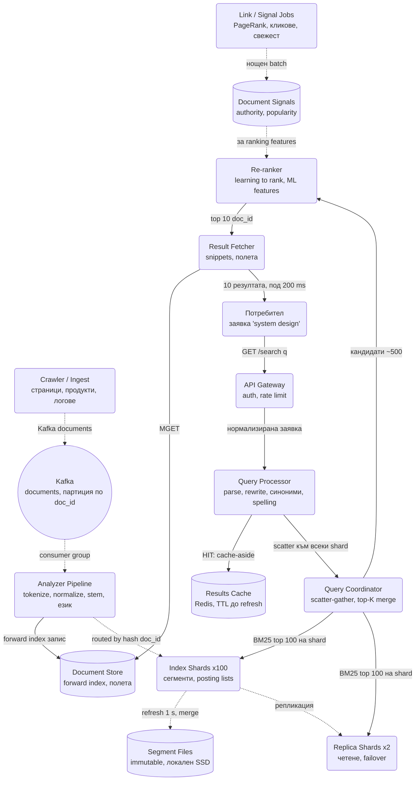
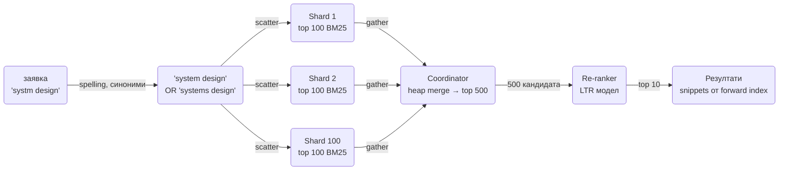
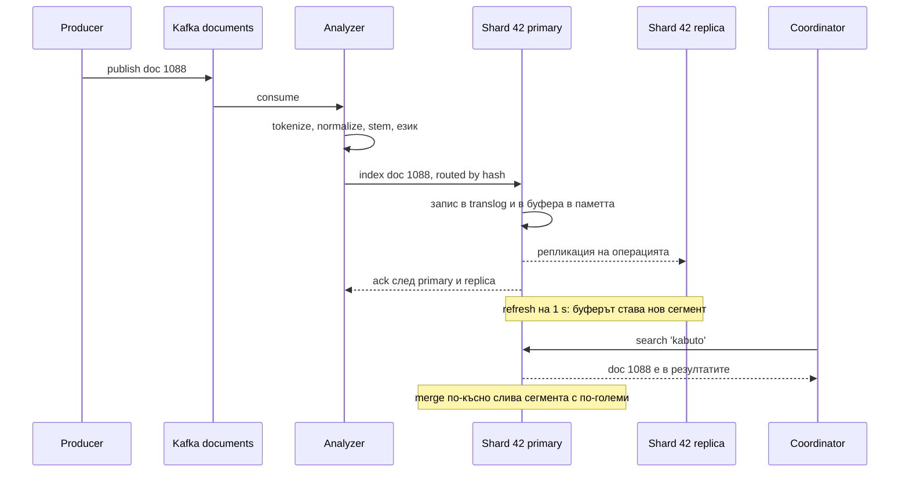

# Търсачка и inverted index (Elasticsearch / Google Search тип) - System Design

Задачата звучи като "намери документите, които съдържат думите от заявката", но истинският
проблем е друг: **милиард документа, десетки хиляди заявки в секунда и отговор за под 200 ms, при
това подреден по релевантност, не по ред на намиране.** Никаква релационна база не прави това с
`LIKE '%дума%'`. Целият дизайн се върти около една структура, обърнатия индекс, и около това как се
шардира, обновява и обхожда за микросекунди.

Това е системата, която се задава, когато интервюиращият иска да види дали разбираш **разликата
между извличане (retrieval) и подреждане (ranking)** и защо те са два отделни етапа с различен
бюджет.

## Архитектурна диаграма



**Как да четеш диаграмата:** горе е пътят на индексиране: документите идват през Kafka, минават
през анализатора и отиват в шард по hash на `doc_id`, където стават неизменяеми сегменти, реплицирани
за четене. Долу е пътят на заявката: парсване и пренаписване, кеш, разпръскване към всички шардове,
сливане на top-K, скъпо преподреждане само на няколкостотин кандидата и накрая изтегляне на самите
документи за snippet-и. Пунктираните линии са фонова работа, плътните са в бюджета на заявката.

## Системен дизайн накратко

Два пътя: индексиране (Kafka → Analyzer → шард по `doc_id` → immutable сегменти) и заявка (parse → кеш → scatter-gather към всички шардове → re-rank на стотици → fetch на 10). 8 сървиса; ключовото разделение е евтино извличане върху милиони и скъпо подреждане върху стотици.

### Сървиси

| # | Сървис | Какво прави | Как комуникира |
| --- | --- | --- | --- |
| 1 | **Analyzer Pipeline** | Tokenize, normalize, stop words, stemming по език, forward index запис | Kafka consumer `documents` (pull); gRPC `Index` към primary шарда по `hash(doc_id)` (синхронно); запис в Document Store |
| 2 | **Index Shards** (около 100 по 50 GB) + реплики (x2) | Буфер в паметта → refresh на 1 s → нов сегмент; merge; BM25 top 100 локално; deleted bitset | gRPC сървър за `Index` и `Search`; primary праща операцията към репликите по gRPC и ack-ва след тях; translog на локален диск като WAL |
| 3 | **Link / Signal Jobs** | PageRank-подобен авторитет, кликове, свежест | Нощен Spark batch; пише в Document Signals store (Cassandra или Redis) |
| 4 | **API Gateway** | Auth, rate limit | HTTPS REST `GET /search`; gRPC към Query Processor (синхронно) |
| 5 | **Query Processor** | Parse, spelling, синоними, пренаписване, results cache | gRPC от Gateway; Redis `GET`/`SET` cache-aside (синхронно); gRPC към Coordinator при miss |
| 6 | **Query Coordinator** | Scatter към всички шардове, gather, heap merge на 10 000 кандидата до около 500 | Паралелни gRPC `Search` към една реплика на всеки шард с deadline (синхронно); hedged request към втора реплика при закъснение |
| 7 | **Re-ranker** | Learning to rank върху около 500 кандидата със стотици признаци | gRPC от Coordinator (синхронно, с бюджет); чете Signals store с `MGET` |
| 8 | **Result Fetcher** | Snippets и полета за финалните 10 | gRPC от Coordinator; `MGET` по `doc_id` от Document Store |

### Хранилища

| Компонент | Роля |
| --- | --- |
| Kafka | `documents`, партиция по `doc_id` |
| Segment files (локален SSD) | Dictionary (FST), компресирани posting lists, deleted bitset |
| Document Store (forward index) | `doc_id → полета и текст` |
| Document Signals | Authority, popularity, freshness за ranking |
| Results Cache (Redis) | Нормализирана заявка → отговор, TTL до refresh |

### Комуникация, backpressure и патерни

- **Синхронно:** HTTPS REST отвън, gRPC вътре; целият път на заявката в бюджет от 200 ms; 10k QPS отвън стават 1M shard заявки вътре.
- **Асинхронно:** индексиране през Kafka, refresh и merge, нощни signal jobs.
- **Backpressure:** results cache и filter cache пред координатора (60-80% hit); таймаут с частичен резултат от 98 шарда; по-малко и по-големи шардове; `search_after` cursor вместо offset; отделен малък "свеж" индекс за новини вместо чест refresh на основния.
- **Патерни:** inverted index с posting lists и skip lists, immutable сегменти + merge (LSM модел), шардиране по документ (не по термин), scatter-gather с hedged requests срещу tail latency, двуфазно подреждане (BM25 retrieval → LTR re-ranking), индексът като производна структура (истината е в Postgres или S3), обновяване = delete + reindex.

### Flow: сценариите стъпка по стъпка

**Нов документ става търсим.** Crawler-ът (или продуктов каталог) публикува документ 1088 в Kafka `documents`. Analyzer Pipeline го тегли и го превръща в термини: разделя на думи, прави lowercase и маха диакритиката (`é` → `e`), изхвърля stop words ("и", "the"), засича езика и прилага stemming ("търсачки", "търсачката" → един корен). Същата нормализация ще се приложи и върху заявките, иначе "Система" и "система" биха били два термина. Записва пълния документ в Document Store (forward index, `doc_id → полета`) и праща термините по gRPC към шард 42, избран по `hash(1088) % 100`. Шардът ги дописва в translog-а си (WAL: ако възелът падне преди refresh, документът се възстановява оттам) и в буфер в паметта, праща същата операция към двете си реплики и ack-ва след тях. Документът още не е търсим. На всяка секунда (refresh) буферът става нов малък неизменяем сегмент на диска: речник (FST) с указатели към posting lists, тоест за всеки термин подреден списък от `doc_id` с честота и позиции, компресиран с delta encoding. Оттук нататък `search 'kabuto'` го намира. Стотици малки сегменти забавят търсенето, затова фонов merge ги слива в по-големи (compaction, същият модел като LSM дърво). Ако документът се обнови, не се пипа на място, защото е разпръснат по хиляди posting lists: старият `doc_id` се маркира в deleted bitset, новата версия се индексира като нов документ, а физически старият изчезва при merge. Затова чести промени на малки полета (брой лайкове) не минават през индекса.

**Заявка "systm design".** Потребителят натиска Enter. `GET /search?q=systm+design` стига през Gateway до Query Processor, който първо нормализира заявката и проверява Results Cache в Redis по хеш на нормализираната форма: топ заявките са Zipf разпределени и 60-80% спират тук. При miss пренаписва: правописът поправя "systm" на "system" (BK-tree или n-грами), синонимите добавят "systems design", филтрите (`site:`, дата) стават bitset условия. Query Coordinator-ът разпръсква (scatter) заявката по gRPC към една реплика на всеки от 100-те шарда, избрана по натоварване, с deadline. Всеки шард работи само върху своите posting lists: започва от най-редкия термин ("design" е по-рядък от "system"), пресича списъците с skip lists (по редкия върви последователно, в дългия скача през 128 записа), смята BM25 за всяко съвпадение (колко пъти е терминът в документа, колко рядък е в целия корпус, колко дълъг е документът) и връща локалния си top 100 с оценки. Координаторът слива (gather) 10 000 кандидата с heap до около 500 и ги праща на Re-ranker-а. Той чете за всеки признаците от Signals store (авторитет от линковата структура, свежест, кликове от предишни потребители, съответствие на заглавието), прилага learning-to-rank модел (GBDT) и връща подредени top 10. Моделът е скъп на кандидат, затова никога не вижда милионите съвпадения, а само стотиците. Result Fetcher прави `MGET` за 10-те документа от Document Store, изрязва snippets около търсените думи и връща отговора за под 200 ms. Query Processor го записва в Redis с TTL до следващия refresh. Пагинацията е `search_after` (score + `doc_id` на последния), не offset: страница 1 000 с offset би искала всеки шард да върне 10 000 кандидата.

**Бавен шард.** При p99 от 50 ms на шард вероятността поне един от 100 да е бавен е над 60%: заявката е бавна колкото най-бавния шард (tail latency). Координаторът не чака пасивно. Ако реплика на шард 17 не е отговорила до p95 латентността (например 40 ms), праща същата заявка към втора реплика на шард 17 (hedged request) и взима първия отговор; струва около 5% допълнителен трафик, а сваля p99 в пъти. Ако и двете закъснеят до deadline-а от 150 ms, координаторът връща частичен резултат от 99 шарда и го маркира като такъв в отговора, вместо да върне грешка. Дългосрочно се следи кои реплики са бавни и трафикът се пренасочва (адаптивен избор на реплика), а броят шардове се държи възможно най-малък, защото всеки шард умножава заявките. Същият проблем и същото решение като при четене с кворум в Key-Value Store.

## Описание на архитектурата стъпка по стъпка

### 1. Обработка на документа (analysis)

Преди да влезе в индекса, текстът се превръща в **термини**:

- **Токенизация:** разделяне по празни места и пунктуация, с изключения (URL, имейли, `C++`).
- **Нормализация:** lowercase, махане на диакритика (`é` → `e`), Unicode NFKC. Същото се прилага и
  върху заявката, иначе "Система" и "система" са два термина.
- **Stop words:** "и", "the", "на" се изхвърлят или се пазят само за фразови заявки. Изхвърлянето
  спестява до 30% от индекса, но чупи "to be or not to be".
- **Stemming / lemmatization:** "търсачки", "търсачка", "търсачката" → един корен. Stemming е евтин
  и груб (Snowball), лематизацията е точна и бавна. За всеки език е различно, затова първо се засича
  езикът на документа.
- **N-грами** за езици без празни места (китайски, японски) и за частично съвпадение.
- **Синоними** се разгръщат при индексиране (по-голям индекс, бърза заявка) или при търсене
  (малък индекс, по-бавна заявка). Продукционният избор е при търсене, защото речникът се сменя без
  преиндексиране.

### 2. Обърнатият индекс (inverted index)

Релационната база пази `документ → думи`. Търсачката пази обратното:

```text
термин       →  posting list
"design"     →  [ (doc 17, tf 3, pos [4, 90, 211]), (doc 42, tf 1, pos [7]), (doc 1088, ...), ... ]
"system"     →  [ (doc 17, tf 5, ...), (doc 42, ...), (doc 305, ...), ... ]
```

- **Речник (dictionary):** всички термини с указател към posting list-а. Пази се като FST (finite
  state transducer) или trie: побира милиони термини в стотици MB и дава и префиксни заявки. Същата
  структура като в [Autocomplete](Search_Autocomplete_Typeahead.md).
- **Posting list:** подреден списък от `doc_id`, с честота на термина (за ranking) и позиции (за
  фрази и близост). Подредбата по `doc_id` позволява сливане на два списъка за AND заявка с един
  проход.
- **Forward index / document store:** обратното, `doc_id → полета и текст`, за snippet-и и за
  показване на резултата. Не се чете при извличането, само за финалните 10.

### 3. Компресия и бърза пресечна точка

Posting list за "the" има милиард записа. Без компресия индексът е по-голям от текста.

- **Delta encoding:** вместо `[1000, 1003, 1007]` се пазят разликите `[1000, 3, 4]`, които са малки
  числа.
- **Variable byte / PForDelta / Roaring bitmaps:** малките числа се кодират в 1-2 байта, или като
  битмапи, когато списъкът е плътен. Резултатът: индексът е **30-50% от размера на суровия текст**.
- **Skip lists:** при AND на "system" (100 млн. документа) и "kabuto" (200 документа) не се обхождат
  100 млн. записа. По редкия списък се върви последователно, а в дългия се скача с skip указатели на
  всеки 128 записа.
- Заявката винаги започва от **най-редкия термин**, защото той определя горната граница на
  кандидатите.

### 4. Изграждане на индекса: сегменти

Индексът е **неизменяем**, защото вмъкване в средата на компресиран posting list е невъзможно.
Решението е същото като LSM дървото в [Key-Value Store](Distributed_Key_Value_Store.md):

- Новите документи се събират в буфер в паметта и на всеки **refresh interval** (1 s в Elasticsearch)
  се записват като нов малък **сегмент**. Оттам са търсими.
- Заявката пита всички сегменти на шарда и слива резултатите. Стотици сегменти забавят, затова фонов
  **merge** слива малките в по-големи (пак compaction).
- **Изтриване** е маркер в bitset ("документ 42 е изтрит"), приложен при търсене; физически изчезва
  при merge. **Обновяване** е изтриване плюс индексиране наново, защото документът е разпръснат по
  хиляди posting lists.
- **Офлайн изграждане** (MapReduce / Spark) за пълен реиндекс: map по документ издава `(термин,
  doc_id)`, reduce по термин сглобява posting list-а. Използва се при смяна на анализатора или на
  schema-та, не за ежедневни промени.

### 5. Шардиране по документ, не по термин

| | По документ (стандарт) | По термин |
| --- | --- | --- |
| Какво има шардът | Всички термини за своето подмножество от документи | Целия posting list на своите термини |
| Индексиране | Един шард получава документа, локална операция | Един документ пипа хиляди шардове |
| Заявка | Отива до **всички** шардове, всеки връща локален top-K | Отива само до шардовете на термините, но AND между два термина е обмен на списъци между шардове |
| Горещи точки | Равномерни по hash | "the" е на един шард и той гори |
| Кой го ползва | Elasticsearch, Solr, Google | Рядко, изследователски системи |

Заявката към 100 шарда е **scatter-gather**: координаторът разпръсква, всеки шард връща своите top
100 по BM25, координаторът слива 10 000 кандидата и взима глобалния top. Цената: латентността на
заявката е латентността на **най-бавния** шард. Виж въпроса за tail latency долу.

Репликите (обикновено 2 на шард) дават пропускливост на четене и издръжливост; заявката отива към
една реплика от всяка група, избрана по натоварване.

### 6. Двуфазно подреждане (retrieval, then ranking)

Ето разделението, което носи точки на интервю:

1. **Извличане с евтина функция върху милиони кандидати.** BM25: колко пъти терминът е в документа
   (tf), колко рядък е в целия корпус (idf), колко дълъг е документът (нормализация). Изчислява се
   вътре в шарда, върху posting list-овете, без да се чете самият документ.
2. **Преподреждане със скъп модел върху стотици кандидати.** Learning to rank (GBDT или невронен
   модел) със стотици признаци: авторитет на документа (PageRank-подобен сигнал от линковата
   структура), свежест, клик-сигнали от предишни потребители, съответствие на заглавието,
   персонализация, качество на страницата. Признаците се четат от предварително изчислен
   **signals store**, не се смятат в критичния път.

Ако скъпият модел се пусне върху всички кандидати, заявката става секунди. Ако евтината функция реши
всичко, резултатите са спам. Двуфазният подход е компромисът, който всяка голяма търсачка прави.

### 7. Пътят на заявката



- **Parse:** булев израз, фрази в кавички, филтри (`site:`, дата, категория).
- **Rewrite:** правопис (същият BK-tree / n-gram механизъм като в autocomplete), синоними, разширяване
  по език.
- **Results cache:** идентична нормализирана заявка → готов отговор в Redis с TTL до следващия
  refresh. Топ заявките са Zipf разпределени, така че кешът поема голям дял. Плюс **filter cache** в
  шарда: bitset за `category = books` се преизползва между заявки.
- **Facets и агрегации** (брой по категория, ценови диапазони) се смятат по същите bitset-и в шарда
  и се сливат в координатора.

### 8. Свежест срещу цена

| Режим | Как | Латентност до търсимост | Цена |
| --- | --- | --- | --- |
| Batch реиндекс | Нощен Spark job, нови сегменти | Часове | Най-евтино, идеални сегменти |
| Near-real-time | Буфер в паметта, refresh на 1 s | Секунда | Много малки сегменти, постоянен merge |
| Приоритетен поток | Новини и горещи документи през отделен малък индекс | Секунди | Втори индекс, който се пита паралелно |

Google прави точно последното: основният индекс се обновява рядко, а новините влизат в отделен
"свеж" слой, който се слива при заявката. Същият хибрид като trending слоя в autocomplete.

## Оразмеряване (Back-of-the-envelope)

Допускане: **1 млрд. документа** по ~10 KB текст, индекс 40% от текста, шард до 50 GB (за да се
презареди и премести за минути), **10 000 заявки/сек** в пик, P99 бюджет 200 ms.

| Метрика | Изчисление | Резултат |
| --- | --- | --- |
| Суров текст | 1G × 10 KB | 10 TB |
| Индекс | 10 TB × 40% | ≈ 4 TB |
| Шардове | 4 TB / 50 GB | ≈ 80-100 шарда |
| С реплики (x3) | 100 × 3 × 50 GB | ≈ 15 TB SSD общо |
| Възли | 15 TB / 2 TB SSD на възел, плюс RAM за кеш | ≈ 8-10 възела, реално 20+ за CPU |
| Заявки към шардове | 10 000 × 100 шарда | **1 млн. shard заявки/сек** |
| На шард | 1M / 300 копия | ≈ 3 300 заявки/сек на копие |
| Forward index четения | 10 000 × 10 резултата | 100 000 MGET/сек, кеширани |
| Results cache | Топ 20% заявки | 60-80% hit rate при търсене в уеб |

Изводът: **fan-out-ът умножава заявките по броя шардове.** 10k QPS отвън са 1M QPS вътре, затова
броят шардове се държи възможно най-малък, а кешът пред координатора е задължителен, не оптимизация.

## API и модел на данните

```text
GET  /api/v1/search?q=system+design&filter=category:books&page=cursor  → { hits[10], facets, took_ms }
POST /api/v1/index/:index/_doc/:id   { title, body, category, url }      → 202 (търсим след refresh)
DELETE /api/v1/index/:index/_doc/:id                                       → 202
```

| Структура | Ключ | Съдържание |
| --- | --- | --- |
| Dictionary (FST) | термин | Указател към posting list, `df` (в колко документа) |
| Posting list | термин → списък | `doc_id` (delta), `tf`, позиции; компресирани блокове по 128 |
| Forward index | `doc_id` | Полета, текст за snippet, версия |
| Deleted bitset | сегмент | Бит на изтрит документ |
| Signals store | `doc_id` | Authority, popularity, freshness, качество; нощен batch |
| Results cache | `hash(нормализирана заявка)` | Готов отговор, TTL до refresh |

Пагинацията е по **search_after cursor** (последният score + `doc_id`), не по offset: страница 1 000
с offset значи всеки шард да върне 10 000 кандидата за сливане.

## От нов документ до търсим резултат



Translog-ът е WAL-ът на шарда: ако възелът падне между ack и refresh, документът се възстановява от
него. Същата роля като commit log-а в Cassandra.

## Ключови въпроси за интервюто

### Защо обърнат индекс, а не `LIKE '%дума%'` в базата?

`LIKE` с водещ `%` не ползва B-tree индекс и сканира всеки ред: при милиард реда това е минути.
Обърнатият индекс отговаря на "кои документи съдържат X" с едно четене на posting list. Освен това
базата не дава ranking по релевантност, stemming и фразово търсене. Postgres има `tsvector` и GIN
индекс, който е обърнат индекс в малък мащаб и е правилният отговор до няколко милиона документа.

### Шардиране по документ или по термин?

По документ, почти винаги. Индексирането е локално, няма горещ шард за "the", и AND между термини се
решава вътре в шарда. Цената е, че всяка заявка пита всички шардове. По термин има смисъл само ако
заявките са предимно едно-терминни и индексът е статичен.

### Как подреждате резултатите?

Двуфазно. BM25 в шарда върху posting list-овете за груб top-100 на шард, после learning-to-rank модел
върху сляти ~500 кандидата с признаци от предварително изчислен signals store (авторитет, свежест,
клик-сигнали). Скъпият модел никога не вижда милиони кандидати.

### Как нов документ става търсим за секунди?

Записва се в translog и в буфер в паметта; на всеки refresh (1 s) буферът става нов неизменяем сегмент,
който заявката вижда. Merge процес слива малките сегменти после. Ако свежестта е критична само за
малка част от документите, те минават през отделен малък индекс, който се пита паралелно.

### Заявка към 100 шарда е бавна колкото най-бавния. Какво правите?

Това е класическият tail latency проблем: при P99 от 50 ms на шард, шансът поне един от 100 да е бавен
е над 60%. Мерките: **hedged requests** (пращаш към втора реплика, ако първата не отговори до P95 и
взимаш първия отговор), адаптивен избор на реплика по натоварване, по-малко и по-големи шардове,
таймаут с частичен резултат (връщаш от 98 шарда и маркираш отговора като частичен). Същият проблем и
решение като в Key-Value Store документа.

### Може ли Elasticsearch да е system of record?

Не. Индексът е **производна структура**: сменяш анализатора и трябва да го изградиш наново от
източника. Няма транзакции между документи, а обновяването е изтриване плюс преиндексиране. Истината
живее в Postgres или в обектно хранилище, а индексът се пълни от нея през Kafka или CDC и може да се
изтрие и изгради наново по всяко време.

### С какво autocomplete е различен от търсенето?

Autocomplete отговаря на **префикс** за под 100 ms с предварително изчислен top-K и няма нужда от
ranking в реално време. Търсенето отговаря на **цяла заявка** с булева логика, фрази и релевантност,
изчислена по време на заявката. Първото е trie или FST с готови отговори, второто е posting lists и
двуфазно подреждане. Виж [Autocomplete](Search_Autocomplete_Typeahead.md).

### Как обновявате документ, който е в хиляда posting lists?

Не го обновявате на място. Маркирате стария `doc_id` като изтрит в bitset-а на сегмента и
индексирате новата версия като нов документ в текущия буфер. При търсене изтритите се филтрират, а
при merge физически изчезват. Затова честите обновявания на малки полета (брояч на харесвания) не
бива да минават през индекса: държат се отделно и се четат при показване.
