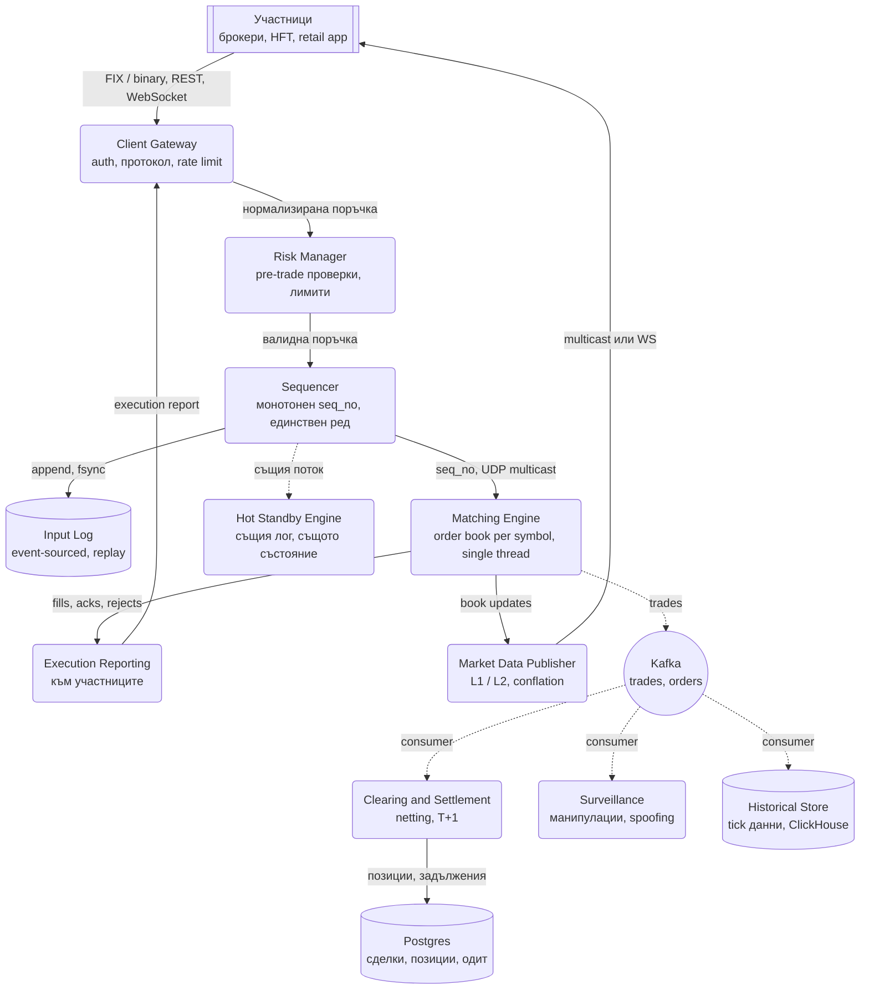
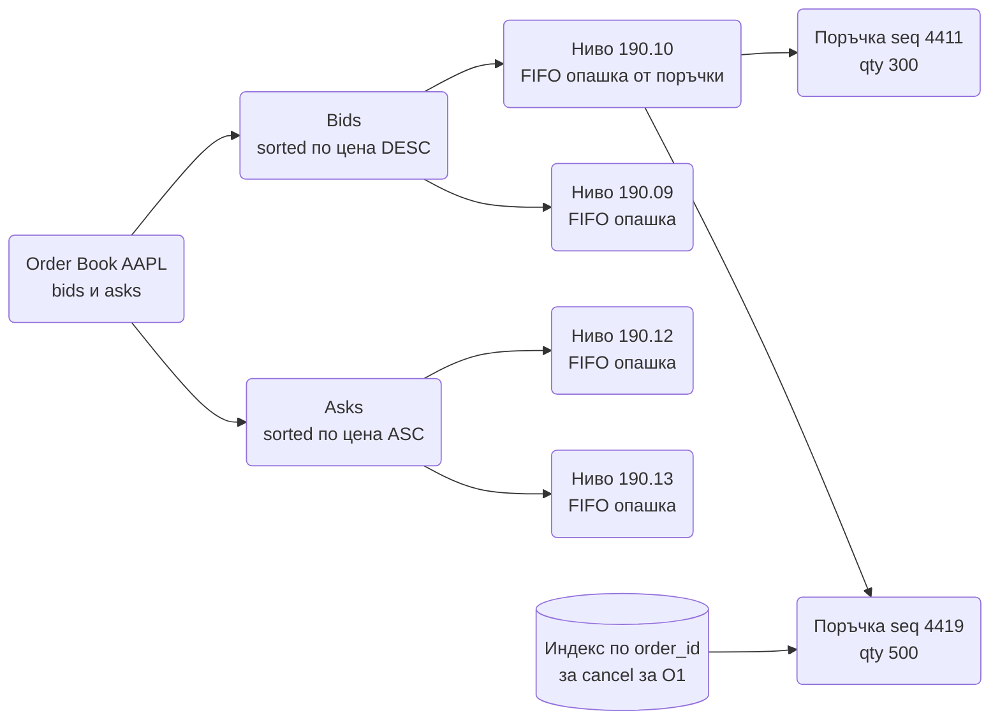
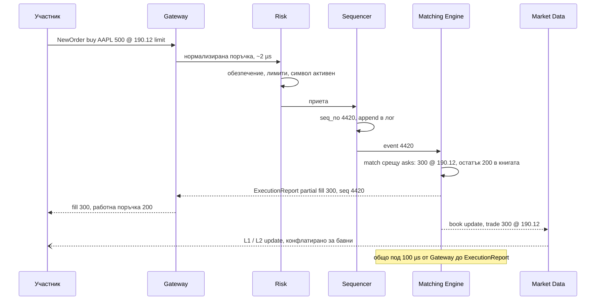

# Борса и order matching engine (NYSE / Binance тип) - System Design

Единствената система в папката, в която латентността се мери в **микросекунди**, а не в
милисекунди, и в която "eventually consistent" е забранена дума. Две поръчки, пристигнали с 3
микросекунди разлика, трябва да се изпълнят в този ред, всеки участник трябва да види един и същ
пазар, и след срив системата трябва да се възстанови до **точно** същото състояние, без загубена
или удвоена сделка.

Централните идеи: **един sequencer определя реда на всичко**; **matching engine-ът е
еднонишков, детерминистичен и в паметта**; и **всяко състояние е резултат от replay на входния
лог**, така че резервен инстанс, който чете същия лог, е винаги на същото място.

## Архитектурна диаграма



**Как да четеш диаграмата:** отгоре надолу е горещият път: поръчката влиза през gateway, минава през
рисковите проверки, получава пореден номер от sequencer-а и стига до matching engine-а, който я
сравнява с книгата и връща изпълнения. Всичко в този път е в паметта и се мери в микросекунди.
Sequencer-ът пише всяко събитие в лог, който hot standby engine-ът консумира паралелно, така че при
срив той е на същото състояние. Вдясно и долу е студеният път: сделките отиват в Kafka за клиринг,
надзор и история, и никой от тези консуматори не може да забави matching-а.

## Системен дизайн накратко

Горещ път в микросекунди (Gateway → Risk → Sequencer → Matching Engine → Execution Report) изцяло в паметта, и студен път в милисекунди през Kafka (клиринг, надзор, история). 9 компонента; всичко е детерминистично и възстановимо от входния лог.

### Компоненти

| # | Компонент | Какво прави | Как комуникира |
| --- | --- | --- | --- |
| 1 | **Client Gateway** | Протоколи, сесии, auth, rate limit на участник, нормализира в фиксиран бинарен формат | Приема FIX по TCP и собствен бинарен протокол по TCP от институционалните участници, HTTPS REST и WebSocket от retail; към Risk подава бинарни съобщения през lock-free ring buffer в паметта или по TCP с kernel bypass (синхронно) |
| 2 | **Risk Manager** | Pre-trade проверки под 10 µs: обезпечение, лимити, fat finger, спрян символ | Бинарни съобщения в паметта от Gateway (синхронно); отказаните връща веднага; приетите подава към Sequencer; обновява позициите си от execution reports (обратен поток) |
| 3 | **Sequencer** | Дава монотонен `seq_no` на всяко събитие и го записва в Input Log; единствената точка на сериализация | Append + `fsync` в Input Log на NVMe; UDP multicast на събитията към Matching Engine и Hot Standby (едно изпращане, всички получават); primary/standby с lease + fencing epoch |
| 4 | **Matching Engine** | Една нишка на символ, order book в паметта (масив по тикове, FIFO на ниво, hash по `order_id`), price-time priority | Консумира multicast потока строго по `seq_no`; изход към Execution Reporting и Market Data през ring buffers в паметта; сделките към Kafka producer (асинхронно, не чака ack) |
| 5 | **Hot Standby Engine** | Същият лог, същото състояние, не публикува; поема за микросекунди | Същият multicast поток от Sequencer; при failover започва да публикува от следващия `seq_no` |
| 6 | **Execution Reporting** | Fills, acks, rejects обратно към участниците | Бинарни съобщения към Gateway, който ги превежда във FIX ExecutionReport или WebSocket съобщение |
| 7 | **Market Data Publisher** | L1/L2 потоци, conflation за бавни консуматори, recovery канал по `seq_no` | UDP multicast към колокираните участници + TCP recovery канал за загубени пакети; WebSocket (конфлатиран) за retail |
| 8 | **Clearing and Settlement** | Netting, позиции, задължения T+1 | Kafka consumer `trades` (pull); SQL към Postgres |
| 9 | **Surveillance** | Spoofing, layering, манипулации | Kafka consumer `orders` и `trades` (pull); пише в ClickHouse |

### Хранилища

| Компонент | Роля |
| --- | --- |
| Input Log | Append-only, единствената истина; книгата е функция от лога |
| Book snapshots | На всеки N секунди за бърз cold start |
| Kafka | `trades`, `orders` към студения път |
| Postgres | Сделки, позиции, одит (пише се от консуматор, не от engine-а) |
| ClickHouse | Tick данни, backtesting, регулаторни заявки |

### Комуникация, backpressure и патерни

- **Синхронно (горещ път):** бинарни съобщения, kernel bypass, lock-free ring buffer, UDP multicast, без алокации, без GC; p99 под 100 µs.
- **Асинхронно (студен път):** Kafka за всичко, което търпи милисекунди; никой консуматор не може да забави matching-а.
- **Backpressure:** rate limit на участник на входа; conflation на market data за бавни клиенти (сделките не се конфлатират); отказана поръчка не получава `seq_no`.
- **Патерни:** single sequencer (превръща разпределен проблем в еднонишков), single-threaded engine per symbol (паралелизъм между книги, не вътре), event sourcing + replay + snapshot, hot standby, lease с fencing за failover, партициониране по `symbol` навсякъде, opening auction за пика при отваряне.

### Flow: сценариите стъпка по стъпка

**Поръчка до изпълнение.** Брокер праща по FIX `NewOrderSingle: buy AAPL 500 @ 190.12 limit`. Client Gateway я парсва веднъж и я превръща във вътрешно бинарно съобщение с фиксиран размер, за да няма повече parsing по пътя, и проверява, че участникът не е надхвърлил 1 000 съобщения в секунда. Risk Manager гледа в паметта си: има ли брокерът обезпечение за 500 × 190.12, не е ли поръчката 50 пъти над нормалния размер (fat finger), не е ли AAPL спрян. Отнема около 2 µs. Отказаната поръчка се връща веднага и никога не получава номер; официално не е пристигнала. Приетата отива в Sequencer-а, който ѝ дава `seq_no 4420`, дописва я в Input Log и я праща по UDP multicast. Matching Engine-ът за AAPL (една нишка, закачена за едно ядро, която обработва събитията строго по номер) я сравнява с книгата: най-ниската продажна цена е 190.12 с 300 акции на това ниво, по-ранната поръчка е първа (price-time priority по `seq_no`, не по timestamp, защото часовниците на машините се разминават с микросекунди). Изпълнява 300, остатъкът от 200 влиза в книгата като работна поръчка. Праща ExecutionReport "partial fill 300, seq 4420" към Gateway, който го превежда във FIX към брокера, и book update към Market Data. Общо под 100 µs. Чак сега, без да чака, сделката отива в Kafka: Clearing я чете за нетиране и T+1 сетълмент, Surveillance проверява дали не е част от spoofing схема, ClickHouse я пази завинаги.

**Падане на Matching Engine.** Машината с AAPL книгата спира по средата на сесията. Hot Standby Engine-ът е получавал същия multicast поток от Sequencer-а и е обработвал всяко събитие по същия начин, така че в паметта му стои идентична книга на `seq_no 4420`; просто досега не е публикувал. Lease-ът на primary изтича, standby-ят поема и започва да публикува от 4421. Участниците може да получат последните няколко execution reports втори път, но всеки носи `seq_no` и те ги дедупликират. Нищо не е загубено: всичко, което е получило номер, е в Input Log, а всичко без номер официално не е пристигнало. Ако паднат и двата engine-а, нов инстанс зарежда последния snapshot на книгата (правен на всеки N секунди) и replay-ва събитията от лога след него; понеже engine-ът е детерминистичен, стига до байт същата книга. Същият детерминизъм се тества всяка нощ: записан лог от продукцията се пуска през две версии на engine-а и изходите се сравняват байт по байт.

**Бавен market data клиент.** В 15:30 излиза отчет и книгата на NVDA се променя 20 000 пъти в секунда. Колокираните HFT участници получават всяка промяна по UDP multicast (едно изпращане от нашата страна, без TCP потвърждения; загубен пакет се възстановява през отделен TCP канал по `seq_no`). Retail приложението на WebSocket обаче не може да приеме 20 000 съобщения в секунда и не му трябват. Market Data Publisher следи колко изостава всеки WebSocket клиент и за изоставащите слива междинните състояния: вместо 200 book updates праща последното състояние на топ 10 нива (conflation, защото за цената важи само последната стойност). Сделките обаче не се конфлатират, всяка има значение и всяка стига. Така един бавен клиент не трупа буфер в паметта на сървъра и не бави никого. Rate limit-ът на входа е огледалният механизъм: един алгоритъм с 50 000 cancel-а в секунда не може да задуши входа за останалите.

## Описание на архитектурата стъпка по стъпка

### 1. Client Gateway: протоколи и нормализация

- Институционалните участници говорят **FIX** (текстов протокол от 1992, `35=D` е нова поръчка) или
  собствен бинарен протокол за ниска латентност. Retail приложението говори REST и WebSocket.
- Gateway-ът превежда всичко в едно вътрешно бинарно съобщение с фиксиран размер, за да няма
  parsing по-нататък по пътя.
- Тук са сесиите, автентикацията и **rate limit на участник** (например 1 000 съобщения/сек), за да
  не може един алгоритъм да задуши всички. Това е и мястото, където Node.js е разумен избор: много
  връзки, I/O-bound работа, без строги изисквания за микросекунди.

### 2. Risk Manager: pre-trade проверки

Преди поръчката да стигне до книгата се проверява **синхронно**, за под 10 µs, срещу данни в
паметта:

- Има ли участникът достатъчно обезпечение или наличност (при крипто: реален баланс, при акции:
  кредитен лимит на брокера).
- Не надхвърля ли поръчката максимален размер или отклонение от текущата цена (fat finger защита).
- Не е ли символът спрян за търговия.

Отказаната поръчка се връща веднага и никога не получава пореден номер. Risk е stateful (позициите
се променят с всяка сделка), затова се храни от execution report-ите обратно.

### 3. Sequencer: един ред за целия свят

Sequencer-ът е най-важната и най-простата част. Приема събития от много gateway-и и прави две
неща: **дава им монотонно нарастващ `seq_no`** и **ги записва в лога**. Всичко след него, включително
matching engine-ът, обработва събитията строго в този ред.

- Защо е нужен: без него две поръчки от различни gateway-и нямат обективен ред. "Кой е пръв" не
  може да се реши по timestamp, защото часовниците на машините се разминават с микросекунди, което
  тук е цяла вечност.
- Той е **единична точка на сериализация** и това е нарочно: тя е евтина (запис в паметта и в лог),
  а дава детерминизъм на всичко останало.
- Резервираност: primary и standby sequencer с бърз failover; standby-ят получава същия поток и
  продължава от последния `seq_no`. Един активен по всяко време (lease с fencing, същата идея като
  epoch в [Online Trading Game](Online_Trading_Game.md)).

Изречението за интервю: **sequencer-ът превръща разпределен проблем в еднонишков.**

### 4. Matching Engine: еднонишков и детерминистичен

Един символ (AAPL, BTC-USDT) се обработва от **една нишка**, която държи order book-а на символа в
паметта и обработва събитията по `seq_no`. Причини:

- **Няма локове.** Книгата се променя само от една нишка, така че няма race condition и няма
  синхронизация, която струва микросекунди.
- **Детерминизъм.** Едни и същи входни събития в същия ред дават същото състояние. Това е
  единственото, което прави replay и hot standby възможни.
- **Мащаб:** по символи. 5 000 символа се разпределят между машини; един символ никога не се дели.
  Горещ символ (NVDA в деня на отчет) получава собствена машина.

Алгоритъмът е **price-time priority**: при покупка се сравнява с най-ниската продажна цена; при
равна цена печели по-рано пристигналата поръчка (по `seq_no`, не по време). Изпълнението може да е
частично: поръчка за 1 000 срещу 300 на най-добра цена изпълнява 300 и продължава към следващото
ниво или остава в книгата с остатък.

### 5. Структурата на order book-а



- **Ценови нива** в сортирана структура. Учебникът казва red-black tree или skip list; практиката
  казва **масив, индексиран по цена в тикове**, защото цените са дискретни (190.10 е тик 19010) и
  масивът дава O(1) достъп и cache locality. Best bid и best ask са указатели, които се местят.
- **FIFO опашка на ниво**: свързан списък или ring buffer от поръчки в ред на пристигане.
- **Hash map по `order_id`** за cancel и modify за O(1): cancel-ите са 90%+ от съобщенията на HFT.
- **Без алокации в горещия път**: обектите се преизползват от pool, за да няма GC пауза посред
  matching. Затова ядрото е на C++, Java с изключен GC (Azul, off-heap) или Rust, не на Node.js.

### 6. Типове поръчки

| Тип | Поведение | Защо съществува |
| --- | --- | --- |
| **Limit** | Изпълни на тази цена или по-добра, остатъкът в книгата | Основата на книгата, дава ликвидност |
| **Market** | Изпълни веднага на най-добрите налични цени | Сигурно изпълнение, несигурна цена |
| **IOC** (immediate or cancel) | Изпълни каквото може веднага, откажи остатъка | Не оставя следа в книгата |
| **FOK** (fill or kill) | Изпълни изцяло или нищо | Атомарно изпълнение на голям блок |
| **Stop** | Става market/limit, когато цената мине праг | Държи се извън книгата в отделна структура |

### 7. Market Data и conflation

Всяка промяна на книгата поражда съобщение. При 100 000 събития в секунда никой WebSocket клиент
не може да ги приеме, а и не му трябват:

- **L1** (best bid/ask + последна сделка) и **L2** (топ N нива с агрегирани количества) се публикуват
  като отделни потоци.
- **Multicast UDP** за колокираните участници: едно изпращане, всички получават, без TCP
  потвърждения. Загубеното съобщение се възстановява през отделен recovery канал по `seq_no`.
- **Conflation** за бавни консуматори: ако клиентът изостава, междинните snapshot-и се сливат и той
  получава последното състояние, не всяка стъпка. Точно това е coalescible фреймът в Online Trading Game: за
  цената важи само последната стойност.
- Сделките (trades) обаче **не се конфлатират**: всяка има значение.

### 8. Възстановяване и hot standby

Matching engine-ът е в паметта и няма база. Как оцелява при срив:

- Всяко входно събитие е в лога на sequencer-а със `seq_no`. Състоянието на книгата е чиста функция
  от лога до даден `seq_no`.
- **Hot standby** инстанс консумира същия поток и поддържа същата книга, но не публикува. При срив на
  primary той става primary за микросекунди, продължавайки от следващия `seq_no`, без replay.
- **Cold start** след пълен отказ: зареждане на последния snapshot на книгата (правен на всеки N
  секунди) плюс replay на събитията след него. Детерминизмът гарантира същото състояние.
- Всяко изходящо съобщение носи `seq_no` на събитието, което го е породило, така че участниците могат
  да дедупликират при failover (standby-ят може да препрати последните няколко).



### 9. Латентност: къде отиват микросекундите

| Стъпка | Типично | Техника |
| --- | --- | --- |
| Мрежа от колокация до gateway | 5-20 µs | Kernel bypass (DPDK, Solarflare Onload), без syscalls |
| Parsing и risk | 1-5 µs | Фиксирани бинарни формати, данни в L1/L2 cache |
| Sequencer | 1-3 µs | Append в паметта, lock-free ring buffer (LMAX Disruptor) |
| Matching | 1-10 µs | Масив по тикове, без алокации, една нишка на ядро с CPU pinning |
| Публикуване | 5-10 µs | Multicast, pre-allocated буфери |

Целта е **p99 под 100 µs** от gateway до execution report, и по-важно, **ниска вариация**: HFT
участниците плащат за предвидимост повече, отколкото за средна стойност. Затова се избягват GC,
page faults, context switches и споделени структури между ядра. Node.js не е за ядрото, но е
подходящ за gateway-ите за retail, за WebSocket fan-out на market data и за целия backoffice.

### 10. Справедливост

Борсата продава доверие, че никой не вижда поръчките преди другите:

- Всички колокирани участници имат **еднакво дълги кабели** (буквално, NYSE го прави), за да няма
  предимство от разстояние.
- Редът се определя единствено от sequencer-а по пристигане, никога от приоритет на клиент.
- Rate limit на участник пречи един да монополизира входа.
- Surveillance консуматорът търси spoofing (поръчки, които се отменят преди изпълнение, за да
  подведат) и layering. Това е студен път, но е задължителен по регулация.

## Оразмеряване (Back-of-the-envelope)

Допускане: **1 млрд. съобщения на ден** (поръчки, cancel-и, модификации), 6.5 часа търговска сесия,
5 000 символа, 10% от съобщенията водят до сделка.

| Метрика | Изчисление | Резултат |
| --- | --- | --- |
| Съобщения средно | 1G / 23 400 s | ≈ 43 000/сек |
| Пик при отваряне (x5) | 43k × 5 | ≈ 200 000/сек, за минути |
| Сделки на ден | 1G × 10% | 100 млн. |
| Пропускливост на един символ в пик | горещ символ, ~5% от трафика | ≈ 10 000/сек, една нишка смогва |
| Order book на символ | 10 000 отворени поръчки × ~100 B | ≈ 1 MB, десетки MB за големите |
| Входен лог за ден | 1G × ~64 B | ≈ 64 GB/ден, NVMe, fsync на партиди |
| Market data изход | 43k събития × 10 000 абонати без conflation | Невъзможно, затова multicast и conflation |
| Историческо съхранение | 64 GB × 250 търговски дни | ≈ 16 TB/година, ClickHouse |

Числото, което носи точки: **200 000 съобщения в секунда при отваряне, но никога повече от 10 000
за един символ.** Затова еднонишков matching на символ е достатъчен, а мащабът идва от броя символи,
не от паралелизъм вътре в книгата.

## Модел на данните

```text
NewOrderSingle   { client_order_id, symbol, side, type, qty, price?, tif }   → ExecutionReport NEW | REJECTED
CancelRequest    { client_order_id, order_id }                              → ExecutionReport CANCELLED | REJECT
ReplaceRequest   { order_id, new_qty, new_price }                           → ExecutionReport REPLACED
MarketData L1    { symbol, bid, bid_qty, ask, ask_qty, last, seq_no }        поток, conflated
MarketData L2    { symbol, bids[10], asks[10], seq_no }                     поток, snapshot + incremental
Trade            { trade_id, symbol, price, qty, buyer_order, seller_order, seq_no }
```

| Хранилище | Ключ | Съдържание | Бележка |
| --- | --- | --- | --- |
| Order book (памет) | `symbol` → книга | Ценови нива, FIFO опашки, индекс по `order_id` | Няма база; източникът е логът |
| Input Log | `seq_no` | Всяко входно събитие, бинарно | Append-only, единствената истина |
| Book snapshots | `(symbol, seq_no)` | Сериализирана книга на всеки N секунди | Ускорява cold start |
| `trades` (Postgres) | `trade_id`, партиция по ден | Сделки за клиринг и отчети | Пише се от Kafka консуматор, не от engine-а |
| `positions` | `(participant_id, symbol)` | Нетна позиция, задължения | Обновява се от Clearing, ден T+1 |
| Tick store (ClickHouse) | `(symbol, time)` | Всички сделки и book updates | Аналитика, backtesting, регулаторни заявки |

**Partition key:** `symbol`, навсякъде. Един символ е една нишка, една книга, един лог-поток, една
Kafka партиция. Кросове между символи (spread стратегии) са грижа на участника, не на борсата.

## Ключови въпроси за интервюто

### Защо matching engine-ът е еднонишков, при положение че имаме 64 ядра?

Защото книгата на един символ трябва да се променя строго последователно, а всеки лок или CAS върху
споделена структура струва повече, отколкото самото matching. 64-те ядра се използват за 64 символа
или групи символи, всеки на своя нишка, закачена за свое ядро. Паралелизмът е между книги, никога
вътре в една.

### Какво е sequencer и защо не използваме timestamp-и?

Sequencer-ът дава на всяко събитие пореден номер и записва лога. Timestamp-ите на различни машини се
разминават с микросекунди дори с PTP синхронизация, а тук две поръчки на 3 µs разстояние трябва да
имат ясен ред. Един процес, който брои, е единственият обективен арбитър. Цената е, че е точка на
сериализация; тя е приемлива, защото работата му е тривиална.

### Как се възстановявате след срив на matching engine-а?

Hot standby, който консумира същия лог и е на същия `seq_no`, поема за микросекунди. Ако и той падне,
нов инстанс зарежда последния snapshot и replay-ва лога след него; детерминизмът гарантира идентична
книга. Участниците дедупликират изходящите съобщения по `seq_no`. Нищо не се губи, защото всичко, което
е получило номер, е в лога, а всичко без номер официално не е пристигнало.

### Как се тества детерминизмът?

Записан лог от продукция се пуска през две версии на engine-а или през primary и standby, и
изходите се сравняват байт по байт. Всяко разминаване е бъг. Освен това property-based тестове:
случайни последователности поръчки, проверка на инварианти (best bid < best ask, сумата на
количествата се запазва, никоя сделка не е на цена, по-лоша от лимита на двете страни).

### Как гарантирате справедливост между участниците?

Редът е само по пристигане при sequencer-а, физическите разстояния до него са изравнени, rate limit-ът
е еднакъв за всички в един клас, а surveillance следи за манипулации. Няма "приоритетен" вход.
Регулаторът може да поиска лога и да провери реда на всяка сделка.

### Какво се променя при крипто борса?

Работи 24/7 без сесии, така че няма прозорец за поддръжка и snapshot-ите и деплойте са онлайн.
Борсата е и **custodian**: държи реалните баланси, така че Risk Manager проверява истински пари, а
не кредитен лимит, и withdrawal-ите са отделна високорискова система с cold wallets. Сетълментът е
моментален вътре в борсата (промяна на баланси в ledger, виж
[Payment System](Payment_System_Stripe_Wallet.md)), а не T+1 през клирингова къща.

### Защо market data не минава през Kafka?

Kafka дава милисекунди латентност и at-least-once, което е отлично за клиринга, но не за котировки,
които трябва да стигнат за микросекунди до колокираните участници. Затова горещият market data път е
multicast UDP с recovery канал, а Kafka е за всичко, което може да чака милисекунди: сделки към
клиринг, история, надзор.

### Къде би се счупила системата първо?

При отваряне на пазара, когато всички поръчки от нощта влизат едновременно и книгата на всеки символ
се строи от нулата (opening auction). Решението е отделен auction алгоритъм, който събира поръчки без
matching и намира една цена на отваряне, вместо да ги обработва една по една. Второто слабо място е
sequencer failover: ако standby-ят поеме, докато primary още работи, две поръчки могат да получат един
номер; затова failover-ът минава през lease с fencing и primary спира сам, ако не може да го поднови.
