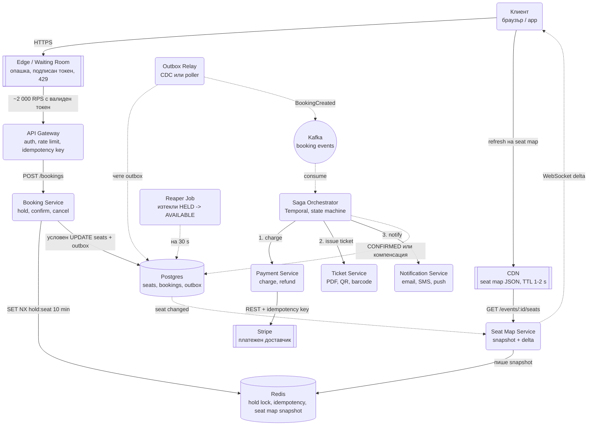
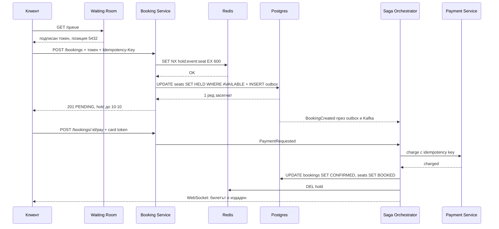
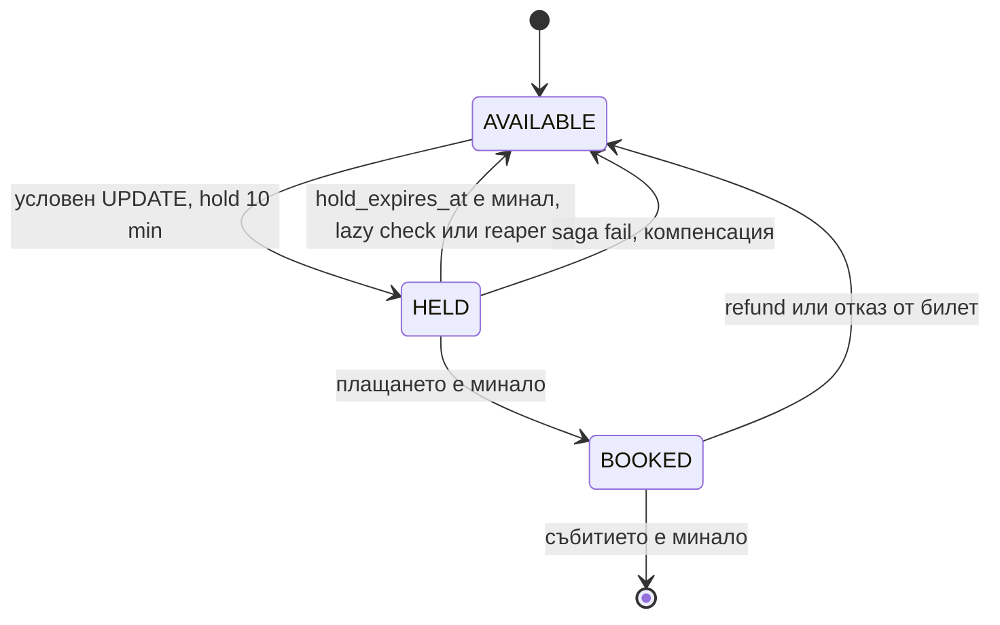

# Платформа за билети (Ticketmaster тип) - System Design

## Архитектурна диаграма



**Как да четеш диаграмата:** Пътят за запис е тесният и строго контролиран: Waiting Room пуска
само толкова трафик, колкото базата издържа, Booking Service взима hold в Redis като оптимизация
и прави условен `UPDATE` в Postgres като истинската гаранция, а Saga-та довършва плащане, билет и
известие асинхронно. Пътят за четене на seat map-а е широкият и е напълно отделен: snapshot в
Redis, WebSocket delta съобщения и кратко кеширан JSON на CDN-а, така че 200k RPS refresh-и никога
не докосват таблицата `seats`. Пунктираните линии са асинхронни.

## Системен дизайн накратко

Проблемът не е обем, а конкуренция: милион души за 50 000 реда. Затова писането е тесен, строго контролиран път (Waiting Room → Booking → Postgres), а четенето на seat map-а е широк и напълно отделен (Redis snapshot + WebSocket + CDN). Общо 9 сървиса плюс Waiting Room на edge-а.

### Сървиси

| # | Сървис | Какво прави | Как комуникира |
| --- | --- | --- | --- |
| 1 | **Waiting Room (Edge)** | Нарежда потребителите на опашка и пуска около 2 000 RPS с подписан токен | HTTP на edge-а; 429 за останалите |
| 2 | **API Gateway** | Auth, rate limit, проверка на токена от чакалнята, `Idempotency-Key` | REST от клиента |
| 3 | **Booking Service** | Hold на място (Redis `SET NX` за 10 min) + условен `UPDATE seats WHERE AVAILABLE` в Postgres + outbox ред в същата транзакция | Sync към Redis и Postgres; връща 201 PENDING |
| 4 | **Outbox Relay** | Чете таблицата `outbox` и публикува `BookingCreated` | pg-query-stream или CDC (Debezium) → Kafka |
| 5 | **Saga Orchestrator** | State machine на резервацията: charge → issue ticket → notify, компенсации при провал | Kafka consumer; sync извиквания към Payment, Ticket, Notification; Temporal или собствен |
| 6 | **Payment Service** | Charge и refund през Stripe с idempotency key | REST към Stripe; webhook-и обратно |
| 7 | **Ticket Service** | Генерира билета: PDF, QR, баркод | Викан от Saga-та |
| 8 | **Notification Service** | Email, SMS, push при потвърждение | Викан от Saga-та; async доставка |
| 9 | **Seat Map Service** | Поддържа snapshot на залата в Redis и праща delta по WebSocket | Слуша промени в `seats`; WebSocket към клиента; JSON през CDN с TTL 1-2 s |
| 10 | **Reaper Job** | Връща изтеклите HELD места в AVAILABLE на 30 s | Периодичен процес с разпределен лок към Postgres |

### Хранилища

| Компонент | Роля |
| --- | --- |
| Postgres | `seats`, `bookings`, `outbox`; `UNIQUE (event_id, seat_id)` е истинската гаранция |
| Redis | Hold lock с TTL, idempotency ключове, seat map snapshot |
| Kafka | Booking events между Booking и Saga |
| CDN | Кеширан seat map JSON |

### Комуникация, backpressure и патерни

- **Синхронно:** REST до `201 PENDING`. Saga стъпките са sync RPC към Payment/Ticket/Notification, но самата Saga е асинхронна спрямо клиента.
- **Асинхронно:** outbox → Kafka → Saga; seat map delta по WebSocket; резултатът от Saga-та се връща по WebSocket.
- **Backpressure:** две точки. Waiting Room ограничава входа до дебита на базата (token bucket). Outbox Relay чете като stream, за да не препълни паметта, а Kafka буферира Saga-та.
- **Патерни:** distributed lock като оптимизация + условен UPDATE като гаранция (fencing tokens при нужда), Transactional Outbox, Saga с оркестрация и компенсации, идемпотентност по ключ от клиента, reconciliation с PSP, CQRS разделение на четене и запис. Алтернатива: single writer per event (Kafka партиция по `event_id`).

## Описание на архитектурните патерни и микросървиси

### 1. Управление на конкурентността (Distributed Locking с Redis Redlock)

- **Проблемът (Double Booking):** Двама души натискат бутона за Място 42 в една и съща милисекунда.
- **Решението:** Преди Booking Service да запише в базата данни, прави опит да вземе Distributed
  Lock в Redis с кратък Time-To-Live (TTL) от 10 минути за ключ `lock:event_123:seat_42`.
  - Ако Сървър А вземе лока, продължава напред.
  - Ако Сървър Б опита да вземе същия лок, получава отказ "Мястото вече е временно резервирано".

#### Важно: Redis локът НЕ е гаранцията за коректност

Това е най-честият въпрос на интервю по тази система, и Martin Kleppmann има известна критика
точно към Redlock. Разпределеният лок може да бъде нарушен при:

- **GC пауза или STW спиране** на процеса, което го приспива за по-дълго от TTL-а. Локът изтича,
  друг процес го взима, а първият се събужда и продължава да пише, убеден че още го държи.
- **Clock drift** между Redis възлите.
- **Мрежово разделяне** (network partition) между възлите на Redlock кворума.

Затова локът е **оптимизация**, която пази 99.9% от заявките да не стигат до базата, а истинската
гаранция стои в базата данни:

```sql
-- Атомарно условно вземане на мястото: или го взимаш, или получаваш 0 засегнати реда.
UPDATE seats
   SET status = 'HELD', held_by = $user_id, hold_expires_at = NOW() + INTERVAL '10 minutes'
 WHERE seat_id = $seat_id
   AND (status = 'AVAILABLE' OR (status = 'HELD' AND hold_expires_at < NOW()))
RETURNING seat_id;
```

Плюс `UNIQUE` индекс на `(event_id, seat_id)` в таблицата с резервации, който прави физически
невъзможно двама души да имат потвърден билет за едно и също място, каквото и да се е случило по
пътя. Ако системата има нужда лок и запис да са наистина безопасни заедно, се използват
**fencing tokens**: локът връща монотонно нарастващ номер, който всеки следващ запис носи, и базата
отхвърля запис със стар номер.

### 2. Виртуална чакалня (Virtual Waiting Room & Backpressure Точка 1)

- **Проблемът:** При пускане на билети за огромно събитие, 500,000 заявки в секунда удрят API-то.
- **Решението (Backpressure):** На ниво Edge / API Gateway се използва Virtual Waiting Room (напр.
  Cloudflare Waiting Room или Token Bucket). Потребителите се нареждат в опашка и се пускат към
  Booking Service само с такъв дебит, какъвто базата данни може да издържи (напр. максимум 2,000
  заявки/сек). Всички останали виждат екран "Вие сте #5432 в опашката".

### 3. Outbox Pattern & Backpressure Точка 2

- Booking Service създава резервация със статус `PENDING` и записва събитие в `outbox` таблицата в
  една и съща SQL транзакция.
- Outbox Relay чете чрез Node.js Streams (`pg-query-stream`) с вграден Backpressure, за да не
  препълни RAM паметта при огромен брой резервации, и изпраща събитието `BookingCreated` към Kafka.
  Алтернатива без собствен код: CDC (Debezium) чете WAL-а на Postgres и публикува редовете от
  `outbox` директно в Kafka.

### 4. Saga Pattern за разпределени транзакции (Orchestration-based)

Тъй като плащането, издаването на билета и пращането на имейл са в различни микросървиси с отделни
бази данни, не можем да използваме стандартна SQL транзакция (`BEGIN ... COMMIT`). Използваме
**Saga Pattern**:

- **Saga Orchestrator:** Централен сервиз (често имплементиран с рамки като Temporal.io или custom
  Node.js state machine), който управлява стъпките:
  - **Стъпка 1:** Вика Payment Service да вземе парите.
  - **Стъпка 2:** Вика Inventory Service да генерира и задели официалния билет и QR код.
  - **Стъпка 3:** Вика Notification Service за изпращане на имейл.

**Компенсиращи действия (Compensating Actions / Rollback):**

Ако Стъпка 1 (плащане) мине успешно, но Стъпка 2 (генериране на билет) се провали (напр. генераторът
за QR кодове крашне) или потребителят се забави над 10 минути:

- Saga Orchestrator-ът задейства компенсираща транзакция.
- Вика обратно Payment Service да направи Refund (връщане на парите).
- Изпраща команда за освобождаване на мястото в базата данни и в Redis, правилно отменяйки целия
  процес без непоследователни данни (Data Inconsistency).

#### Щастливият път от край до край



### 5. Жизнен цикъл на мястото и изтичане на държането

Едно място минава през строга машина на състоянията. Без нея "изтеклите" резервации остават заключени
завинаги и залата се разпродава на хартия, докато е празна.



- **TTL в Redis** освобождава лока, но **не** променя реда в базата. Затова `seats` носи и
  `hold_expires_at`.
- **Lazy check:** всяко ново вземане на мястото третира изтекло `HELD` като свободно (виж `UPDATE`
  по-горе). Това е основният механизъм.
- **Reaper job:** периодичен процес с разпределен лок минава изтеклите държания и ги връща в
  `AVAILABLE`, за да се появят пак в seat map-а. Това е подсигуряване, не основен механизъм.

### 6. Идемпотентност на резервацията и плащането

Мобилното приложение прави retry при слаба мрежа. Без защита потребителят получава два билета и две
плащания.

- Клиентът праща `Idempotency-Key` (UUID) в заглавието на `POST /bookings`.
- Booking Service прави `SETNX idempotency:<key>` в Redis; при съществуващ ключ връща **същия**
  предишен отговор, без нова резервация.
- Webhook-ите от Stripe също се дедупликират по `event_id` на доставчика - те се преизпращат по
  дизайн (at-least-once).

### 7. Reconciliation с платежния доставчик

Saga-та може да падне между "парите са взети" и "билетът е издаден", а компенсацията да не мине.
Затова нощен Reconciliation Job сравнява нашите записи със сетълмент файла на Stripe и вдига флаг за
всяко разминаване: платено без билет (дължим refund) или билет без плащане (дупка в приходите).

### 8. Оразмеряване (Back-of-the-envelope)

Горещо събитие: стадион с **50 000 места**, билетите излизат в 10:00 ч.

| Метрика | Изчисление | Резултат |
| --- | --- | --- |
| Пик на заявките | ~1M души за 50k места | 100 000 - 500 000 RPS в първите секунди |
| Какво пуска Waiting Room-ът | ~2 000 RPS към Booking Service | 250:1 отношение на филтриране |
| Записи в базата | 50 000 места / ~10 мин. | ≈ 85 записа/сек - тривиално |
| Четене на seat map | 1M души × refresh на 5 s | ≈ 200 000 RPS → CDN + Redis, не DB |

Изводът за интервюто: **проблемът не е в обема данни, а в конкуренцията върху 50 000 реда.**
Оразмеряването доказва, че писането е малко, а цялата сложност е в опашката отпред и в
заключването.

### 9. Пътят на четене (seat map)

Seat map-ът е 200k RPS от read-only трафик и не бива да минава през същата база, която обслужва
резервациите:

- Снимка на състоянието в Redis, обновявана при всяка промяна, раздавана през WebSocket delta
  съобщения или кратко кеширан HTTP отговор (1-2 s TTL).
- Клиентът трябва да очаква, че мястото може да е заето при кликване. **Eventual consistency на
  четенето е приемлива; на записа не е.**

### 10. Алтернатива: един писач на събитие (single-writer per event)

Дизайнът по-горе е "много писачи + лок + условен UPDATE". Има и втори валиден отговор, който
интервюиращият оценява, ако го обясниш с компромисите му: **инвентарът на едно събитие се
притежава от точно един процес**, който взима всички решения за него последователно.

| | Много писачи + лок + условен UPDATE | Един писач на събитие |
| --- | --- | --- |
| Как се решава конфликтът | Базата отхвърля втория `UPDATE` | Няма конфликт: заявките се обработват една след друга в паметта на собственика |
| Как се реализира | Redis hold + Postgres `seats` | Kafka партиция с ключ `event_id` и един консуматор, или in-memory owner с lease във Valkey/Redis + fencing epoch (моделът от документа за Online Trading Game) |
| Латентност на решение | Няколко ms (Redis + Postgres) | Под 1 ms, чиста памет |
| Скалиране | Хоризонтално по места, всяко място е независим ред | Един процес на събитие: горещо събитие = горещ процес / горещ partition |
| Отказ | Stateless сървиси, базата е истината | Собственикът пада: lease изтича, друг възстановява от snapshot / replay на партицията; през това време събитието не приема резервации |
| Durability | Веднага в Postgres | Snapshot + append-only лог на решенията, записът в Postgres е асинхронен |
| Кога е правилният избор | Много събития с умерен трафик, екипът иска простота и SQL гаранции | Малко много горещи събития, където 2 000 решения/сек върху 50 000 реда трябва да са детерминистични и бързи |

Двата модела не се изключват: Kafka партиция по `event_id` пред Booking Service вече сериализира
заявките за едно събитие и прави условния `UPDATE` почти никога да се проваля. Изречението за
интервю: **"Ако конкуренцията е върху малък набор редове, най-евтиният лок е да няма конкуренция:
един процес решава последователно."** Цената е, че цялото събитие е един hot spot, който трябва да
се шардира по сектор или блок места, ако един процес не смогва.

### 11. Наблюдаемост и SLO

Системата може да е "зелена" по CPU и все пак да губи пари. Метриките, на които се алармира:

- **Hold-to-confirm conversion:** делът от `HELD`, които стигат до `BOOKED`. Рязък спад означава
  счупено плащане или ботове, които държат места без да купуват.
- **Saga compensation rate:** процент саги, завършили с refund. Над ~1% е инцидент при доставчика
  или бъг в Ticket Service.
- **Дълбочина на опашките:** outbox backlog (редове без `published_at`), Kafka consumer lag на
  Saga-та и брой хора в Waiting Room спрямо освободения дебит.
- **Latency на условния `UPDATE`** и брой заявки с 0 засегнати реда (колко хора са ударили вече
  заето място, тоест колко изостава seat map-ът).
- **Reconciliation разминавания** на ден: целта е нула; всяко едно е ръчна намеса.
- SLO: `POST /bookings` P99 под 500 ms при пуснатия дебит; seat map staleness под 2 s; време от
  плащане до издаден билет под 30 s за 99% от случаите.

## Текст за представяне пред интервюиращите

Термините, на които да наблегнеш:

> "Срещу Double Booking имам два слоя: Redis hold с TTL 10 минути като оптимизация, която спира
> почти целия конкурентен трафик, и условен `UPDATE ... WHERE status = 'AVAILABLE'` плюс `UNIQUE`
> constraint в Postgres като истинската гаранция. Локът не е коректност; базата е. Ако ми трябва
> локът и записът да са безопасни заедно, добавям fencing token."

> "Използвам Saga Pattern с Orchestrator (напр. Temporal) за осигуряване на Eventual Consistency
> между микросървисите за Плащания, Инвентар и Нотификации."

> "Имплементирам Компенсиращи транзакции (Compensating Actions), които автоматично връщат парите и
> освобождават мястото, ако плащането изтече или някой сервиз по веригата спре да работи."

> "Прилагам Backpressure още на входната точка чрез Virtual Waiting Room и Token Bucket алгоритми,
> за да предпазя вътрешните база данни от претоварване."

> "Пътят на четене е отделен: seat map-ът идва от Redis snapshot и WebSocket delta, не от таблицата
> `seats`. Eventual consistency при четене е приемлива, при запис не е."

## Допълнителни въпроси, които се задават

### Как гарантираме, че никой не прескача виртуалната чакалня?

Чакалнята издава **подписан токен** (JWT / HMAC) с позиция и време на валидност. Booking Service
приема заявка само с валиден, неизтекъл и неизползван токен. Без подпис всеки може да си направи
директна заявка към API-то и опашката става декорация.

### Защо не 2PC (двуфазов комит) вместо Saga?

2PC държи заключени ресурси във всички участници докато координаторът реши, и блокира всичко, ако
координаторът падне. При външен платежен доставчик, който изобщо не говори 2PC, това е неприложимо.
Saga разменя атомарността за **eventual consistency** плюс компенсации.

### Какво става, ако компенсацията се провали?

Компенсиращите действия също се retry-ват (Temporal ги прави издръжливи през рестарт). След N опита
случаят отива в DLQ и в опашка за ръчна намеса, защото "потребителят е платил и няма билет" е
инцидент, а не грешка.

### Как се борим с ботове и препродавачи?

Rate limit по акаунт, устройство и IP; captcha на входа на чакалнята; лимит билети на човек, налаган
в базата с уникален constraint, а не само в UI-а; проверка на платежния метод.

### Какво става с места без номера (general admission)?

Няма ред на място, а брояч `remaining` на секция. Условният `UPDATE` става
`UPDATE sections SET remaining = remaining - 1 WHERE id = $id AND remaining > 0`, което е същият
принцип, но върху един горещ ред. При 2 000 RPS към един ред Postgres издържа, но при повече се
разделя на N под-броячи (`remaining_0..remaining_9`), от които клиентът избира случаен, и се слива
остатъкът накрая. Класически "hot row" проблем.

### Как избираме "най-добрите свободни места" без да заключим половината зала?

Best-available търсенето е read-only заявка над snapshot-а в Redis (или материализиран изглед),
която връща кандидати. Резервацията е след това пак условен `UPDATE` по конкретни `seat_id`.
Ако някой ги е взел междувременно, търсенето се повтаря с новия snapshot. Никога не се заключват
диапазони от места "докато потребителят избира".

### Как деплойвате Booking Service по средата на продажба?

Сървисите са stateless, така че rolling deploy е безопасен: hold-ът е в Redis и Postgres, не в
паметта на процеса. Saga-та е в Temporal и продължава след рестарт. Единственото, което трябва да
се пази, е Waiting Room дебитът: по време на деплой се сваля временно, защото капацитетът зад него
е по-малък.
