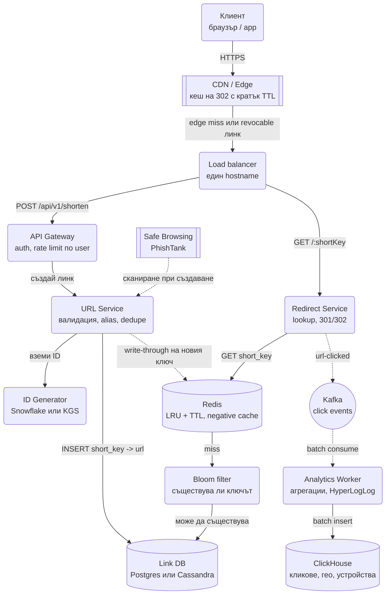

# URL Shortener - System Design

## Архитектурна диаграма



**Как да четеш диаграмата:** Има два основни пътя с коренно различен обем. Пътят за писане минава
през API Gateway, URL Service и ID Generator и завършва в базата. Пътят за четене започва от CDN
edge-а, който обслужва голяма част от кликовете сам, а при miss удря Redirect Service, Redis и чак
накрая базата. Пунктираните линии са асинхронни: събитията за кликове отиват през Kafka към
аналитиката, без пренасочването да ги чака.

## Системен дизайн накратко

Два потока с коренно различен обем: писане (създаване на линк, около 1 000/сек) и четене (пренасочване, около 100 000/сек). Затова системата е 5 сървиса, разделени по поток, с CDN и Redis пред базата и Kafka за аналитиката след факта.

### Сървиси

| # | Сървис | Какво прави | Как комуникира |
| --- | --- | --- | --- |
| 1 | **API Gateway** | Приема `POST /shorten`, auth, rate limit по потребител, идемпотентност по `Idempotency-Key` | REST от клиента; вътрешно HTTP към URL Service |
| 2 | **URL Service** | Валидира URL-а, проверява го в Safe Browsing, dedupe, custom alias, записва двойката key → url | Sync към ID Generator и Link DB; write-through в Redis |
| 3 | **ID Generator** | Дава уникални ключове: Snowflake (без координация) или KGS с предварително генерирани партиди | Вътрешен RPC или библиотека в процеса; KGS раздава партиди по 10 000 |
| 4 | **Redirect Service** | `GET /:key`: Redis → Bloom filter → DB, връща 301/302 | Чете Redis и DB синхронно; публикува `url-clicked` в Kafka, без да чака |
| 5 | **Analytics Worker** | Чете кликовете на партиди, агрегира, брои уникални с HyperLogLog | Kafka consumer group; batch insert в ClickHouse |

Отпред стоят CDN/Edge (кешира 302 с кратък TTL) и Load balancer. Не са наши сървиси, но поемат по-голямата част от четенето.

### Хранилища

| Компонент | Роля |
| --- | --- |
| Link DB (Postgres или Cassandra) | Източник на истината; `short_key` е primary и partition key |
| Redis | Кеш на горещите ключове (LRU, TTL), negative cache, HyperLogLog броячи |
| Bloom filter | Отсява несъществуващи ключове преди базата |
| Kafka | Click events; разделя пренасочването от аналитиката |
| ClickHouse | Агрегации по време, гео, устройство |

### Комуникация, backpressure и патерни

- **Синхронно:** REST от клиента. Пътят на четене е CDN → Redis → DB, всеки слой поема miss-овете на предния.
- **Асинхронно:** кликовете отиват в Kafka; пренасочването никога не чака аналитиката.
- **Backpressure:** Kafka е буферът между 100k RPS четене и ClickHouse; Analytics Worker-ът пише на партиди и изостава (consumer lag), вместо да бави редиректа. Rate limit при създаване пази ключовото пространство.
- **Патерни:** cache-aside с write-through за новите ключове, negative caching + Bloom filter срещу cache penetration, single-flight + TTL jitter срещу stampede, идемпотентно създаване, lazy deletion за изтекли линкове.

## Описание на архитектурата стъпка по стъпка

Архитектурата на URL Shortener се дели на два основни потока с коренно различно натоварване:
**Писане** (създаване на линк) и **Четене** (пренасочване).

### 1. Поток за съкращаване на линк (Write Flow)

- **API Gateway:** Приема заявката `POST /api/v1/shorten` с оригиналния URL, прави Rate Limiting
  (за защита от спам) и я препраща към URL Service.
- **ID Generator (генератор на уникални ключове):** Всяко съкращаване има нужда от уникален ключ.
  За да няма дублиране при разпределени Node.js сървъри, се използва един от три подхода (сравнени
  подробно по-долу):
  - **Range-based ID Server:** Сервизът си заделя диапазони от ID-та (напр. Сървър 1 взима ID-та от
    1 до 1 000 000, Сървър 2 взима от 1 000 001 до 2 000 000).
  - **Twitter Snowflake ID:** Генератор на 64-битови числа, базирани на време (Timestamp) +
    Worker ID + Sequence.
  - **Key Generation Service (KGS):** Отделен сервиз предварително генерира случайни ключове и ги
    раздава на партиди.
- **Base62 Encoding (кодиране):** Взема се генерираното уникално ID (напр. `1251938221`) и се
  преобразува в Base62 кодировка (букви a-z, A-Z и цифри 0-9).
  - **Защо Base62?** Позволява 62 възможни символа на позиция. 7-символен код (напр.
    `bit.ly/aX9kL2m`) дава 62^7 ≈ 3.5 × 10^12 уникални URL-а.
- **Запис в базата данни:** Записва се двойката
  `{ short_key: 'aX9kL2m', original_url: 'https://example.com/long/path' }`. Тъй като заявките са
  главно по ключ, идеален избор са NoSQL Key-Value бази (Cassandra, DynamoDB) или индексирана
  PostgreSQL база.
- **Write-through в кеша:** Новосъздаденият линк обикновено се споделя и кликва в следващите
  минути. Записваме го в Redis още при създаването, за да не плащаме първия cache miss.

### 2. Поток за пренасочване (Read Flow - бърз достъп)

Това е най-натоварената част от системата (съотношение четене/писане обикновено e 100:1).

- **CDN / Edge кеш (първи слой):** Пренасочването е малък, еднакъв за всички отговор, така че
  може да се кешира на edge-а. Ако сървърът върне `302` с `Cache-Control: public, max-age=60`,
  повторните кликове върху горещ линк в следващата минута изобщо не стигат до origin-а.
  Аналитиката за тези кликове идва от edge логовете (CDN доставчиците ги стриймват към S3 / Kafka).
  Компромисът е revocation: деактивиран линк живее на edge-а до изтичане на TTL-а, затова за
  линкове, при които моментално спиране е важно, се връща `Cache-Control: private, max-age=0`.
- **Redis Cache (втори слой):** При edge miss Redirect Service проверява в Redis (in-memory):
  - **Cache Hit (намерено в кеша):** Връща се HTTP статус код 301 (Permanent Redirect) или 302
    (Found) и потребителят веднага се пренасочва. Време за отговор: под 2-5 ms.
  - **Cache Miss (няма го в кеша):** Заявката минава през Bloom filter (ако ключът със сигурност
    не съществува, връщаме 404 без да пипаме базата), после отива до основната база данни, извлича
    оригиналния URL, записва го в Redis за следващи запитвания и пренасочва потребителя.
- **LRU Eviction Strategy (премахване от кеша):** Тъй като 20% от линковете генерират 80% от
  кликовете (Закон на Парето), в Redis се използва политика LRU (Least Recently Used) - пази в
  паметта само най-често отваряните линкове.

### 3. Асинхронна аналитика (Analytics & Statistics)

При всяко пренасочване се събират данни (кога е кликнато, от коя държава, какъв браузър/устройство).
Затова събитието се излъчва от **Redirect Service** (пътя на четене), а не при създаването на линка.

- **Защо асинхронно?** Не искаме пренасочването да чака запис в аналитичната база данни.
- **Event Broker (Kafka):** При клик Redirect Service просто хвърля събитие в Kafka топик
  (`url-clicked-events`) и веднага връща отговор на потребителя.
- **Analytics Workers & Time-Series DB:** Отделен Worker чете от Kafka и записва данните на партиди
  (batches) в Time-Series / Columnar база данни като ClickHouse или Cassandra, която е оптимизирана
  за бързи агрегации и графики.
- **Уникални посетители с HyperLogLog:** "Колко различни хора са кликнали" е скъп въпрос, ако се
  пази set от IP/cookie за всеки линк (милиони линкове × хиляди посетители). Redis `PFADD` /
  `PFCOUNT` дава броя уникални с ~0.8% грешка в **12 KB на ключ**, независимо от броя посетители.
  За аналитика това е напълно приемливо и с порядъци по-евтино.

## Избор на генератор на ключове

Трите подхода решават един и същ проблем с различни компромиси:

| Подход | Как работи | Плюсове | Минуси |
| --- | --- | --- | --- |
| **Snowflake + Base62** | 64-битово ID от време + worker + sequence, кодирано в Base62 | Без координация, K-sortable (добре за LSM бази), 7-11 символа | Ключовете са **предвидими и изброими**; трябва разбъркване (виж по-долу) |
| **Случаен ключ + retry** | 7 символа от CSPRNG, `INSERT` с `UNIQUE`, retry при колизия | Най-просто, непредвидим | Вероятност за колизия расте с пълненето; разпръснат запис в LSM база; всеки insert е и проверка |
| **Key Generation Service (KGS)** | Отделен сервиз предварително генерира случайни уникални ключове в таблица `unused_keys`; всеки app сървър си взима партида от 10 000 в паметта | Няма колизии в критичния път, непредвидими ключове, нула латентност за генериране | Още един компонент; загубена партида при срив на сървър (приемливо, ключовете са евтини); самият KGS трябва да е HA, иначе спира писането |

Изречението за интервю: **Snowflake, ако искаш нула координация и не те притеснява
предвидимостта; KGS, ако искаш случайни ключове без да плащаш проверка за колизия при всеки запис.**
При 3 500 записа/сек в пик и двете работят; при ~100 записа/сек случаен ключ + retry е достатъчен.

## Оразмеряване (Back-of-the-envelope)

Интервюиращият почти винаги иска числа преди диаграмата. Допускане: **100 млн. нови линка на ден**,
съотношение четене/писане **100:1**.

| Метрика | Изчисление | Резултат |
| --- | --- | --- |
| Записи (средно) | 100M / 86 400 s | ≈ 1 160 заявки/сек |
| Записи (пик, x3) | 1 160 × 3 | ≈ 3 500 заявки/сек |
| Четения (средно) | 1 160 × 100 | ≈ 116 000 заявки/сек |
| Съхранение / ден | 100M × ~500 B на запис | ≈ 50 GB/ден |
| Съхранение / 5 години | 50 GB × 365 × 5 | ≈ 90 TB |
| Кеш (горещи 20%) | 20M записа × 500 B | ≈ 10 GB RAM |
| Изчерпване на ключовете | 3.5 × 10^12 / 100M на ден | ≈ 35 000 дни (~96 години) |

Изводът, който трябва да произнесеш на глас: **116k RPS четене не се обслужва от база данни.**
Затова целият дизайн е CDN + кеш отпред, а базата вижда само cache miss-овете. При 90% hit rate
на edge-а и 90% в Redis до базата стигат около 1 000 заявки/сек, което е спокойно за един
клъстер.

## Схема на данните и API

```text
POST   /api/v1/shorten        { url, custom_alias?, expires_at? }  → 201 { short_url }
GET    /:shortKey                                                  → 301 / 302
GET    /api/v1/stats/:shortKey                                     → { clicks, unique, by_country }
DELETE /api/v1/links/:shortKey                                     → 204
```

| Колона | Тип | Бележка |
| --- | --- | --- |
| `short_key` | `varchar(8)` | **Primary Key** / partition key. Всички четения са по него. |
| `original_url` | `text` | До 2 KB. |
| `user_id` | `uuid` | Индекс за "моите линкове". |
| `created_at` | `timestamptz` | UTC. |
| `expires_at` | `timestamptz` | `NULL` = безсрочен. |
| `is_active` | `boolean` | Деактивиране без триене (злонамерен линк, изтекло право). |

**Sharding:** по `hash(short_key)`, не по `created_at`. Ключът е и партиционен ключ, така че всяко
четене е single-shard lookup. Ако се шардира по време, целият днешен трафик пада върху един шард
(hot partition).

### Коя база и защо

Схемата е **чист key-value lookup**: една таблица, четене по първичен ключ, без join-ове и без
аналитични заявки (те са в ClickHouse). Това означава, че изборът на база е въпрос на обем, не на
модел:

- **До няколко TB (малка/средна система):** PostgreSQL с партициониране по `hash(short_key)` и
  read replicas е напълно достатъчен и дава транзакции за custom alias и `UNIQUE` без усилие.
- **При 90 TB и 100k+ четения/сек:** Cassandra или DynamoDB. Хоризонтално скалиране без ръчно
  шардиране, репликация по няколко региона и TTL на ниво ред, който решава изтичането на линкове
  безплатно. Цената е, че `UNIQUE` за custom alias трябва да се направи през Lightweight
  Transaction (`IF NOT EXISTS`) или през KGS.

### Идемпотентно създаване

Клиентът прави retry при таймаут и без защита получава два различни къси линка за един и същ URL.
Две нива на защита:

- **`Idempotency-Key` в заглавието** (UUID от клиента): при повторение връщаме същия отговор.
- **Дедупликация по `(user_id, original_url)`** като опция на продукта: ако същият потребител
  съкрати същия URL, връщаме съществуващия ключ. Внимание: не бива да е глобална дедупликация
  между потребители, защото тогава аналитиката на двама души се смесва, а единият може да разбере
  какво е съкратил другият.

### Rate limiting: два различни лимита

- **При създаване:** строг, по потребител / API key (напр. 100 линка/час), защото писането е
  скъпо, ключовото пространство е споделено и спамът се създава тук.
- **При пренасочване:** много по-либерален, по IP, само срещу сканиране и злоупотреба (напр.
  1 000 заявки/мин от един IP). Легитимен вирусен линк има хиляди кликове в секунда от различни
  IP-та и не бива да бъде ограничаван.

## Предвидимост на ключа (пропускан security gap)

Sequential ID + Base62 означава, че ключовете са **последователни и изброими**. Всеки може да
итерира `aX9kL2m`, `aX9kL2n`, ... и да изтегли чужди линкове, включително частни документи.

Три решения:

- **Обратимо разбъркване на ID-то (Feistel мрежа / XOR шифър)** преди кодирането. Запазва
  уникалността 1:1, но прави реда непредвидим. Няма нужда от проверка за колизии.
- **Случаен ключ** (7-8 символа от CSPRNG) + `UNIQUE` индекс и retry при колизия, или същите
  случайни ключове предварително генерирани от KGS. Проста логика, но губиш K-sortability, а
  записът в LSM база (Cassandra) става разпръснат.
- **HMAC(original_url + salt)**, съкратен до 7 символа, с проверка за колизия. Дава и естествена
  дедупликация на еднакви URL-и.

## Защита на кеша

- **Cache penetration:** бот сканира несъществуващи ключове; всяка заявка минава кеша и удря базата.
  Решение: **negative caching** (записваме "липсва" с кратък TTL 30-60 s) + Bloom filter пред DB +
  rate limit на 404-ките.
- **Cache stampede (thundering herd):** TTL-ът на горещ линк изтича и хиляди паралелни заявки
  тръгват към базата едновременно. Решение: single-flight (само една заявка попълва кеша, другите
  чакат) + jitter в TTL стойностите.
- **Bloom filter-ът трябва да се пълни при всеки нов ключ** и да се преизгражда периодично от
  базата, защото не поддържа изтриване. Изтритите линкове остават в него като false positive, което
  е безобидно: просто се стига до базата, която връща 404.

## Ключови въпроси за интервюто

### HTTP Status 301 срещу 302: кой да изберем?

- **301 (Moved Permanently):** Браузърът кешира пренасочването локално. При следващ клик браузърът
  изобщо не пита нашия сървър, а пренасочва директно.
  - Плюс: Спестява сървърен ресурс.
  - Минус: Губим аналитиката за броя кликове.
  - Минус, за който малцина се сещат: **не можем да отменим линка.** Ако се окаже фишинг, браузърите
    вече са кеширали пренасочването и ще водят към него, докато кешът им не изтече.
- **302 (Found / Temporary Redirect):** Всяка заявка минава през нашия сървър.
  - Плюс: Точна аналитика в реално време за всеки клик.
  - Плюс: Можем да сменим или спрем дестинацията моментално.
  - Минус: По-високо натоварване на сървърите.

> Правилният отговор на интервю: използваме 302 с `Cache-Control: private, max-age=0`, ако
> аналитиката и възможността за отмяна са важни за бизнес модела ни. Ако сме готови да жертваме
> до минута закъснение при отмяна, 302 с кратък публичен TTL на CDN-а сваля повечето от трафика
> от origin-а.

### Как се справяме с изтичащи линкове (Expired URLs)?

Вместо да пускаме тежки `DELETE` заявки в базата, ползваме **Lazy Deletion** (триене при опит за
четене, ако `expired_at < NOW()`) или автоматично чистене с фонов процес (Cron / TTL в NoSQL базите).

### Как гарантираме уникалност между няколко региона?

Snowflake ID-то съдържа Worker/Datacenter битове, така че всеки регион генерира от собствено
пространство и колизия е невъзможна без координация. Алтернатива: всеки регион получава собствен
диапазон от Range Server-а, или собствена партида ключове от KGS.

### Какво правим със злонамерени линкове?

Проверка при създаване срещу Google Safe Browsing / PhishTank, повторно асинхронно сканиране на
популярните линкове, и възможност за моментално деактивиране (което налага 302 вместо 301 и
`is_active` флаг вместо триене).

### Custom alias (vanity URL)

Отделно пространство от генерираните ключове, `UNIQUE` индекс, списък със запазени думи (`api`,
`admin`, `login`), и rate limit, за да не се "заграбят" всички кратки думи.

### Защо не просто auto-increment в PostgreSQL?

Един auto-increment е точка на сериализация и single point of failure за писането. При 3 500
записа/сек в пик и няколко региона той става бутилково гърло. Snowflake е разпределен и не изисква
координация.

### Какво става, ако Redis падне?

Нищо катастрофално, ако дизайнът е правилен: Redis е **производен кеш**, не източник на истината.
Трафикът минава към базата, която трябва да издържи поне временно (затова базата се оразмерява за
няколко пъти над нормалния miss трафик, а не за 1 000 заявки/сек точно). Защита: Redis Cluster с
реплики, плюс CDN слоят отпред, който продължава да поема горещите линкове и без Redis.

### Как се изтрива линк, който е кеширан на три места?

Базата се обновява (`is_active = false`), Redis ключът се трие явно (`DEL`), а CDN-ът получава
purge заявка по URL или се чака TTL-ът. Точно затова edge TTL-ът за 302 е кратък: purge API-тата
са бавни и не са гарантирани, а минута изчакване е приемлива за повечето продукти.

### Как изглежда аналитиката "в реално време" за собственика на линка?

Двуслойно: Redis брояч `INCR clicks:<key>` и `PFADD uniques:<key>` за текущия момент (евтино,
приблизително), а точните агрегации по държава/устройство/ден идват от ClickHouse с няколко минути
закъснение. Dashboard-ът чете и двете и ги слива; никой не забелязва разликата между "сега" и
"преди 2 минути".
