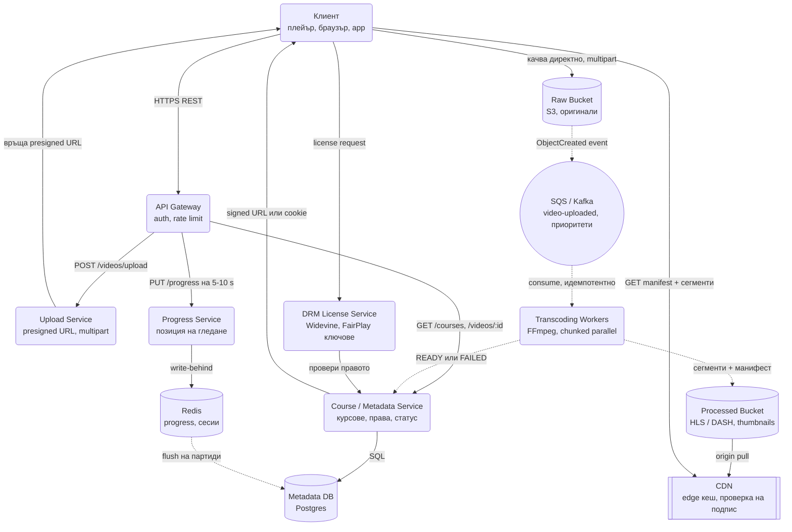
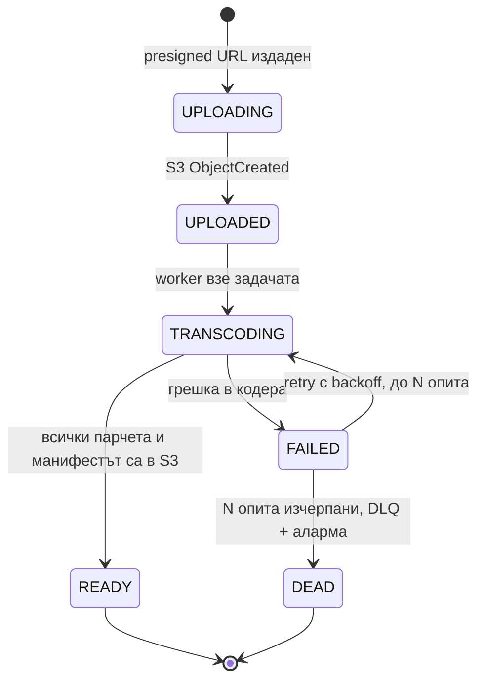

# Видео платформа (Udemy / Netflix тип) - System Design

## Архитектурна диаграма

**Как да четеш диаграмата:** Пътят за качване върви надясно и надолу: клиентът получава presigned
URL, качва директно в S3, а събитието от storage-а пуска транскодирането асинхронно (пунктирани
линии). Пътят за гледане никога не минава през приложните сървъри: Metadata Service издава
подписан линк, плейърът дърпа манифест и сегменти от CDN-а, а DRM сервизът дава ключа за
декриптиране. Третият, малък поток е прогресът на гледане, който се пише в Redis и се флъшва към
базата на партиди.

## Системен дизайн накратко

Три потока: качване (рядко, гигабайти), транскодиране (асинхронно, тежко) и гледане (постоянно, 70 Gbps). Приложните сървиси са 6 и никой от тях не пренася видео байтове: качването е директно в S3, гледането е от CDN.

### Сървиси

| # | Сървис | Какво прави | Как комуникира |
| --- | --- | --- | --- |
| 1 | **API Gateway** | Auth, rate limit, маршрутизира REST заявките | Приема HTTPS REST от плейъра и браузъра; препраща към сървисите по gRPC (синхронно) |
| 2 | **Upload Service** | Издава presigned URL за multipart качване директно в Raw bucket | gRPC от Gateway; HTTPS към S3 API за подписване на URL (синхронно); самият файл отива от браузъра към S3 с HTTPS PUT, без да минава през нас |
| 3 | **Course / Metadata Service** | Курсове, уроци, права за достъп, състояние на видеото (UPLOADING → READY), издава signed URL за CDN | gRPC от Gateway и от DRM; SQL към Postgres; получава READY/FAILED като gRPC извикване от Transcoding Workers (асинхронно спрямо клиента) |
| 4 | **Transcoding Workers** | FFmpeg: режат на парчета, кодират по резолюции паралелно, слепват HLS/DASH манифест, thumbnails, субтитри | SQS/Kafka consumer на `video-uploaded` (pull, асинхронно); HTTPS GET/PUT към S3; gRPC към Metadata при завършване; брояч на готовите парчета в Redis |
| 5 | **Progress Service** | Позиция на гледане на всеки 5-10 s | gRPC от Gateway; Redis `SET` (write-behind); периодичен batch UPDATE в Postgres |
| 6 | **DRM License Service** | Издава ключове за декриптиране (Widevine, FairPlay) след проверка на правото | HTTPS license request от плейъра; gRPC към Metadata Service (синхронно) |

### Хранилища и инфраструктура

| Компонент | Роля |
| --- | --- |
| Raw bucket (S3) | Оригинали, write-once, Glacier след обработка |
| Processed bucket (S3) | Сегменти и манифести, четат се само през CDN с подпис |
| SQS / Kafka | `video-uploaded` от S3 ObjectCreated event; отделни опашки по приоритет |
| Postgres | Метаданни, права, state machine на видеото |
| Redis | Progress, сесии, брояч на транскодирани парчета |
| CDN | Раздава сегментите, проверява подписа на edge-а |

### Комуникация, backpressure и патерни

- **Синхронно:** HTTPS REST за метаданни, прогрес, лицензи; gRPC между сървисите. Тънки заявки, никакви байтове.
- **Асинхронно:** S3 event → опашка → worker-и → READY. Клиентът чака само до "качено", не до "готово".
- **Backpressure:** опашката поглъща пика от качвания, worker pool-ът скалира по дълбочината ѝ; отделни опашки за платени и безплатни uploads; Progress се пише write-behind, за да не прави 100k записа/сек в базата.
- **Патерни:** direct-to-S3 с presigned URL, fan-out/fan-in за паралелно транскодиране, state machine с retry и DLQ, идемпотентни worker-и (опашката е at-least-once), signed URL + DRM за защита, CDN pre-warm.

### Flow: сценариите стъпка по стъпка

**Качване на урок.** Инструкторът избира файл от 4 GB и натиска "Качи". Браузърът праща `POST /videos/upload` със заглавие и размер. API Gateway проверява кой е и го препраща по gRPC към Upload Service. Upload Service създава запис в Metadata Service със състояние `UPLOADING` и иска от S3 подписан URL за multipart качване (временен линк, който позволява на точно този клиент да пише в точно този ключ в Raw bucket-а за следващите минути). Връща го на браузъра. Оттук нататък нашите сървъри не участват: браузърът качва файла на парчета директно в S3 по HTTPS и при прекъсване продължава от последното потвърдено парче (resumable upload). Когато последното парче пристигне, S3 сам генерира събитие `ObjectCreated` и го пуска в опашката `video-uploaded`. Metadata записът минава в `UPLOADED`. Инструкторът вижда "Видеото се обработва", защото UI-ът чете точно това поле.

**Транскодиране.** Първи свободен Transcoding Worker тегли съобщението от опашката (pull: worker-ът взима задача само когато има свободен слот, така че 1 000 едновременни качвания не го събарят, а просто чакат в опашката). Проверява дали изходните обекти вече не съществуват в S3 (ако опашката е доставила съобщението два пъти, приключва без работа, идемпотентност). Разрязва оригинала на парчета по 1-2 минути по keyframe граници, без да прекодира, и пуска по една задача на парче и резолюция обратно в опашката: при 60 парчета и 4 резолюции това са 240 независими задачи, разпределени по целия пул. Всеки worker кодира своето парче с FFmpeg, качва резултата в Processed bucket под детерминистичен ключ и увеличава брояч в Redis. Worker-ът, който види, че броячът е стигнал 240, прави fan-in: слепва сегментите, генерира `.m3u8` манифеста и thumbnail-ите и вика Metadata Service по gRPC: `READY`. Ако кодер се провали, задачата се опитва наново с backoff до N пъти, а след това отива в DLQ с аларма и видеото става `FAILED`, без инструкторът да качва файла пак.

**Гледане.** Студентът отваря урока. Плейърът пита Metadata Service (през Gateway) за видеото; сервизът проверява дали студентът е купил курса и връща подписан URL към манифеста с живот от няколко минути. Плейърът тегли манифеста от CDN-а, после сегментите един по един, като сам преценява скоростта на връзката и избира 1080p или 480p за следващото парче (adaptive bitrate). CDN edge-ът проверява подписа, преди да даде сегмент, и при miss го дърпа от Processed bucket-а веднъж, след което го сервира на всички следващи от кеша си. Понеже сегментите са криптирани, плейърът иска ключ от DRM License Service, който пита Metadata дали правото е валидно и връща ключа. На всеки 5-10 секунди плейърът праща `PUT /progress`; Progress Service пише позицията в Redis веднага и я флъшва към Postgres на партиди (write-behind), така че на друго устройство видеото продължава от същото място, а базата не вижда 100 000 записа в секунда.

## Описание на архитектурата стъпка по стъпка

Видео платформите имат два коренно различни модула: **асинхронно качване и обработка**
(Ingestion & Transcoding) и **оптимизирано стриймване** (Streaming Delivery).

### 1. Поток за качване на видео (Upload Pipeline)

Качването на гигабайти видео директно през Node.js API блокира мрежовия ресурс и RAM паметта.
Затова се използва **Direct-to-S3 Upload**:

- **Заявка за качване (`POST /upload`):** Потребителят (напр. инструктор в Udemy) изпраща метаданни
  за видеото (заглавие, размер).
- **Presigned URL:** Node.js Upload Service генерира временен и защитен Presigned URL (от AWS S3,
  Google Cloud Storage или MinIO) и го връща на клиента.
- **Директно качване:** Браузърът качва видео файла (необработеното "RAW" видео) директно в Cloud
  Storage S3, заобикаляйки Node.js сървърите.
- **Resumable Uploads:** Използва се протокол като tus.io или S3 Multipart Upload, за да може при
  спиране на интернета качването да продължи оттам, докъдето е стигнало.

### 2. Асинхронно транскодиране (Transcoding & Chunking)

Суровото видео (напр. 4K ProRes) е твърде голямо и неизползваемо за директно гледане.

- **S3 Event → Queue:** Щом файлът се качи напълно в S3, Cloud Storage генерира събитие
  (`ObjectCreated`), което отива в опашка (`video-uploaded`, SQS или Kafka).
- **Transcoding Workers (FFmpeg / Handbrake / Cloud Transcoder):**
  - Разпределени Worker сервизи четат от опашката и задвижват процеса по конвертиране.
  - Видеото се преобразува в различни резолюции (1080p, 720p, 480p, 360p) и различни битрейтове
    (bitrates).
- **Chunking (разбиване на парчета):**
  - Видеото се нарязва на малки сегменти от по 2 до 10 секунди (файлове `.ts` или `.m4s`).
  - Генерира се "манифест файл" (плейлист: `.m3u8` за HLS или `.mpd` за DASH).
- **Запис в крайно S3 хранилище:** Обработените сегменти и манифест файлове се записват в
  Processed Storage Bucket.

#### Паралелизиране на транскодирането

Едночасов урок, кодиран последователно на една машина, отнема между 30 минути и 2 часа. Това е
неприемливо за инструктор, който чака да публикува. Решението е **да се раздели работата, не да се
купи по-бърза машина**:

1. Първи worker разрязва оригинала на парчета от 1-2 минути по keyframe граници (`ffmpeg -c copy`,
   без прекодиране, отнема секунди).
2. Всяко парче става отделна задача в опашката: `(video_id, chunk_index, rendition)`. При 60
   парчета и 4 резолюции това са 240 независими задачи, разпределени по целия пул.
3. Worker-ите кодират паралелно и качват резултата в S3 под детерминистичен ключ.
4. Последна стъпка (fan-in) чака всички парчета, слепва сегментите, генерира манифеста и маркира
   видеото `READY`.

Ефектът: времето за обработка пада от часове до минути и зависи от размера на пула, не от
дължината на видеото. Цената е по-сложно състояние (трябва да знаеш кои парчета са готови,
типично брояч в Redis или таблица `transcode_chunks`) и малка загуба на компресия по границите.

- **CPU или GPU:** CPU кодерите (x264, x265, SVT-AV1) дават най-добро качество на бит и са
  евтини на spot инстанси; GPU кодерите (NVENC, Quick Sync) са 5-10 пъти по-бързи, но с по-ниска
  ефективност на компресията при същия битрейт. VOD платформа с per-title encoding предпочита CPU,
  защото плаща трафика, а не времето; live стрийминг предпочита GPU, защото плаща латентността.
- **Приоритети в опашката:** платен инструктор с 50 000 студенти и анонимен безплатен upload не
  бива да чакат в една опашка. Отделни опашки (или priority attribute) с отделни пулове worker-и,
  така че масов безплатен upload да не забави публикуването на платен курс.

### 3. Поток за стрийминг и гледане (Streaming Delivery)

Стриймингът **НЕ МИНАВА** през Node.js сървърите, а през CDN (Content Delivery Network).

- **Adaptive Bitrate Streaming (ABS) през HLS / DASH:**
  - Потребителският видео плейър (напр. Video.js, Shaka Player) изтегля `.m3u8` манифест файла.
  - Плейърът динамично преценява скоростта на интернета на потребителя:
    - Ако интернетът е бърз → изтегля следващото 4-секундно парче в 1080p.
    - Ако интернетът забави → автоматично сваля следващото парче в 480p, без видеото да спира да
      върви (без buffering).
- **Content Delivery Network (CDN):**
  - Чанковете се кешират на хиляди Edge сървъри по целия свят (Cloudflare, AWS CloudFront, Fastly).
  - Потребителят тегли видео фрагментите от най-близкия до него сървър, което осигурява незабавно
    пускане.

### 4. Допълнителни микросервизи

- **Progress & Resume Service:** Специфичен за Udemy/Netflix. Малък сервиз записва на всеки 5-10
  секунди до кой точно сегмент е стигнал потребителят (използва се Redis за бърз запис +
  синхронизация към база данни), за да може видеото да продължи от същото място на друго устройство.
- **DRM / Video Protection (защита от пиратство):** При Udemy/Netflix видео сегментите са криптирани
  (AES-128). Плейърът изисква лицензен ключ от DRM License Service (Widevine, FairPlay), преди да
  може да ги декриптира и възпроизведе.

### 5. Метаданни и състояние на видеото

Диаграмата показва пътя на файловете, но една платформа не се състои само от файлове. Отделен
**Metadata / Course Service** с релационна база пази курсовете, уроците, реда им, цените, правата за
достъп и **състоянието на обработката**. Без него плейърът не знае какво изобщо има за гледане.

Транскодирането е дълъг процес, който се проваля редовно, затова видеото има изрична машина на
състоянията:

- UI-ът показва "Видеото се обработва" вместо счупен плейър, защото чете точно това поле.
- Всяка стъпка е **идемпотентна**: worker-ът, който получи същото съобщение втори път (опашката е
  at-least-once), проверява дали изходният обект вече съществува в S3 и приключва без работа.
- Провалилите се задачи отиват в DLQ с оригиналното съобщение, за да могат да се пуснат наново, без
  инструкторът да качва файла пак.

### 6. Защита на съдържанието отвъд DRM

DRM решава криптирането, но **не** решава кой изобщо може да поиска манифеста:

- **Signed URLs / Signed Cookies** от CDN-а с кратък срок (минути). Плейърът получава подписан линк
  чак след като Course Service потвърди, че потребителят е купил курса.
- **Token authentication на ниво CDN edge** - Cloudflare/CloudFront проверяват подписа, преди изобщо
  да отдадат сегмент. Без това всеки може да сподели `.m3u8` линка и да заобиколи цялото плащане.
- **Watermarking** (видим или forensic, персонализиран на потребител) за проследяване на изтекло
  съдържание.
- **Ротация на ключовете** на сегментите, за да не работи един изтекъл AES ключ вечно.

### 7. Bitrate ladder и per-title encoding

"1080p, 720p, 480p" е половината отговор. Всяка резолюция върви с определен битрейт, а стълбата се
избира според съдържанието:

| Резолюция | Типичен битрейт | Кога се пуска |
| --- | --- | --- |
| 240p | 300 kbps | Много слаба мобилна мрежа |
| 480p | 1 Mbps | 3G / претоварена мрежа |
| 720p | 2.5 Mbps | Стандартно мобилно гледане |
| 1080p | 5 Mbps | Wi-Fi / десктоп |

- **Per-title encoding** (подходът на Netflix): слайдове с говореща глава се кодират с много по-нисък
  битрейт от екшън кадри при същото възприемано качество. Спестява десетки проценти от трафика, а
  при видео платформа трафикът е най-голямото перо в сметката.
- **Избор на кодек:** H.264 за универсална съвместимост, HEVC/AV1 като допълнителна пътека за
  устройства, които ги поддържат (~30-50% по-малък файл, но по-скъпо кодиране).

### 8. Оразмеряване (Back-of-the-envelope)

Допускане: **10 000 нови часа видео месечно**, 1 млн. дневно активни зрители по 40 минути.

| Метрика | Изчисление | Резултат |
| --- | --- | --- |
| Сурово качено видео | 10 000 h × ~4 GB/h | ≈ 40 TB/месец |
| След транскодиране (4 пътеки) | ~2.5x от суровото | ≈ 100 TB/месец нови данни |
| Часове гледане на ден | 1M × 40 min | ≈ 667 000 часа |
| Изходящ трафик | 667k h × 2.5 Mbps × 3600 s | ≈ 750 TB/ден |
| Средна пропускливост | 750 TB / 86 400 s | ≈ 70 Gbps (пик 3x: ~200 Gbps) |
| Транскодиращи ядра | 10 000 h × ~2x realtime / 720 h | ≈ 30-60 постоянни машини |

Числото, което трябва да произнесеш: **70 Gbps устойчив изходящ трафик.** Оттам следва защо CDN-ът
не е оптимизация, а задължително условие, и защо трафикът, а не съхранението, определя сметката.

#### Модел на разходите

Грубо, при публични облачни цени:

| Перо | Порядък на месец | Лостът за намаляване |
| --- | --- | --- |
| CDN egress: 750 TB/ден ≈ 22 PB/месец | Стотици хиляди долари, дори при договорени цени под $0.01/GB | Per-title encoding и AV1 за поддържащите устройства: всеки спестен процент битрейт е същият процент от сметката |
| Съхранение: ~100 TB нови/месец, натрупващо се | Хиляди долари | Tiering: оригиналите в Glacier, рядко гледаните rendition-и в Infrequent Access |
| Транскодиране: ~50 машини | Хиляди до десетки хиляди долари | Spot инстанси, кодиране само на резолюциите, които реално се гледат за този курс |

Изводът: **egress-ът е 90%+ от сметката**, така че инженерното време се инвестира в битрейта, а
не в оптимизация на storage-а. Един процент по-добра компресия струва повече от всяко друго
подобрение в системата.

### 9. Какво още влиза в pipeline-а

Транскодирането рядко е единствената стъпка. В същия worker поток се вършат и:

- **Thumbnail генериране** и sprite лента за preview при пренавиване.
- **Субтитри**: автоматична транскрипция (Whisper/ASR) + превод, доставени като WebVTT пътека.
- **Индексиране за търсене**: транскриптът отива в Elasticsearch, за да може да се търси "в кой урок
  се говори за Kafka".
- **Проверка на съдържанието**: сканиране за зловреден файл и (при UGC платформа) модерация.
- **Уведомяване на инструктора**, че видеото е готово (email / WebSocket).
- **Тиъринг на съхранението**: суровият мастер отива в S3 Glacier след успешно транскодиране,
  защото се пипа веднъж на година, а стои с години.

## Ключови въпроси за интервюто при тази система

### HLS срещу DASH: какво са те?

- **HLS (HTTP Live Streaming):** Разработен от Apple, използва `.m3u8` и `.ts` файлове.
  Най-популярният протокол, поддържан от абсолютно всички мобилни устройства и браузъри.
- **DASH (Dynamic Adaptive Streaming over HTTP):** Отворен стандарт, използва `.mpd` файлове.
  По-гъвкав при избор на кодеци (AV1, VP9, HEVC).
- **CMAF** решава дублирането: едни и същи `.m4s` сегменти се описват и с HLS, и с DASH манифест,
  така че не се пази двойно копие на съдържанието.

### Защо използваме CDN вместо да стриймваме от собствени Node.js сървъри?

Видео трафикът генерира огромна мрежова честотна лента (bandwidth). Ако стриймваш видео от Node.js,
Event Loop-ът и мрежовият интерфейс на сървъра бързо ще блокират. CDN прехвърля натоварването върху
инфраструктура, специално проектирана за раздаване на статични файлове с ниска латентност.

### Как се справяме с паметта при качване на големи файлове?

В Node.js никога не зареждаме целия файл в RAM (heap memory). Използва се Direct S3 Upload
(Presigned URLs) или Node.js Streams с изчистване на паметта чрез backpressure.

### Защо S3 Event, а не приложението да пише директно в Kafka?

Защото качването не минава през нашия сървър - клиентът праща файла директно в S3. Единственият,
който знае със сигурност, че файлът е пристигнал **цял**, е самият storage. Ако разчитахме
приложението да съобщи, всяко прекъснато качване щеше да пуска транскодиране на счупен файл. На
практика веригата е S3 → SNS/SQS/EventBridge → конектор към Kafka, или направо SQS консуматори.

### Как гледането продължава от същото място на друго устройство?

Progress Service пише позицията в Redis на всеки 5-10 секунди (евтин, чест запис) и я флъшва към
базата на партиди (write-behind). При загуба на Redis се губят последните секунди от прогреса, което
е напълно приемливо; при синхронен запис в базата на всеки 10 секунди × 1 млн. зрители излизат
100 000 записа/сек, което не е.

### Какво се променя при live стрийминг?

Сегментите падат до 1-2 секунди (LL-HLS / CMAF chunked transfer), транскодирането е в реално време и
не може да се retry-ва, а закъснението става водеща метрика. VOD pipeline-ът оптимизира цена; live
pipeline-ът оптимизира латентност.

| | VOD (Udemy) | Live (Twitch, спорт) |
| --- | --- | --- |
| Сегмент | 4-10 s | 1-2 s, chunked transfer |
| Транскодиране | Паралелно, retry, часове са ОК | Реално време, GPU, без retry |
| Кодиране | Per-title, много пътеки | Фиксирана стълба, по-малко пътеки |
| Кеш на CDN | Почти 100% hit, pre-warm | Origin shield, request coalescing на един и същ сегмент |
| Метрика | Цена на GB | Glass-to-glass латентност |

### Как се справяме с "цял курс се пуска в 9:00 сутринта" пиково натоварване?

CDN pre-warming: сегментите на популярните уроци се избутват в edge кеша предварително, за да не удрят
всички origin-а едновременно (cache miss storm).

### Как разбираме, че качеството на гледане е паднало, ако CDN-ът не е наш?

Плейърът е сензорът: праща QoE метрики (време до първи кадър, rebuffer ratio, средна резолюция,
брой смени на пътека) на всеки 30 секунди към аналитичен endpoint. Агрегирани по регион, ISP и CDN
PoP, те показват проблема преди потребителите да пишат в support. Netflix и YouTube управляват
multi-CDN превключването именно по тези данни.

### Един S3 bucket за всичко или отделни?

Отделни: Raw (оригинали, write-once, Glacier след обработка), Processed (публично четен през CDN,
но само с подпис), и Thumbnails (публичен, без подпис, кеширан агресивно). Различните политики за
достъп, lifecycle и цена не се изразяват върху един bucket.

### Как се трие видео, което е на хиляди edge сървъри?

Не се разчита на CDN purge за сигурност. Метаданните се маркират като изтрити, Course Service спира
да издава подписани линкове, а вече издадените изтичат до минути. Самите сегменти се трият от
Processed bucket-а асинхронно, а edge копията отпадат по TTL. Purge заявка се пуска, но е
допълнение, не гаранция.
