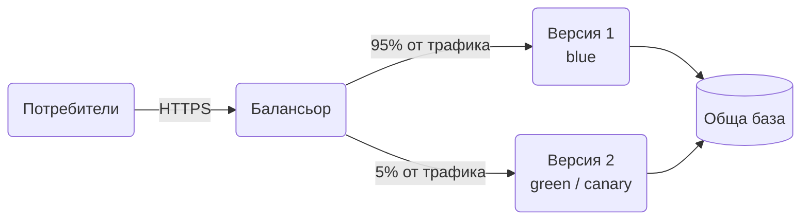

# Blue-Green & Canary Releases

Новата версия се пуска до старата, не върху нея. При Blue-Green превключваш целия трафик наведнъж и можеш да го върнеш за секунда. При Canary пускаш малка част от трафика към новото и гледаш дали се държи добре, преди да пуснеш всичко.

## Представи си

Пекарна сменя рецептата на хляба. Вариант едно: пече цяла партида по новата рецепта в съседната фурна и в един момент сменя хляба на щанда. Ако клиентите се оплачат, връща старата партида. Вариант две: слага по два нови хляба на всеки двадесет и пита купувачите как са. Ако харесват, увеличава дела. Първото е Blue-Green, второто е Canary.

## Проблемът, който решава

Класическият деплой спира старата версия и пуска новата на същите машини. Докато трае, системата не работи. Ако новата версия има бъг, връщането назад е нов деплой с още минути грешки за потребителите. Искаш нула прекъсване и връщане назад с едно действие.

## Как работи

1. Старата версия (blue) обслужва целия трафик. До нея вдигаш новата (green) с нула трафик.
2. Пускаш автоматични проверки и health checks срещу green.
3. Blue-Green: балансьорът превключва 100% към green. Blue остава жива няколко часа като резерв за връщане назад.
4. Canary: балансьорът праща 1% към новата версия, после 5%, 25%, 100%. На всяка стъпка сравняваш грешки, латентност и бизнес метрики между двете групи.
5. Ако метриките се влошат, връщаш трафика към старата версия. Нищо не се деплойва наново.
6. Когато новата версия е стабилна, старата се изключва.

## Кога да го ползваш

- Системата трябва да работи без прекъсване по време на деплой.
- Връщането назад трябва да е бързо и безопасно.
- Искаш да хванеш проблеми, които се виждат само с реален трафик: редки заявки, странни данни, натоварване.

## Капани

- **Базата е една.** Двете версии пишат в една и съща база. Промените в схемата трябва да са съвместими и с двете версии: първо добави колона, после смени кода, после махни старата.
- **Двойна цена.** Blue-Green изисква двойно ресурси по време на прехода. За малки системи е добре, за големи планирай бюджета.
- **Canary без метрики.** Ако не сравняваш двете групи с числа, canary е просто бавен деплой. Трябват грешки, латентност и ключови бизнес показатели по версия.
- **Залепнали сесии.** Ако потребител скача между версиите, вижда ту новото, ту старото. Насочвай един потребител винаги към една версия.

## Къде е в наръчника

- [Мрежа и балансиране](Networking_Load_Balancing.md): health checks и алгоритми на балансьора, които правят превключването.
- [Postgres отвътре](Database_Internals_Postgres.md): миграции без downtime, съвместими с две версии на кода.
