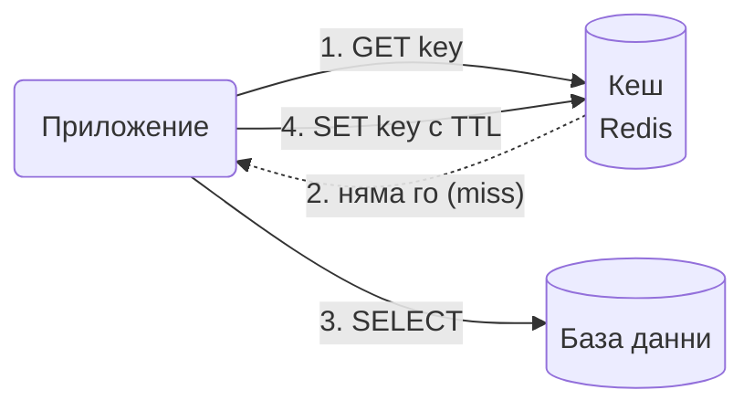

# Cache-Aside

Първо погледни в бързата памет (кеша). Ако го няма там, вземи го от базата, запази копие в кеша и го върни. Следващия път ще е там.

## Представи си

Държиш на бюрото си бележник с телефоните, които най-често търсиш. Когато ти трябва номер, първо гледаш в бележника. Ако го няма, отваряш големия указател, намираш номера и го преписваш в бележника. Следващия път не отваряш указателя. Бележникът е кешът, указателят е базата данни.

## Проблемът, който решава

Базата данни е бавна и скъпа в сравнение с паметта, а повечето системи четат едни и същи неща много пъти. В URL shortener например всеки линк се чете стотици пъти за всяко записване. Да питаш базата всеки път е загуба: тя се задъхва, а потребителят чака.

## Как работи

1. Приложението пита кеша за ключа.
2. Ако го има (cache hit), връща го веднага. Край.
3. Ако го няма (cache miss), чете от базата.
4. Записва резултата в кеша с време на живот (TTL) и го връща.
5. При промяна на данните приложението изтрива ключа от кеша, а не го обновява. Следващото четене ще зареди свежата стойност.

## Кога да го ползваш

- Четеш много повече, отколкото пишеш.
- Малко закъснение в данните е приемливо: TTL от секунди до минути.
- Не искаш кешът да е задължителен. Ако той падне, системата продължава да работи, само по-бавно.

## Капани

- **Cache stampede.** Популярен ключ изтича и хиляда заявки едновременно хукват към базата. Решението е single-flight: само една зарежда, другите чакат нейния резултат.
- **Стари данни.** Ако обновиш базата, но забравиш да изтриеш ключа, кешът лъже до изтичане на TTL. Изтривай при запис, не обновявай.
- **Негативни резултати.** Ако нещо го няма и в базата, кеширай и това ("няма такъв") за кратко. Иначе всяко търсене на несъществуващ ключ удря базата.
- **Горещи ключове.** Един ключ, който всички четат, претоварва един Redis възел. Копирай го на няколко ключа или го дръж в локалната памет на процеса.

## Къде е в наръчника

- [Distributed Cache](Distributed_Cache_Redis.md): консистентност кеш/база, eviction, горещи ключове.
- [URL Shortener](URL_Shortener.md): cache-aside и negative caching в действие.
- [Графи, дървета, низове](Algorithms_Graphs_Trees_Strings.md): LRU и LFU кеш като код.
