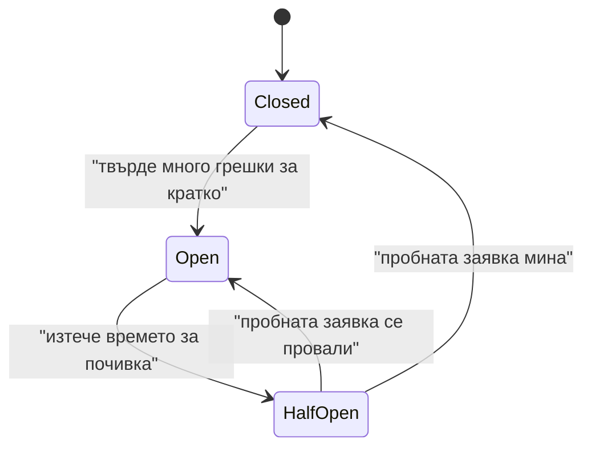

# Circuit Breaker

Когато една услуга се проваля отново и отново, спри да я викаш за малко. Върни грешка веднага, дай ѝ време да се съвземе и след това внимателно провери дали е оздравяла.

## Представи си

Електрическият предпазител вкъщи. Когато нещо даде на късо, той изключва тока, вместо да остави жиците да се нагорещят и да стане пожар. После ти го вдигаш и проверяваш дали проблемът го има още. Circuit Breaker е същият предпазител, но между две програми.

## Проблемът, който решава

Услугата за плащания падна. Всяка твоя заявка към нея чака таймаут от 2 секунди и после се проваля. Хиляди потребители чакат по 2 секунди за нищо, а твоите нишки и връзки са заети с безсмислено чакане. Още по-лошо, падналата услуга получава лавина от заявки точно когато се опитва да се вдигне, и пада пак. [Retry](retry.md) тук само влошава нещата.

## Как работи

1. **Closed** (затворен, токът тече). Заявките минават нормално, а предпазителят брои грешките.
2. Ако грешките надхвърлят праг, например 50% от последните 20 заявки, предпазителят минава в **Open**.
3. **Open** (отворен, токът е прекъснат). Всяка заявка се отхвърля веднага с грешка, без да се вика услугата. Това трае фиксирано време, например 30 секунди.
4. След почивката предпазителят минава в **Half-Open** и пуска една или няколко пробни заявки.
5. Ако пробните минат, връща се в Closed. Ако се провалят, връща се в Open и чака отново.

## Кога да го ползваш

- Викаш външна услуга, която може да падне или да стане много бавна.
- Имаш смислен отговор при грешка: кеширана стойност, съобщение "опитай по-късно", намалена функционалност.
- Искаш падналата услуга да има шанс да се възстанови, без да я засипваш.

## Капани

- **Един предпазител за всичко.** Ако един Circuit Breaker пази и плащанията, и препоръките, грешка в препоръките ще спре плащанията. Отделен предпазител за всяка зависимост.
- **Твърде чувствителен праг.** Три грешки за минута не са повод да спреш целия трафик. Мери процент грешки за прозорец от време, не абсолютен брой.
- **Без Timeout отдолу.** Предпазителят брои грешки. Ако заявките само висят без таймаут, той никога няма да се отвори.
- **Състояние само в един процес.** При десет инстанции всяка има свой предпазител и свое мнение. Често това е приемливо, но трябва да го знаеш.

## Къде е в наръчника

- [Node.js архитектурни патерни](Design_Patterns_Node_Architecture.md): Circuit Breaker с трите състояния като код.
- [Notification System](Notification_system.md): предпазител пред външните доставчици на известия.
