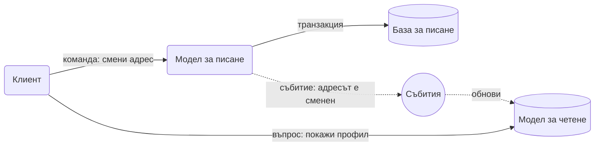

# CQRS

Command Query Responsibility Segregation: раздели кода и често данните на две части. Едната приема команди, които променят нещо. Другата отговаря на въпроси. Всяка е оформена за своята работа.

## Представи си

В ресторант сервитьорът приема поръчки и ги носи в кухнята, но не готви. На таблото пред кухнята стои списък с готовите ястия, който всеки сервитьор може да погледне за секунда. Кухнята записва промените, таблото се чете. Никой не рови в кухнята, за да провери дали супата е готова. Кухнята е моделът за писане, таблото е моделът за четене.

## Проблемът, който решава

Един модел трябва да върши две различни неща. При запис искаш строги правила, валидации и транзакции, затова данните са нормализирани в много таблици. При четене искаш един екран да се зареди с една бърза заявка, затова ти трябват готови, разгънати редове. Когато един модел се опитва да е и двете, става бавен за четене и объркан за писане.

## Как работи

1. Клиентът праща команда: "смени адреса", "добави в кошницата". Командата не връща данни, само успех или грешка.
2. Моделът за писане проверява правилата и записва в своята база.
3. След записа излиза събитие, което казва какво се е променило.
4. Моделът за четене слуша събитията и обновява своите готови таблици, оформени точно за екраните.
5. Клиентът пита модела за четене. Отговорът е проста заявка по ключ, без JOIN.

## Кога да го ползваш

- Четенето и писането имат много различен товар или форма. Хиляди гледания на един профил срещу една промяна на ден.
- Правилата при запис са сложни и искаш да ги държиш далеч от кода за екраните.
- Вече имаш събития, например от [Event Sourcing](event-sourcing.md), и четящите модели са естествено продължение.

## Капани

- **Закъснение.** Потребителят сменя адреса, презарежда и вижда стария, защото четящият модел още не е обновен. Покажи промяната локално в клиента или чети от модела за писане веднага след запис.
- **Удвоен код.** Два модела, две бази, събития между тях. За CRUD приложение с десет таблици това е излишна тежест.
- **Загубени събития.** Ако събитието се изгуби, моделът за четене остава стар завинаги. Ползвай [Transactional Outbox](transactional-outbox.md) и пази възможност да го построиш отново от нулата.
- **CQRS навсякъде.** Прилагай го в частта на системата, която има проблема, не в целия продукт.

## Къде е в наръчника

- [Патерни и концепции](System_Design.md): CQRS в речника и къде се среща в системите.
- [SOLID, DDD и архитектурни стилове](SOLID_DDD_Architecture_Styles.md): команди, събития и bounded contexts.
