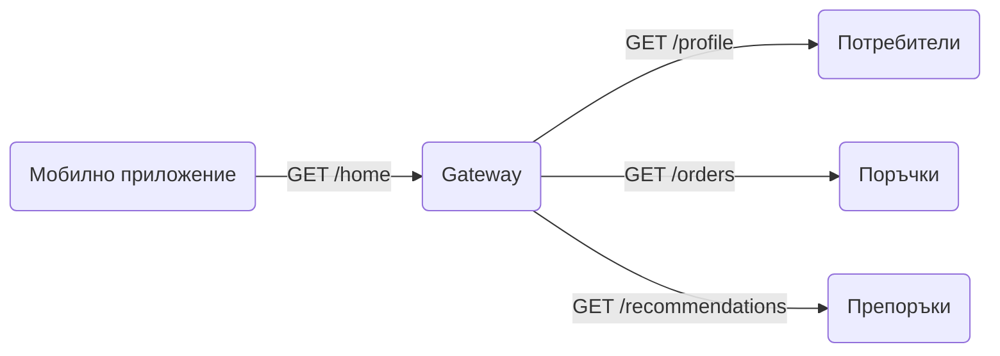

# Gateway Aggregation

Клиентът праща една заявка. Gateway-ят пита няколко услуги едновременно, събира отговорите в един и го връща. Вместо пет обиколки по мрежата, една.

## Представи си

Поръчваш храна в ресторант. Не ходиш сам до кухнята за основното, до бара за напитката и до сладкаря за десерта. Казваш всичко на сервитьора, той обикаля вместо теб и ти носи всичко наведнъж на една табла. Сервитьорът е gateway-ят, кухнята, барът и сладкарят са услугите.

## Проблемът, който решава

Един екран в мобилно приложение често показва данни от много услуги: профил, поръчки, известия, препоръки. Ако телефонът пита всяка услуга поотделно, прави пет заявки през бавна мобилна мрежа и чака най-бавната от тях. Батерията страда, екранът се зарежда на части, а всяка заявка носи свой TLS handshake и свои хедъри. Проблемът става още по-голям, когато заявките зависят една от друга и трябва да вървят една след друга.

## Как работи

1. Клиентът праща една заявка за това, което екранът показва, например `/home`.
2. Gateway-ят знае кои услуги са нужни и ги пита паралелно, не една след друга.
3. Всяка услуга връща своята част. Gateway-ят чака с таймаут, не безкрайно.
4. Отговорите се сглобяват в един JSON и се връщат на клиента.
5. Ако някоя услуга не отговори навреме, gateway-ят връща останалото и празно поле за липсващото, вместо да провали целия екран.

## Кога да го ползваш

- Клиентът е на бавна или скъпа мрежа: мобилни телефони, IoT устройства.
- Един екран се нуждае от данни от три или повече услуги.
- Искаш да скриеш от клиента как е разделен бекендът.

## Капани

- **Най-бавната услуга определя времето.** Паралелните заявки чакат най-бавната. Слагай таймаут на всяка и връщай частичен отговор.
- **Gateway-ят става бизнес логика.** Събиране на отговори е добре. Изчисления, валидации и правила принадлежат на услугите.
- **Тясно място.** Всеки трафик минава оттук. Ако gateway-ят прави тежка работа за всеки клиент, той става най-натоварената част от системата.
- **Един размер за всички.** Уеб и мобилното приложение искат различни неща. Ако един gateway обслужва всички, расте неудържимо. Тогава мисли за [Backends for Frontends](backends-for-frontends.md).

## Къде е в наръчника

- [Мрежа и балансиране](Networking_Load_Balancing.md): API gateway и BFF спрямо reverse proxy.
- [News Feed / Timeline](News_Feed_Timeline.md): hydration, тоест сглобяване на фийда от няколко източника.
