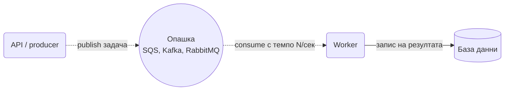

# Queue-Based Load Leveling

Сложи опашка между този, който праща работа, и този, който я върши. Пиковете се трупат в опашката, а работникът ги обработва със скорост, която издържа.

## Представи си

Пекарна с една фурна. В 8 сутринта идват петдесет клиенти наведнъж, а фурната пече по десет хляба на час. Ако всеки клиент стои пред фурната и чака, магазинът се задръства. Вместо това продавачът взима поръчките и ги слага на лист. Фурната пече по списъка със своето темпо, а клиентите си тръгват и се връщат, когато хлябът е готов. Листът с поръчки е опашката.

## Проблемът, който решава

Трафикът никога не е равен. Идва на вълни: разпродажба, новина, начало на работния ден. Ако услугата отзад трябва да обработи всичко в момента, в който пристигне, трябва да е оразмерена за най-големия пик, тоест да стои празна през останалото време. Още по-лошо, при наистина голям пик тя пада и губи всичко, което е било по средата.

## Как работи

1. Клиентът праща заявка. Услугата отпред я записва в опашката и веднага отговаря "прието".
2. Опашката държи задачите, колкото и бързо да идват. Тя е буферът, който поема вълната.
3. Работниците отзад теглят задачи с темпо, което знаят, че издържат.
4. Когато вълната отмине, опашката се изпразва и системата се успокоява сама.
5. Ако задачите се трупат по-бързо, отколкото изчезват, добавяш още работници или сигнализираш, че си претоварен.

## Кога да го ползваш

- Работата може да изчака секунди или минути: изпращане на имейл, транскодиране на видео, генериране на отчет.
- Трафикът има пикове, а искаш услугата отзад да е оразмерена за средното натоварване.
- Искаш да не губиш заявки, когато работниците са бавни или временно спрени.

## Капани

- **Не става за синхронни отговори.** Ако потребителят чака резултата веднага, опашката само добавя закъснение. Тогава трябва [Asynchronous Request-Reply](asynchronous-request-reply.md) или директна заявка.
- **Безкрайно растяща опашка.** Буферът не е безкраен. Следи дължината ѝ и възрастта на най-старото съобщение, иначе разбираш за проблема след часове.
- **Загуба при падане на опашката.** Опашката става критична част. Избери брокер с трайност (persistence) и репликация.
- **Двойна обработка.** Повечето опашки доставят поне веднъж. Работникът трябва да е [Idempotent Consumer](idempotent-consumer.md).

## Къде е в наръчника

- [Message brokers](Message_Brokers_Comparison.md): кой брокер каква трайност, подредба и backpressure дава.
- [Video Platform](Video_platform_like_Udemy.md): опашка за транскодиране, която изглажда качванията.
- [Notification System](Notification_system.md): опашки с приоритети и backpressure към доставчиците.
