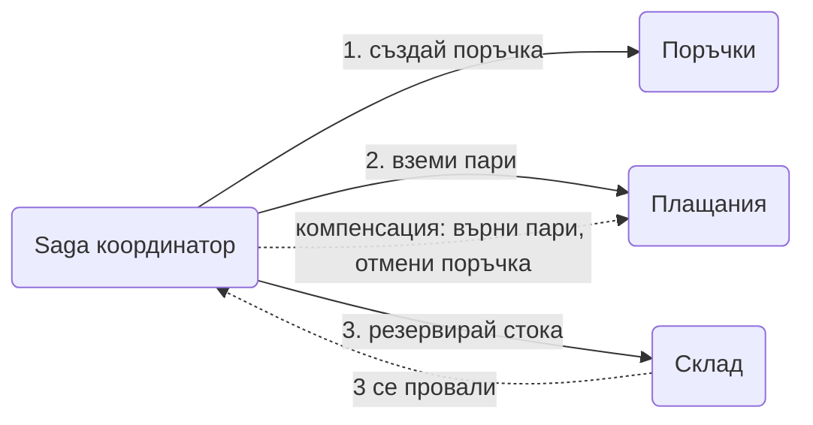

# Saga

Дълга бизнес операция, разделена на поредица от малки локални транзакции в различни услуги. Ако някоя стъпка се провали, предишните се отменят с компенсации. Няма глобална транзакция, има договорен ред.

## Представи си

Организираш сватба: зала, кетъринг, музика, фотограф. Всеки доставчик е отделна фирма със свой договор. Ако фотографът откаже два дни преди събитието, не можеш да "върнеш" цялата сватба. Или намираш друг, или отменяш останалото и всеки връща капарото по своите правила. Сватбата е сагата, доставчиците са услугите, отмените са компенсациите.

## Проблемът, който решава

Поръчка в онлайн магазин минава през услуги за поръчки, плащания, склад и доставка. Всяка има своя база. Класическата транзакция "всичко или нищо" не работи през мрежата между независими услуги, а двуфазният commit е бавен и крехък. Трябва начин операцията да стигне до край или да се върне в чисто състояние, дори когато услуги падат по средата.

## Как работи

1. Операцията се разбива на стъпки. Всяка стъпка е локална транзакция в една услуга и има своя компенсация.
2. Стъпките се изпълняват подред. Състоянието на сагата ("стъпка 2 приключи") се пази в база, за да оцелее при рестарт.
3. Ако всички стъпки минат, сагата е завършена.
4. Ако стъпка се провали, координаторът пуска [компенсациите](compensating-transaction.md) на вече минатите стъпки в обратен ред.
5. Два стила на управление. **Оркестрация**: един координатор казва на всеки какво да прави, както на диаграмата. **Хореография**: няма координатор, всяка услуга слуша събития и реагира сама. Разликата е описана в [Choreography](choreography.md).

## Кога да го ползваш

- Бизнес процес, който пресича граници между услуги и бази.
- Можеш да живееш с временно междинно състояние: поръчката за минута е "в процес".
- Всяка стъпка има смислена компенсация.

## Капани

- **Стъпка без компенсация.** Ако изпратиш стоката и чак после провериш плащането, няма как да компенсираш. Подреди стъпките така, че трудните за отмяна да са последни.
- **Загубено състояние на сагата.** Координаторът умира след стъпка 2 и при рестарт не знае докъде е стигнал. Състоянието се пази в база, стъпките и компенсациите са идемпотентни.
- **Непълна изолация.** Друга заявка вижда поръчката между стъпките и действа върху половинчато състояние. Маркирай обектите като "в процес" и не ги показвай като готови.
- **Хореография при много стъпки.** С десет услуги, които си пращат събития, никой не знае целия процес. Над четири или пет стъпки оркестрацията е по-ясна.

## Къде е в наръчника

- [Ticketmaster](Ticketmaster.md): Saga с резервация, плащане и компенсации при провал.
- [SOLID, DDD и архитектурни стилове](SOLID_DDD_Architecture_Styles.md): бизнес процеси през bounded contexts.
- [Message brokers](Message_Brokers_Comparison.md): какво предлага всеки брокер за събития между стъпките.
