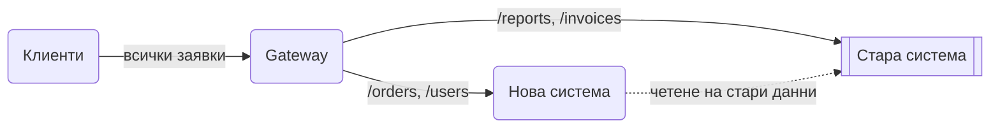

# Strangler Fig

Не пренаписвай старата система наведнъж. Сложи пред нея gateway и премествай функция по функция в новата система. Трафикът се пренасочва парче по парче, докато старата система остане без работа и бъде изключена.

## Представи си

Ремонтираш къща, в която живееш. Не я събаряш, за да построиш нова, защото няма къде да спиш. Ремонтираш стая по стая: преместваш се в новата кухня, после в новата баня. Старите стаи стоят, докато не ти трябват, и накрая ги събаряш. Къщата е старата система, новите стаи са новите услуги, ти самият си трафикът, който се мести.

## Проблемът, който решава

Пълното пренаписване на голяма система почти винаги се проваля. Отнема две години, през които старата система продължава да се променя и новата я гони. Никой не вижда полза до края. Когато накрая се превключи наведнъж, всичко, което е било пропуснато, избухва в един ден. Нужен е начин да се мести постепенно, с възможност за връщане назад на всяка стъпка.

## Как работи

1. Поставяш gateway пред старата система. Отначало той препраща всичко към нея. Нищо не се променя за потребителите.
2. Избираш една малка, ясно отделена функция и я реализираш в новата система.
3. Превключваш в gateway-я само този път към новата система. Ако нещо се счупи, връщаш правилото за секунди.
4. Повтаряш за следващата функция. Новата система може да чете от старата база през [Anti-Corruption Layer](anti-corruption-layer.md), докато данните също се преместят.
5. Когато нито един път не сочи към старата система, я изключваш.

## Кога да го ползваш

- Голяма стара система, която не можеш да спреш и не можеш да пренапишеш наведнъж.
- Искаш ранна полза: първите преместени части работят по-добре още следващия месец.
- Искаш нисък риск: всяка стъпка се връща назад с една промяна в конфигурацията.

## Капани

- **Две системи завинаги.** Ако никой не довърши миграцията, поддържаш и двете. Планирай края, не само началото.
- **Споделена база.** Докато и двете системи пишат в една база, те са свързани. Преместването на данните е най-трудната част и се отлага най-дълго.
- **Грешен първи избор.** Започни с функция, която е слабо свързана с останалите. Ако започнеш със сърцето на системата, всичко зависи от всичко.
- **Gateway-ят като нова legacy.** Правилата за препращане стават сложни. Дръж ги в конфигурация, документирай ги и ги чисти, когато път се премести изцяло.

## Къде е в наръчника

- [SOLID, DDD и архитектурни стилове](SOLID_DDD_Architecture_Styles.md): миграция със strangler fig, modular monolith срещу microservices.
- [Мрежа и балансиране](Networking_Load_Balancing.md): reverse proxy и API gateway като точка за препращане.
