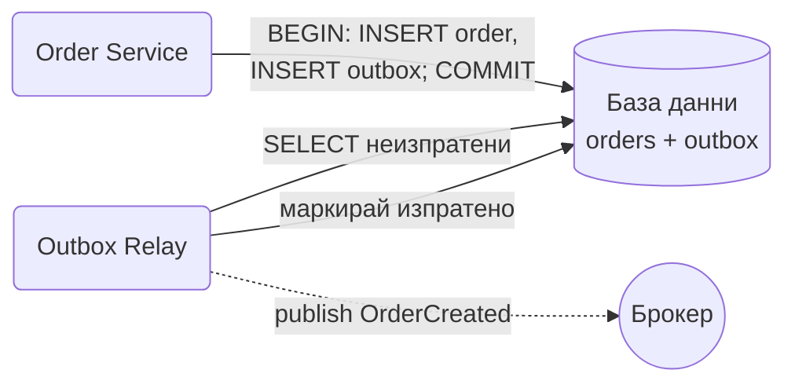

# Transactional Outbox

Когато записваш нещо в базата и трябва да обявиш събитие за него, запиши събитието в същата база, в същата транзакция. Отделен процес после го праща към брокера. Така никога няма запис без събитие или събитие без запис.

## Представи си

Пишеш писмо и го слагаш в кутията "за изпращане" на бюрото си, в същия момент, в който отбелязваш в тефтера, че сметката е платена. Пощальонът минава всеки час, взима всичко от кутията и го носи до пощата. Ако пощальонът закъснее, писмото си стои в кутията и никой не го губи. Кутията е outbox таблицата, пощальонът е relay процесът.

## Проблемът, който решава

Услугата записва поръчката в базата и после публикува `OrderCreated` в Kafka. Две отделни операции. Ако процесът падне между тях, поръчката съществува, но никой не разбира за нея: няма имейл, няма склад. Ако размениш реда, събитието излиза, а записът се проваля, и всички реагират на поръчка, която я няма. Няма начин да направиш база и брокер една транзакция.

## Как работи

1. В една транзакция услугата записва поръчката в `orders` и реда за събитието в `outbox`. Или и двете минават, или нито едно.
2. Relay процесът чете неизпратените редове от `outbox`.
3. Публикува ги към брокера.
4. Маркира ги като изпратени или ги трие. Ако падне между публикуване и маркиране, ще публикува пак. Затова consumer-ите са [Idempotent Consumer](idempotent-consumer.md).
5. Вместо relay, който чете таблицата, може да се ползва [Change Data Capture](change-data-capture.md), който слуша лога на базата.

## Кога да го ползваш

- Записваш в база и публикуваш събитие за същата промяна. Това е почти всяка услуга с събития.
- Загубено събитие е скъпо: поръчка без доставка, плащане без фактура.
- Искаш събитията да излизат в реда, в който са записани.

## Капани

- **Relay с няколко копия.** Две копия четат същите редове и публикуват всичко два пъти. Или едно копие с [Leader Election](leader-election.md), или `SELECT ... FOR UPDATE SKIP LOCKED`.
- **Outbox таблицата расте.** Изпратените редове трябва да се трият или архивират. Иначе таблицата става най-горещата в базата.
- **Забравен outbox на едно място.** Ако някой път публикуваш директно, а друг път през outbox, гаранцията изчезва. Всички събития минават през outbox.
- **Закъснение.** Събитието излиза след опита на relay, тоест със секунда или две забавяне. Това е цената за гаранцията.

## Къде е в наръчника

- [Node.js архитектурни патерни](Design_Patterns_Node_Architecture.md): Outbox с relay като код.
- [Ticketmaster](Ticketmaster.md): outbox при резервацията на билет.
- [Notification System](Notification_system.md): outbox като начало на веригата от известия.
